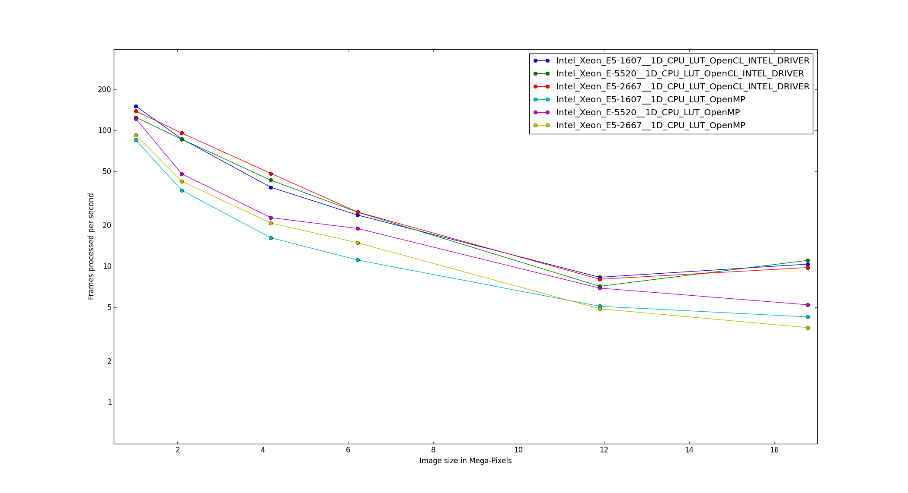
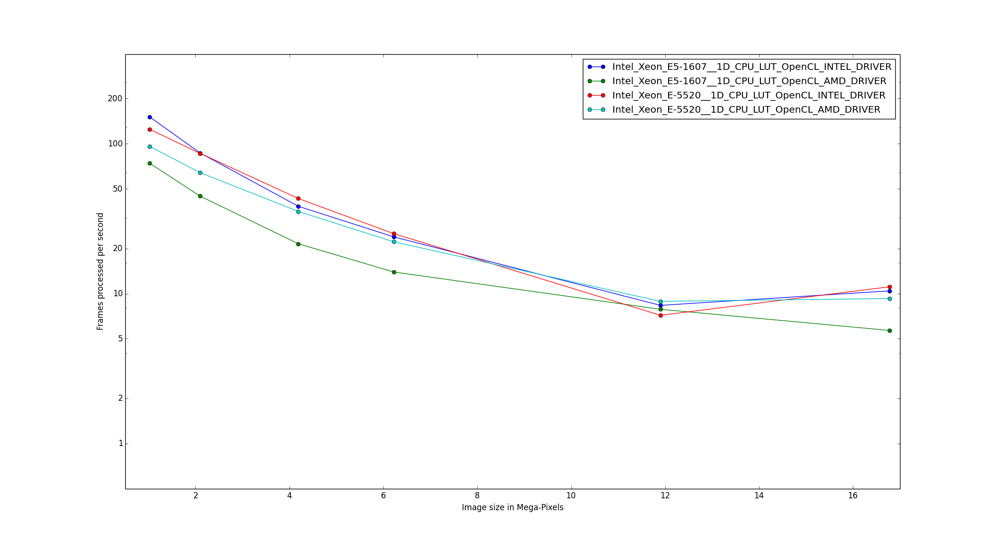
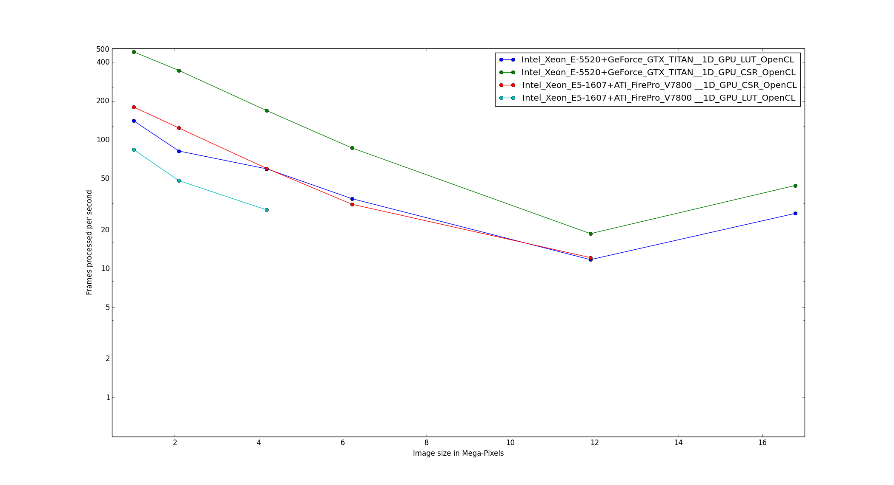
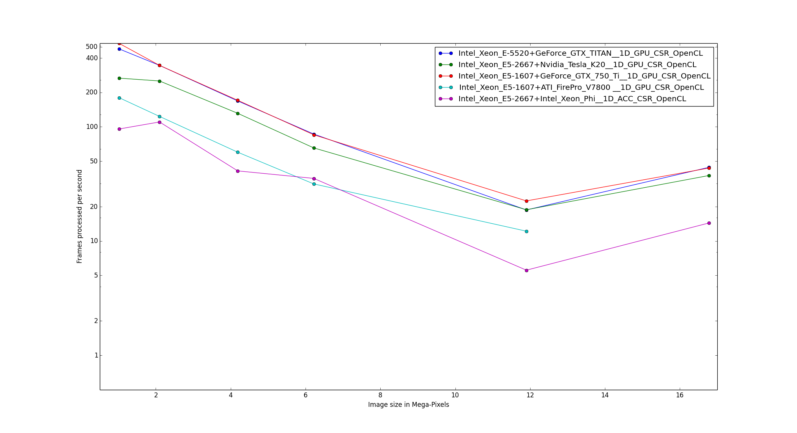

:author: Jérôme Kieffer
:email: jerome.kieffer@esrf.fr
:institution: European Synchrotron Radiation Facility, Grenoble, France

:author: Giannis Ashiotis
:email: giannis.ashiotis@gmail.com
:institution: European Synchrotron Radiation Facility, Grenoble, France

-------------------------------------------------------------------------
PyFAI: a Python library for high performance azimuthal integration on GPU
-------------------------------------------------------------------------

.. class:: abstract

   The pyFAI package has been designed to transform X-ray diffraction images
   into powder diffraction curves to be further processed by scientists
   (like Rietveld refinement, ...)
   This contribution describes how to transform an image into a radial profile
   using the Numpy package, how the process was accelerated using Cython and
   how the algorithm was parallelize, needing a complete re-design to take benefit
   of massively parallel devices like graphical processing units or accelerator like
   the Intel Xeon Phi thanks to PyOpenCL.

.. class:: keywords

   X-rays, powder diffraction, SAXS, HPC, parallel algorithms, OpenCL.

Introduction
============

The Python programming language is widely adopted in the scientific community
and especially in crystallography, this is why a convenient azimuthal integration
routine, one of the basic algorithm in crystallography, was requested by the synchrotron community.
The advent of pixel-detectors with their very high speed (up to 3000 frames per seconds)
imposed strong constrains in speed that most available programs ([FIT2D]_, [SPD]_, ...),
while written in FORTRAN or C, could not meet.

The [pyFAI]_ project started in 2011 and aims at providing a convenient Pythonic interface
for azimuthal integration, so that any crystallographer can adapt it to the type of experiment
he is interested in.
This contribution describes how one of the most fundamental
algorithm used in crystallography has been implemented in Python
and how it was accelerated to reach the performances of today's fastest detectors.

After the description of the experiment and the explanation of what is measured and how it must be transformed in paragraph 2,
the paragraph 3 exposes how the algorithm can be vectorized using [NumPy]_ and speeded up with [Cython]_.
The fourth paragraph highlights the precision enhancements recently introduced while the fith paragraph focuses on
the parallelization of azimuthal integration on manycore systems like Graphical Processing Units (GPU) or on accelerators thanks to [PyOpenCL]_.
Finally, benchmarks are comparing serial and parallel implementation using [OpenMP]_ and [OpenCL]_ from various vendors and devices.

Description of the experiment
=============================

An X-ray is an electromagnetic wave, like light except that its wavelength is much smaller, of
the size of an atom, making it a perfect probe to analyze atoms and molecules.
This X-ray is scattered (re-emitted with the same energy) by the electron cloud surrounding atoms.
When atoms are arranged periodically, as in a crystal, scattered X-rays interfere in a constructive way
when the difference of optical path is a multiple of the wavelength: :math:`2d sin(\theta) = n\lambda`.
In this formula, known as *Bragg's law*, *d* is the distance between crystal plans, :math:`\theta` is the incidence angle and :math:`\lambda` is the wavelength.
An X-ray beam crossing a powder sample made of many small crystals is then scattered along multiple concentric cones.
In a powder diffraction experiment, one aims at measuring the intensity of X-rays as function of the opening of the cone, averaged along each ring.
This transformation is called "azimuthal integration" as it is an averaging of the signal along the azimuthal angle.

.. figure:: HEX-2D-diffraction.png

   Debye-Scherrer cones obtained from diffraction of a monochromatic X-Ray beam by a powder of crystallized material. (Credits: CC-BY-SA  Klaus-Dieter Liss) :label:`diffraction`

Azimuthal integration
=====================

While pyFAI addresses the needs of both mono and bi-dimentional integration with various scattering spaces,
this contribution focuses on the algorithmic and implementation part.
The output spaces implemented in pyFAI are:

* :math:`r = \sqrt{x^2+y^2}`
* :math:`\chi = tan^{-1}(y/x)`
* :math:`2\theta = tan^{-1}(r/d)`
* :math:`q = 4 \pi sin({2 \theta} / 2)/ \lambda`

The pyFAI library was designed to offer a pythonic interface and work together with [FabIO]_ for image reading (or [H5Py]_ for HDF5 files).
This snipplet of code explains you the basic usage of the library: :label:`use`

.. code-block:: python

   import fabio, pyFAI
   data = fabio.open("Pilatus1M.edf").data
   ai = pyFAI.load("Pilatus1M.poni")
   tth, I = ai.integrate1d(data, 1000, unit="2th_deg",\
                                        method="numpy")

Output scale (*r*, *q* or :math:`2\theta`) and units can be chosen with the *unit* keyword.
The *method* keyword selects the algorithm used for integration, those algorithms will be precisely described in this contribution.
Nevertheless the experiment will be limited to 1D full azimuthal integration with a planar detector orthogonal the incoming beam,
in this case the conics drawn on the detector are concentric circles.
The generic geometry used in pyFAI has already been described in [pyFAI_ocl]_.

Test case
---------

To let the reader have an idea of the scale of the problem and the performances needed, we will work on
the simulated image of gold powder diffracting an X-rRay beam of wavelength = 1.0e-10m (the intensities of all rings are the same).
The detector, which has a pixel size of 1e-4m (2048x2048 pixels), is placed at 0.1 m from the sample, orthogonal to the incident beam, and centered.
The Figure :ref:`rings` represents the input diffraction image on the left sub-plot and the integrated profile along the azimuthal angle on the right side.
The radial unit in this case is simply the radius calculated from :math:`r=\sqrt{(x - x_c)^2 + (y - y_c)^2}`,
while crystallographers would have preferred :math:`2\theta` or the scattering vector's norm *q*.

.. figure:: rings2.png

   Simulated powder diffraction image (left side) and integrated profile (right).  :label:`rings`

Naive implementation
--------------------

The initial step of any implementation is to calculate the radius array, giving the previous formula.
Using numpy's slicing feature one can extract all pixels which are between r1 and r2 and average out their values:

.. code-block:: python

   def azimint_naive(data, npt, radius):
       rmax = radius.max()
       res = numpy.zeros(npt)
       for i in range(npt):
           r1 = rmax * i / npt
           r2 = rmax * (i+1) / npt
           mask_r12 = numpy.logical_and((r1 <= radius),
                        (radius < r2))
           values_r12 = data[mask_r12]
           res[i] = values_r12.mean()
       return res

The slicing operation takes tens of millisecond and needs to be repeated thousands of times for a single image,
making each integration last 40 seconds, which is unacceptably slow. :label:`naive`

Numpy histograms
----------------

The naive formulation made in :ref:`naive` can be re-written using histograms.
The *mean* call can be replaced with the ratio of the sum of all values divided by the number of pixel contributing:

.. code-block:: python

    values_r12.mean() = values_r12.sum() / mask_r12.sum()

The denominator, *mask_r12.sum()*, can be obtained from the histogram of *radius* values and the numerator, *values_r12.sum()*
from the weighted histogram of *radius* weighted by the *data* in the image:

.. code-block:: python

   def azimint_hist(data, npt, radius):
       histu = np.histogram(radius, npt)[0]
       histw = np.histogram(radius, npt, weights=data)[0]
       return histw / histu

This new implementation takes about 800ms which is much faster than the loop written in Python
but can be optimized by reading only once the radius array from central memory.

Cython implementation
---------------------

Histograms were re-implemented using [Cython]_ to perform simultaneously the
weighted and the un-weighted histogram with a single memory read of the radius array.
The better use of the CPU cache decreases significantly the integration time to 150ms on a single core.

OpenMP support in Cython
........................

To accelerate further the code we decided to parallelize the [Cython]_ code using to [OpenMP]_.
While the implementation was quick, the result we got were wrong (by a few percent) due to
write conflicts, not protected by atomic_add operation.
Apparently the use of atomic operation is still not yet possible in [Cython]_ (summer 2014).
Multithreaded histogramming was made possible by using as many histograms as threads simultaneously running,
which implies to allocate much more memory for output arrays.

.. table:: Azimuthal integration time for a 4 Mpix image measured on two Xeon E5520 (2x 4-core hyperthreaded at 2.2 GHz) :label:`Cython`

   +----------------+----------------+
   | Implement.     | Exec. time (ms)|
   +----------------+----------------+
   | loop + mean    |     44000      |
   +----------------+----------------+
   | np.histogram   |      829       |
   +----------------+----------------+
   | Cython 1_th    |      149       |
   +----------------+----------------+
   | Cython 2_th    |        81      |
   +----------------+----------------+
   | Cython 4_th    |       59       |
   +----------------+----------------+
   | Cython 8_th    |        41      |
   +----------------+----------------+
   | Cython 16_th   |        48      |
   +----------------+----------------+

The speed-up measured when going from 4 threads to 8 threads (i.e. from one processor to two on this system)
is very small showing we reach the limits of the algorithm.
The only way to go faster is to start thinking in parallel from the beginning
and re-design the algorithm so that it works natively with lots of threads.
This approach is the one taken by [OpenCL]_ where thousands of threads are virtually running in parallel and described in paragraph 5.

Pixel splitting
===============

Pixel splitting is what occurs when a pixel of the detector spans over more than one of the bins of the histogram.
When that happens, the contribution to each of the involved bins is assumed to be
proportional to the area of the pixel segment that falls into that bin.
The goal behind the addition of that extra complexity to the code is that the
results obtained this way owe to be less noisy than the case where pixel splitting is ignored.
This becomes more apparent when the number of pixels falling into each bin
is small like for example on bidimentional integration.
Figure :ref:`bidimentional` presents such an integration performed using histograms
on the left side, hence without pixel splitting which exhibits some
high frequency patterns near the beam center (left of the figure).
The right hand side image was produced using pixel splitting and is
unharmed by such defects related to the low statistics.
Note that for 2D integration this transformation looks like an interpolation,
but interpolation never garanties the conservation of the signal :math:`\sum{image} = \sum{ weighted\ histogram }`
nor the conservation of pixels :math:`\sum{ unweigted\ histogram } = number\ of\  pixels`.

.. figure:: integrate2d.png

   Bi-dimentional azimuthal integration of the gold diffraction image using (right side) or not pixel splitting  :label:`bidimentional`

Bounding Box
------------

The first way pixel splitting was implemented was with a bounding box like in Fit2D [FIT2D]_.
In this case we are abstracting the pixel, which is represented by a center point and a span, with an orthogonal box that circumscribes it.
Two sides are parallel to the radial axis, and the other sides, are equal to the unit.
Now instead of calculating the contribution of each segment of the pixel based on its area, we do that using the area of the bounding box segment instead.
This greatly simplifies the algorithm, giving out good performance.

The algorithm loops over all of the pixels of the detector, adding their contribution to the appropriate bins.
When the whole pixel falls into only one bin, we don’t have pixel splitting and we proceed as previously.
If the pixel spans over more than one bin, the contribution of the two most outward bins (left and right) is calculated first, and added to the correcponding bins' histograms.
Then the remaining contribution is evently distributed among the “internal” bins (if any).
Finally the ratio of the two histograms is calculated and returned.

The conterpart of this simplistic pixel splitting is an overestimation of the pixel's size hence a slight blurring of the signal.

Full Pixel Splitting
--------------------

In an effort to farther improve the results of the azumithal integration,
another pixel-splitting scheme was devised.
This time, no abstraction takes place and the pixel-splitting
is done using the area of the actual pixel segments (assuming they are straight lines).
This introduces some extra complexity to the calculations,
making the process a bit slower.

As before, we first have to check if pixel splitting occurs.
In the case it does not, the pixel is processed as before.
Otherwise we have to handle the pixel splitting.
This is done by firstly defining a function for each of the sides of the pixel in-question.
That is, calculating the slope and the point of intersection.
We’ll also require the area of the pixel.
Next we loop over the bins that the pixel spans over and proceed to
integrate the four functions we’ve previously defied in that interval.
Taking the absolute value of the sum of all those contributions
will give us the area of the pixel segment.
The hard part here was to define the limits of each of the integrals in a
way that wouldn’t hinder the performance by adding allot of conditionals.
The contribution to the histograms is calculated in a similar fashion as before.

Discussion on the statistics
----------------------------

Using either of the two pixel splitting algorithms results in some side effects that the user should be aware of:
The fact that pixels contributing to neighboring bin of the histogram creates some cross-correlation between those bins,
affecting this way the statistics of the final results in a potentially unwanted manner.

More parallelization
====================

For faster execution, one solution is to use manycore systems, like for example
Graphical Processing Units (GPU) or
accelerators, for instance the Xeon-Phi from Intel.
Those chips allocate more silicon for computing (ALU)
and less to branch prediction, memory prefetecher and cache coherency, in comparison to CPU.
Our duties as programmers is to write the code that maximises the usage of ALUs
without relying on pre-fetcher and other commodities offered by normal processors.

Typical GPU have tens (to hundreeds) of compute units able to schedule and run
dozens of threads simultaneously (in a Single Instruction Multiple Data way).
OpenCL allows to execute the same code on processors, graphics cards or accelerator
but we will highlight the memory access pattern is important in order to best use them.
Finally, OpenCL uses on the fly compilation which, at usage, looks very much
like Python interpreted code when interfaced with [PyOpenCL]_
(thanks to the speed of compilation and the memoizing of the binary generated).

.. table:: Few OpenCL devices we have tested our code on. :label:`Devices`
    :class: w

    +--------------------+-----------+-----------+---------+---------+-------------+-----------+
    | Vendor /driver     | Intel     | AMD       | AMD     | Nvidia  | Nvidia      | Intel     |
    +--------------------+-----------+-----------+---------+---------+-------------+-----------+
    | Model              | 2xE5-2667 | 2 E5-2667 | V7800   |Tesla K20|GeForce 750Ti| Phi 5110  |
    +--------------------+-----------+-----------+---------+---------+-------------+-----------+
    | Type               | CPU       | CPU       | GPU     | GPU     | GPU         | ACC       |
    +--------------------+-----------+-----------+---------+---------+-------------+-----------+
    | Compute Unit       | 12        | 12        | 18      | 13      | 5           | 4x69      |
    +--------------------+-----------+-----------+---------+---------+-------------+-----------+
    | Compute Element/CU | 4:AVX     | 1         | 80      | 4x8:Warp| 4x8:Warp    | 16:AVX512 |
    +--------------------+-----------+-----------+---------+---------+-------------+-----------+
    | Core frequency     | 2900 MHz  | 2900 MHz  | 700 MHz | 705 MHz | 1100 MHz    | 1052      |
    +--------------------+-----------+-----------+---------+---------+-------------+-----------+

Parallel algorithms
-------------------

Parallelization of complete algorithms consists most of the time in their decomposition into parallel blocks.
There are a few identified parallel building blocks like:

- Map: apply the same function on all element of a vector
- Scatter: write multiple output from a single input, needs atomic operation support
- Gather: write a single output from multiple inputs
- Reduction: single result from a large vector input, like an inner product
- Scan: apply subsequently an operation to all preceeding elements on an vector like np.cumsum
- Sort: There are optimized sorter for parallel implementation.

Those parallel building blocks will typically be one (or few) individual
kernel as kernel execution synchronizes the global memory in OpenCL.
Parallel algorithmics is how to then assemble those blocks to implement requested features.

Parallel azimuthal integration
------------------------------

The azimuthal integration, like histograms, are scatter operation hence require
the support of atomic operations (in our case of double precision floats).
As Cython does not (yet) support atomic operation, enabling OpenMP parallelization
results in a module, while functional, giving wrong results (we measured 2%
errors on 8 cores)

To overcome this limitation; instead of looking at where input pixels go to
in the output curve,
we instead look at where the output bin come from in the input image.
This transformation is called a “scatter to gather” transformation and needs atomic operation.
In our case, it was implemented as a single threaded [Cython]_ module.

The correspondence between pixels and output bins can be stored in a look-up table (LUT)
together with the pixel weight (ratio of areas) which make the integration look like a simple
(if large and sparse) matrix vector product.
This look-up table size depends on whether pixels are split over multiple bins
and to exploit the sparse structure, both index and weight of the pixel have to be stored.

By making this change we switched from a “linear read / random write” forward algorithm to a
“random read / linear write” backward algorithm which is more suitable for parallelization.
For optimal memory acces patterns, this array my be transposed depending on the hardware (CPU vs GPU)

Optimization of the sparse matrix multiplication
................................................

The compressed sparse row (CSR) sparse matrix format was introduced to
reduce the size of the data stored in the LUT.
This algorithm was implemented both in [Cython]_-[OpenMP]_ and [OpenCL]_.
Our CSR representation contains *data*, *indices* and *indptr* so it is is fully
compatible with the *scipy.sparse.csr.csr_matrix* contructor from [SciPy]_.
This representation is a struct of array which is better suited to GPUs
(stridded memory access) while LUT is an array of struct, known to be
better adapted to CPU (better use of cache and prefetching)
The CSR approach has a double benefit: first, it reduces the
size of the storage needed compared to the LUT by a factor two to three,
offering the opportunity of working with larger images on the same hardware.
Secondly, the CSR implementation in [OpenCL]_ is using an algorithm based
on multiple parallel reductions
where all threads within a workgroup are collaborating to calculate the
content of a single bin.
This makes it very well suited to run on manycore systems where hundreds
to thousands of simultaneous threads are available.

About precision of calculation
..............................

Knowing the tight energy constrains in computing, the future of high performance computing
depends on the capability of programs to use the right precision for their calculation.
As out detectors provide a sensitivity of 12 to 20 bits/pixel, performing all calculation
in double precision (with 52 bits mantissa) looks over-sized  and the 24 bits of mantissa
of single precision float looks better adapted (with no drop of precision).
Moreover, GPU devices provide much more computing power in single precision than in double,
this factor varies from 2 on high-end professional GPU like Nvidia Tesla to 24 on most consumer grade devices.

When using [OpenCL]_ for the GPU we used a compensated arithmetic (or [Kahan]_ summation), to
reduce the error accumulation in the histogram summation (at the cost of more operations to be done).
This allows accurate results to be obtained on cheap hardware that performs calculations in single
precision floating-point arithmetic (32 bits) which are available on consumer grade graphic cards.
Double precision operations are currently limited to high price and performance computing dedicated GPUs.
The additional cost of Kahan summation, 4x more arithmetic operations, is hidden by smaller data types,
the higher number of single precision units and that the GPU is usually limited by the memory bandwidth anyway.

The performances of the parallel azimuthal integration can reach 750 MPix/s
on recent computer with a mid-range graphics card.
On multi-socket server featuring high-end GPUs like Tesla cards, the performances are similar with the
additional capability to work on multiple detector simultaneously.

Outlook on parallel programming
...............................

The calculation of the look-up table which is currently performed in single threaded [Cython]_ code.
As we have seen, this scatter operation is a challenge for parallel programming because of
the dynamic memory allocation needed and of the use of atomic operation in addition
to some numerial precision issues with single precision floating point numbers.

Benchmarks
==========

At this point we present the results from several benchmarks done using the diffetent algorithm options available in PyFAI.
All benchmarks have been performed using the same bounding box pixel splitting scheme and integrated profiles obtained are of equivalent quality.
Execution speed have been measured using the *timeit* module, averaged over 10 iterations (best of 3).
The processing is performed on 1, 2, 4, 6, 12 and 16 Mpixel images taken from actual diffraction experiment and part of the pyFAI test-suite.

They come from various detector and differ in the geometry used and input datatype,
which explains why processing this 16 Mpix image is faster than the 12Mpix image in this benchmark.

Choice of the algorithm
-----------------------

The Look-Up Table contains the index togeather with the coeficient, hence it is an *array of struct* pattern which is known to make best use of CPU caches.
On the opposite the CSR sparse matix representation is a *struct of array* which is better adapted to GPU.
As we can see on figure :ref:`serial-lut-csr`, both parallel implementation out-perform the serial code and both LUT and CSR behave similarly:
the penality of the *array of struct* in CSR is counter-balanced by the smaller chunk on data to be transfered from central memory to CPU

.. figure:: serial_lut_csr.png

   Comparison of azimuthal integration speed obtained using serial implementation versus 
   parallel ones with LUT and CSR sparse matrix representation on two Intel Xeon E2667. :label:`serial-lut-csr`

OpenMP vs OpenCL
----------------

The gain in portability obtained by the use of OpenCL does not mean a sacrifice in performance when the code is run on a CPU.
This is shown in on figure :ref:`openmp-opencl-intel-amda`, where we can see that the OpenCL implementations outperforms the OpenMP one, in all the different CPUs is was tested on.
There is one more thing that should be noted here; the choice of OpenCL driver greatly affects the performance of the program.
In figure :ref:`openmp-opencl-intel-amdb`, we can see that in the case of the newer Intel Xeon E5-1607 the Intel driver clearly out performs the AMD one.
This can be atrubuted to the lack of support for newer features of the chip, like AVX.
This is not the case for the older Intel Xeon E-5520, where such features are not avaialble.

   Comparison of the azimuthal integration speed between the OpenMP and OpenCL implementations. :label:`openmp-opencl-intel-amda`

   The effects of OpenCL driver selection on performance on different generations of CPUs. :label:`openmp-opencl-intel-amdb`

GPUs and Xeon Phi
-----------------

As promised, the CSR implementation runs much faster on all of the GPUs used, compared to the LUT one.
In figure :ref:`gpusa` we can see the difference in that performance.
Somehow unexpectedly, we can also see another benefit of the CSR implementation when it comes to GPUs.
That is, the much lower memory usage of it.
The ATI GPU used here is of a quite old series, with relatevly small amount of onboard memory.
This is the reason the benchmarks stop before reaching the final size of 16 MPixel.
But as you can see this is done much earlier for the LUT implementation.
In figure :ref:`gpusb`, we have gathered the results for all the GPUs tested as well as Intel's Xeon Phi.
As you can see Xeon Phi matches the performance of the relatevly old ATI GPU.
What is surpising though, is how well did the new, consumer grade Nvidia GeForce 750Ti perform.
I has match and surpassed the performance of all the high-end GPUs, being only at a fraction of their cost.

   Comparison of the azimuthal integration speed between the LUT and CSR implementations on GPUs. :label:`gpusa`
   

   Comparison of the performances for several Manycore accelerators: GPUs and Xeon Phi.:label:`gpusb`

Kernel timings
--------------

As stated previously, the benchmark was performed using the *timeit* module from Python
on the last line of the code snipplet described in :ref:`use`.
One may wonder what is the actual time spent in which part of the OpenCL code and how much is the Python overhead.
Table :ref:`profile` shows the execution time on the GeForce Titan (controled by a couple of Xeon 5520).
The overhead of Python in around 40% compared to the total execution time, and the actual azimuthal integration
represents only 20% of the time, while 40% is spent in transfers from central memory to device memory.
All vendors are currently working on an unifed memory space, which will be available for OpenCL 2.0.
It will reduce the time spent in transfers and simplify programming.

If one focuses only on the timimg of the integration kernel, then one could wrongly conclude pyFAI is able to sustain the speed of the fastest detectors.
Unfortunately, even at 2 ms processing per image, few hard-drives are able to deliver the requested gigabytes per second of data this represents.

.. table:: OpenCl profiling of the integration of a Pilatus 1M image on a GeForce Titan running on a dual Xeon 5520. :label:`profile`

                                 +-----------------+---------+
                                 |  ai.intergate1d | 2.030ms |
                                 +-----------------+---------+
                                 |    OpenCL_total | 1.445ms |
                                 +-----------------+---------+
                                 |      H->D image | 0.762ms |
                                 +-----------------+---------+
                                 |            cast | 0.108ms |
                                 +-----------------+---------+
                                 |          memset | 0.009ms |
                                 +-----------------+---------+
                                 |     corrections | 0.170ms |
                                 +-----------------+---------+
                                 |       integrate | 0.384ms |
                                 +-----------------+---------+
                                 |      D->H ratio | 0.004ms |
                                 +-----------------+---------+
                                 |      D->H uhist | 0.004ms |
                                 +-----------------+---------+
                                 |      D->H whist | 0.004ms |
                                 +-----------------+---------+

Drivers used
------------

Computers were running Debian8/Jessie operating system with backported OpenCL drivers:

* Intel OpenCL drivers V4.4.0-117 + MPSS stack v3.2.3
* AMD APP drivers 14.4
* Nvidia CUDA drivers 340.24-2

Project description
===================

PyFAI is open-source software released under the GPL licence available on GitHub (https://github.com/kif/pyFAI).
PyFAI depends on Python v2.6 or v2.7 and [NumPy]_.
In order to be able to read images from various X-ray detectors, pyFAI relies on the [FabIO]_ library.
Optional [OpenCL]_ acceleration is provided by [PyOpenCL]_.
Graphical applications for calibration and integration rely on [matplotlib]_, [PyQt]_ and
SciPy [SciPy]_ for image processing.
A C compilers is needed to build the [Cython]_ code from sources.
PyFAI is packaged and available in common Linux distributions like Debian and Ubuntu but it is also tested and functionnal under Windows and MacOSX.

Conclusions
===========

This contribution shows how one of the most central algorithm in crystallography has been implemented in Python,
optimized in Cython and ported to manycore architectures thanks to PyOpenCL.
15x speed-up have been observed by switching from binary code to OpenCL code running on GPUs (400x vs NumPy).
Some of the best performances were obtained on a mid-range consumer grade Nvidia GeForce 750Ti thanks to the new *Maxell* generation chip
running as fast as high-end graphics based on the *Kepler* architecture (like the Titan), and litteraly outperforming
both AMD GPUs and Xeon-Phi accelerator card.
Thanks to the PyOpenCL interfaced in Python, programming CPUs in a parallel is as easy as programming GPUs.

Acknoledgments
==============

Claudio Ferrero (head of the Data Analysis Unit) and Andy Götz (Head of the Software group) are acknoledged for supporting the developement of pyFAI.
The porting of pyFAI to OpenCL would have not been possible without the financial support of LinkSCEEM-2 (RI-261600), financing the contracts of
Dimitris Karkoulis who started the GPU porting, Zubair Nawaz who ported image distortion and Giannis Ashiotis (CSR, pixel splitting, ...)
Finally the authors would like to acknoledge their colleagues involved in the development of the library, especially Aurore Deschildre and Frédéric Picca for their involvement.
The authors would like to thank all X-ray beamlines promoting pyFAI and providing resources to further develop it: ESRF BM01, ID02, ID11, ID13, ID15, ID16, ID21, ID23, BM26, ID29, BM29 and ID30;
and also in other instituts like Soleil, Petra3, CEA, APS who provide feed-back, bug reports and patches to the library.

References
==========
.. [Cython] S. Behnel, R. Bradshaw, C. Citro, L. Dalcin, D.S. Seljebotn and K. Smith.
            *Cython: The Best of Both Worlds*
            Comput. Sci. Eng., 13(2):31-39, 2011.
.. [FabIO]  E. B. Knudsen, H. O. Sorensen, J. P. Wright,  G. Goret and J. Kieffer.
            *FabIO: easy access to two-dimensional X-ray detector images in Python*,
            J. Appl. Cryst., 46:537-539, 2013.
.. [FIT2D]  A. Hammersley, O. Svensson, M. Hanfland, A. Fitch and D. Hausermann.
            *Two-dimensional detector software*,
            High Press. Res., 14:235–248, 1996.
.. [H5Py] A. Collette.
           * Python and HDF5*
           ISBN 978-1-4493-6783-1, (2013)
.. [Kahan] W. Kahan.
            *Pracniques: Further Remarks on Reducing Truncation Errors*,
            Commun. ACM,8(1):40-, Jan. 1965
.. [matplotlib] J. D. Hunter.
            *Matplotlib: A 2D Graphics Environment*,
            Comput. Sci. Eng., 9(3):90-95, 2007.
.. [NumPy] T. E. Oliphant.
         *Python for Scientific Computing*,
         Comput. Sci. Eng., 9(3):10-20, 2007.
.. [OpenCL] J.E. Stone, D. Gohara and G. Shi.
            *OpenCL: A Parallel Programming Standard for Heterogeneous Computing Systems*,
            Comput. Sci. Eng., 12(3):66-73, 2010.
.. [OpenMP] OpenMP Architecture Review Board.
            *OpenMP Application Program Interface Version 3.0*, 2008.
.. [pyFAI]  J. Kieffer and D. Karkoulis.
            *PyFAI, a versatile library for azimuthal regrouping*,
            Journal of Physics: Conference Series, 425:202012, 2013.
.. [pyFAI_ocl] J. Kieffer and J.P. Wright.
               *PyFAI: a Python library for high performance azimuthal integration on GPU*,
               Powder Diffraction, 28S2:1945-7413, 2013.
.. [PyOpenCL] A. Klöckner, N. Pinto, Y. Lee, B. Catanzaro, P. Ivanov and A. Fasih.
            *PyCUDA and PyOpenCL: A Scripting-Based Approach to GPU Run-Time Code Generation*
            Parallel Computing, 38(3):157-174, 2012.
.. [PyQt] Mark Summerfield.
         *Rapid GUI Programming with Python and Qt: The Definitive Guide to PyQt*,
         ISBN 0132354187 (2007).
.. [SciPy] E. Jones, T. E. Oliphant and  P. Peterson,
           *SciPy: Open source scientific tools for Python*, 2001.
.. [SPD] P. Bösecke.
         *Reduction of two-dimensional small- and wide-angle X-ray scattering data*,
         J. Appl. Cryst., 40:s423–s427, 2007.

