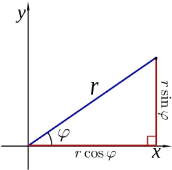

:author: Jérôme Kieffer
:email: jerome.kieffer@esrf.fr
:institution: European Synchrotron Radiation Facility, Grenoble, France

:author: Giannis Ashiotis
:email: giannis.ashiotis@gmail.com
:institution: European Synchrotron Radiation Facility, Grenoble, France

-------------------------------------------------------------------------
PyFAI: a Python library for high performance azimuthal integration on GPU
-------------------------------------------------------------------------

.. class:: abstract

   The pyFAI package has been designed to transform X-ray diffraction images
   into powder diffraction curves to be further processed by scientists
   (like Rietveld refinement, ...)
   This contribution describes how to transform an image into a radial profile
   using the Numpy package, how the process was accelerated using Cython and
   how the algorithm was parallelize, needing a complete re-design to take benefit
   of massively parallel devices like graphical processing units or accelerator like
   the Intel Xeon Phi thanks to PyOpenCL.

.. class:: keywords

   X-rays, powder diffraction, HPC, parallel algorithms, OpenCL

Introduction
============

The Python programming language is widely adopted in the scientific community
and especially in crystallography, this is why a  convenient azimuthal integration
routine, one of the basic algorithm, was requested by the synchrotron community.
The advent of pixel-detectors with their very high speed (about 1000 frames per seconds)
imposed strong constrains in speed that most available programs (FIT2D, SPD, ...),
while written in FORTRAN or C, could not meet.

The pyFAI project started in 2011 and aims at providing a convenient Pythonnic interface
for azimuthal integration, so that any crystallographer can adapt it to the type of experiment
he is interested in.
This contribution describes how one of the most fundamental
algorithm used in crystallography has been implemented in Python
and how it was accelerated to reach the performances of today's fastest detectors.

After the description of the experiment and the explanation of what is measured and how it must be transformed in paragraph 2,
the paragraph 3 exposes how the algorithm can be vectorized using numpy and speeded up with cython.

The parallelization of this algorithm beeing not very efficient we seeked for a completely parallel implementation,
this time based on OpenCL (and interfaced using PyOpenCL)

Description of the experiment
=============================

An X-ray is an electromagnetic wave, like light except that its wavelength is much smaller, of
the size of an atom, making it a perfect probe to analyze atoms and molecules.
This X-ray is scattered (re-emitted with the same energy) by the electron cloud surrounding atoms.
When atoms are arranged periodically (in a crystal), they behave like grattings for X-ray and reflect light with given angles.
An X-ray beam crossing a powder sample made of many small crystals is then scattered along multiple concentric cones.
In a powder diffraction experiment, one aims at measuring the intensity of X-rays as function of the opening of the cone, averaged along each ring.
This transformation is called "azimuthal integration" as it is an averaging of the signal along the azimuthal angle.

.. figure:: HEX-2D-diffraction.png

   Debye-Scherrer cones obtained from diffraction of a monochromatic X-Ray beam by a powder of crystallized material. (Credits: CC-BY-SA  Klaus-Dieter LisS) :label:`diffraction`

Azimuthal integration
=====================

While pyFAI addresses the needs of both single and bi-dimentional integration with various scattering spaces,
this contribution focuses on the algorithmic and implementation part. The output spaces implemented are :

* r = sqrt(x*x+y*y)
* :math:`\chi` = arctan(y/x)
* :math:`2\theta` = arctan(r/d)
* q = 4 :math:`\pi` sin(:math:`2 \theta` / 2)/:math:`\lambda`

The description made in this paper is limited the description of 1D full azimuthal
integration with a planar detector orthogonal the incoming beam,
in this case the conic drawn on the detector are concentric circles.

http://upload.wikimedia.org/wikipedia/commons/thumb/7/78/Polar_to_cartesian.svg/250px-Polar_to_cartesian.svg.png

   Conversion for cartesian to polar coordinates. The general case is usually more complicated than that.
    
Test case
---------

To let the reader have an idea of the scale of the problem and the performances needed, we will work on
the simulated image of gold powder diffracting an X-Ray beam of wavelength = 1.0e-10m (the intensities of all rings are the same).
The detector, which has a pixel size of 1e-4m (2048x2048 pixels), is placed at 0.1 m from the sample, orthogonal to the incident beam, and centered.
The Figure :ref:`rings` represents the input diffraction image on the left sub-plot and the integrated profile along the azimuthal angle on the right side.
The radial unit in this case is simply the radius calculated from :math:`r=\sqrt{(x - x_c)^2 + (y - y_c)^2}`, while in crystallographers woul have preferred :math:`2\theta` or q.

.. figure:: rings2.png

   Simulated powder diffraction image (left side) and integrated profile (right).  :label:`rings`

Naive implementation
--------------------

The initial step of any implementation is to calculate the radius array, giving the previous formula.
Using numpy's slicing feature one can extract all pixels which are between r1 and r2 and average out their values:

.. code-block:: python

   def azimint_naive(data, npt, radius):
       rmax = radius.max()
       res = numpy.zeros(npt)
       for i in range(npt):
           r1 = rmax * i / npt
           r2 = rmax * (i+1) / npt
           mask_r12 = numpy.logical_and((r1 <= radius), 
                        (radius < r2))
           values_r12 = data[mask_r12]
           res[i] = values_r12.mean()
       return res

The slicing operation takes tens of millisecond and needs to be repeated thousands of times for a sing image,
making each integration last 40 seconds, which is unacceptably slow. :label:`naive`

Numpy histograms
----------------

The naive formulation made in :ref:`naive` can be re-written using histograms.
The mean call can be replaced with the ratio of the sum of all values divided by the number of pixel contributing:

.. code-block:: python

    values_r12.mean() = values_r12.sum() / mask_r12.sum()

The denominator, mask_r12.sum(), can be obtained from the histogram of r values and the numerator from the weighted histogram of radius weighted by the intensity in the image:

.. code-block:: python

   def azimint_hist(data, npt, radius):
       hist1 = np.histogram(radius, npt)[0]
       histw = np.histogram(radius, npt, weights=data)[0]
       return histw / hist1

This new implementation takes about 800ms which is much faster than the loop written in Python
but can be optimized by reading only once the radius array from central memory (cache re-use optimization).

Cython implementation
---------------------

Histograms were re-implemented using Cython to perform simultaneously the
weighted and the un-weighted histogram with a single memory read of  the radius array.
The better use if the caches decreases the integration time to 150ms on a single core.

OpenMP support in Cython
........................

To accelerate further the code we decided to parallelize the cython code thanks to OpenMP.
While the implementation was quick, the result we got were wrong (by a few percent) due to
write conflicts, not protected by atomic_add operation. Apparently the use of atomic operation is
still not yet possible in Cython (summer 2014).
Multithreaded histogramming was made possible by using as many histograms as threads, which implies to allocate much more memory.

.. table:: Execution speed measured on a pair of Xeon E5520 (2x 4-core hyperthreaded at 2.2 GHz) :label:`Cython`

   +----------------+--------------------+
   | Implementation | Execution time (ms)|
   +----------------+--------------------+
   | loop + mean    | 44000              |
   +----------------+--------------------+
   | np.histogram   | 829                |
   +----------------+--------------------+
   | Cython 1_th    | 149                |
   +----------------+--------------------+
   | Cython 2_th    |  81                |
   +----------------+--------------------+
   | Cython 4_th    |  59                |
   +----------------+--------------------+
   | Cython 8_th    |  41                |
   +----------------+--------------------+
   | Cython 16_th   |  48                |
   +----------------+--------------------+

The speed-up measured when going from 4 threads to 8 threads (i.e. from one processor to two)
is very small showing we reach the limits of the algorithm.
The only way to go faster is to start thinking in parallel from beginning
and re-design the algorithm so that it works natively with lots of threads.
This approach is the one taken by OpenCL where thousands of threads are virtually running in parallel.
This will be described in paragraph 5.

Pixel splitting
===============

Pixel splitting is what occurs when a pixel of the detector spans over more than one of the bins of the histogram.
When that happens, the contribution to each of the involved bins is assumed to be proportional to the area of the pixel segment that falls into that bin.
The goal behind the addition of that extra complexity to the code is that the results obtained this way owe to be less noisy than the case where pixel splitting is ignored.
This becomes more apparent when the number of pixels falling into each bin is small like for example on bidimentional integration.
Figure :ref:`bidimentional` presents such an integration performed using histograms on the left side, hence without pixel splitting which exhibits some high frequency patterns near the beam center.
The right hand side image was produced using pixel splitting and is unharmed by such defects related to the low statistics.
Note that for 2D integration this transformation looks like an interpolation, but interpolation never garanties the conservation of the signal :math:`\sum{image} = \sum{ weighted\ histogram }`
nor the conservation of pixels :math:`\sum{ unweigted\ histogram } = number\ of\  pixels`.

.. figure:: integrate2d.png

   Bi-dimentional azimuthal integration of the gold diffraction image using (right side) or not pixel splitting  :label:`bidimentional`
 
Bounding Box
------------

The first way pixel splitting was implemented was with a bounding box like in Fit2D :ref:`FIT2D`.
In this case we are abstracting the pixel, which is represented by a center point and a span, with an orthogonal box that circumscribes it.
Two sides are parallel to the radial axis, and the other sides, are equal to the unit.
Now instead of calculating the contribution of each segment of the pixel based on its area, we do that using the area of the bounding box segment instead.
This greatly simplifies the algorithm, giving out good performance.

The algorithm loops over all of the pixels of the detector, adding their contribution to the appropriate bins.
When the whole pixel falls into only one bin, we don’t have pixel splitting and we proceed as previously.
If the pixel spans over more than one bin, the contribution of the two most outward bins (left and right) is calculated first, and added to the correcponding bins' histograms.
Then the remaining contribution is evently distributed among the “internal” bins (if any).
Finally the ratio of the two histograms is calculated and returned.

The conterpart of this simplistic pixel splitting is an overestimation of the pixel's size hence a slight blurring of the signal.

Full Pixel Splitting
--------------------

In an effort to farther improve the results of the azumithal integration, another pixel-splitting scheme was devised.
This time, no abstraction takes place and the pixel-splitting is done using the area of the actual pixel segments (assuming they are straight lines).
This introduces some extra complexity to the calculations, making the process a bit slower.

As before, we first have to check if pixel splitting occurs.
In the case it does not, the pixel is processed as before.
Otherwise we have to handle the pixel splitting.
This is done by firstly defining a function for each of the sides of the pixel in-question.
That is, calculating the slope and the point of intersection.
We’ll also require the area of the pixel.
Next we loop over the bins that the pixel spans over and proceed to integrate the four functions we’ve previously defied in that interval.
Taking the absolute value of the sum of all those contributions will give us the area of the pixel segment.
The hard part here was to define the limits of each of the integrals in a way that wouldn’t hinder the performance by adding allot of conditionals.
The contribution to the histograms is calculated in a similar fashion as before.

Discussion on the statistics
----------------------------

Using either of the two pixel splitting algorithms results in some side effects that the user should be aware of:
The fact that pixels contributing to neighboring bin of the histogram creates some cross-correlation between those bins, affecting this way the statistics of the final results in a potentially unwanted manner.

More paralleliztion
===================

For faster execution, one solution is to use faster hardware, like for example
Graphical Processing Units (GPU) or
accelerators, for instance the Xeon-Phi from Intel.
Those chips allocate more silicon for computing (ALU)
and less to branch prediction, memory prefetecher and cache coherency, in comparison to CPU.
Our duties as programmers is to write the code that maximises the usage of ALUs
without relying on pre-fetcher and other commodities offered by normal processors.

Typical GPU have tens (to hundreeds) of compute units able to schedule and run dozens of threads simultaneously (in a Single Instruction Multiple Data way).
OpenCL allows to execute the same code on processors, graphics cards or accelerator but we will highlight the memory access pattern is important in order to best use them.
Finally, OpenCL uses on the fly compilation which, at usage, looks very much
like Python interpreted code when interfaced with PyOpenCL
(thanks to the speed of compilation and the memoizing of the binary generated).

.. table:: Few OpenCL devices we have tested our code on. :label:`Devices`
    :class: w

    +--------------------+-----------+-----------+---------+---------+---------------+-----------+
    | Vendor             | Intel     | AMD       | AMD     | Nvidia  | Nvidia        | Intel     |
    +--------------------+-----------+-----------+---------+---------+---------------+-----------+
    | Model              | 2 E5-2667 | 2 E5-2667 | V7800   | K20     | GeForce 750Ti | Phi       |
    +--------------------+-----------+-----------+---------+---------+---------------+-----------+
    | Type               | CPU       | CPU       | GPU     | GPU     | GPU           | ACC       |
    +--------------------+-----------+-----------+---------+---------+---------------+-----------+
    | Compute Unit       | 12        | 12        | 5       | 13      | 5             | 4*69      |
    +--------------------+-----------+-----------+---------+---------+---------------+-----------+
    | Compute Element/CU | 8:AVX256  | 4:SSE     | 288     | 4*8:Warp| 4*8:Warp      | 16:AVX512 |
    +--------------------+-----------+-----------+---------+---------+---------------+-----------+
    | Core frequency     | 2900 MHz  | 2900 MHz  | 700 MHz | 705 MHz | 1100 MHz      | 1052      |
    +--------------------+-----------+-----------+---------+---------+---------------+-----------+

Parallel algorithms
-------------------

Parallelization of complete algorithms consists most of the time in their decomposition into parallel blocks.
There are a few identified parallel building blocks like:

- Map: apply the same function on all element of a vector
- Scatter: write multiple output from a single input, needs atomic operation support
- Gather or Stencil: write a single output from multiple inputs
- Reduction: single result from a large vector input, like an inner product
- Scan: apply subsequently an operation to all preceeding elements on an vector like numpy.cumsum
- Sort: There are optimized sorter for parallel implementation.

Those parallel building blocks will typically be one (or few) individual
kernel as kernel execution synchronizes the global memory in OpenCL.
Parallel algorithmics is how to then assemble those blocks to implement requested features.

Parallel azimuthal integration
------------------------------

The azimuthal integration, like histograms, are scatter operation hence require
the support of atomic operations.
As Cython does not (yet) support atomic operation, enabling OpenMP parallelization
results in a module, while functional, giving wrong results (we measured 2%
errors on 8 cores)

To overcome this limitation; instead of looking at where input pixels go to
in the output curve,
we instead look at where the output bin come from in the input image.
This transformation is called a “scatter to gather” transformation and needs atomic operation.
In our case, it was implemented as a single threaded Cython module.

The correspondence between pixels and output bins can be stored in a look-up table (LUT)
together with the pixel weight (ratio of areas) which make the integration look like a simple
(if large and sparse) matrix vector product.
This look-up table size depends on whether pixels are split over multiple bins
and to exploit the sparse structure, both index and weight of the pixel have to be stored.

By making this change we switched from a “linear read / random write” forward algorithm to a
“random read / linear write” backward algorithm which is more suitable for parallelization.

Optimization of the sparse matrix multiplication
................................................

The compressed sparse row (CSR) sparse matrix format was introduced to reduce the size of the dat stored in the LUT.
This algorithm was implemented both in [Cython]-OpenMP and OpenCL.
Our CSR representation contains data, indices and indptr so it is is fully compatible with scipy.sparse.csr.csr_matrix contructor
The CSR approach has a double benefit: first, it reduces the size of the storage needed compared to the LUT by a factor two to three,
offering the opportunity of working with larger images on the same hardware.
Secondly, the CSR implementation in OpenCL is using an algorithm based on multiple parallel reductions
where all threads within a workgroup are collaborating to calculate the content of a single bin.
This makes it very well suited to run on GPUs and accelerators where hundreds to thousands of simultaneous threads are available.

About precision of calculation
..............................

Knowing the tight energy constrains in computing, the future of high performance computing
depends on the capability of programs to use the right precision for their calculation.
As out detectors provide a sensitivity of 12 to 20 bits/pixel, performing all calculation
in double precision (with 52 bits mantissa) looks over-sized  and the 24 bits of mantissa
of single precision float looks better adapted (with no drop of precision).
Moreover, GPU devices provide much more computing power in single precision than in double,
this factor varies from 2 on high-end professional GPU like Nvida Tesla to 24 on most consumer grade devices.

When using OpenCL for the GPU we used a compensated (or Kahan_summation), to reduce the error accumulation in the histogram summation (at the cost of more operations to be done). This allows accurate results to be obtained on cheap hardware that performs calculations in single precision floating-point arithmetic (32 bits) which are available on consumer grade graphic cards. Double precision operations are currently limited to high price and performance computing dedicated GPUs. The additional cost of Kahan summation, 4x more arithmetic operations, is hidden by smaller data types, the higher number of single precision units and that the GPU is usually limited by the memory bandwidth anyway.

The performances of the parallel implementation based on a LUT, stored in CSR format, can reach 750 MPix/s on recent multi-core computer with a mid-range graphics card. On multi-socket server featuring high-end GPUs like Tesla cards, the performances are similar with the additional capability to work on multiple detector simultaneously.

Of course, no paper would be complete without some source code.  Without
highlighting, it would look like this::

   def sum(a, b):
       """Sum two numbers."""

       return a + b

With code-highlighting:

.. code-block:: python

   def sum(a, b):
       """Sum two numbers."""

       return a + b

Maybe also in another language, and with line numbers:

.. code-block:: c
   :linenos:

   int main() {
       for (int i = 0; i < 10; i++) {
           /* do something */
       }
       return 0;
   }

Or a snippet from the above code, starting at the correct line number:

.. code-block:: c
   :linenos:
   :linenostart: 2

   for (int i = 0; i < 10; i++) {
       /* do something */
   }

Important Part
**************

It is well known [Atr03]_ that Spice grows on the planet Dune.  Test
some maths, for example :math:`e^{\pi i} + 3 \delta`.  Or maybe an
equation on a separate line:

.. math::

   g(x) = \int_0^\infty f(x) dx

or on multiple, aligned lines:

.. math::
   :type: eqnarray

   g(x) &=& \int_0^\infty f(x) dx \\
        &=& \ldots

The area of a circle and volume of a sphere are given as

.. math::
   :label: circarea

   A(r) = \pi r^2.

.. math::
   :label: spherevol

   V(r) = \frac{4}{3} \pi r^3

We can then refer back to Equation (:ref:`circarea`) or
(:ref:`spherevol`) later.

Mauris purus enim, volutpat non dapibus et, gravida sit amet sapien. In at
consectetur lacus. Praesent orci nulla, blandit eu egestas nec, facilisis vel
lacus. Fusce non ante vitae justo faucibus facilisis. Nam venenatis lacinia
turpis. Donec eu ultrices mauris. Ut pulvinar viverra rhoncus. Vivamus
adipiscing faucibus ligula, in porta orci vehicula in. Suspendisse quis augue
arcu, sit amet accumsan diam. Vestibulum lacinia luctus dui. Aliquam odio arcu,
faucibus non laoreet ac, condimentum eu quam. Quisque et nunc non diam
consequat iaculis ut quis leo. Integer suscipit accumsan ligula. Sed nec eros a
orci aliquam dictum sed ac felis. Suspendisse sit amet dui ut ligula iaculis
sollicitudin vel id velit. Pellentesque hendrerit sapien ac ante facilisis
lacinia. Nunc sit amet sem sem. In tellus metus, elementum vitae tincidunt ac,
volutpat sit amet mauris. Maecenas diam turpis, placerat at adipiscing ac,
pulvinar id metus.

.. figure:: benchmark.png

   This is the caption. :label:`egfig`

.. figure:: benchmark.png
   :align: center
   :figclass: w

   This is a wide figure, specified by adding "w" to the figclass.  It is also
   center aligned, by setting the align keyword (can be left, right or center).

.. figure:: benchmark.png
   :scale: 20%
   :figclass: bht

   This is the caption on a smaller figure that will be placed by default at the
   bottom of the page, and failing that it will be placed inline or at the top.
   Note that for now, scale is relative to a completely arbitrary original
   reference size which might be the original size of your image - you probably
   have to play with it. :label:`egfig2`

As you can see in Figures :ref:`egfig` and :ref:`egfig2`, this is how you reference auto-numbered
figures.

.. table:: This is the caption for the materials table. :label:`mtable`

   +------------+----------------+
   | Material   | Units          |
   +------------+----------------+
   | Stone      | 3              |
   +------------+----------------+
   | Water      | 12             |
   +------------+----------------+
   | Cement     | :math:`\alpha` |
   +------------+----------------+

We show the different quantities of materials required in Table
:ref:`mtable`.

.. The statement below shows how to adjust the width of a table.

.. raw:: latex

   \setlength{\tablewidth}{0.8\linewidth}

.. table:: This is the caption for the wide table.
   :class: w

   +--------+----+------+------+------+------+--------+
   | This   | is |  a   | very | very | wide | table  |
   +--------+----+------+------+------+------+--------+

Perhaps we want to end off with a quote by Lao Tse:

  *Muddy water, let stand, becomes clear.*

.. Customised LaTeX packages
.. -------------------------

.. Please avoid using this feature, unless agreed upon with the
.. proceedings editors.

.. ::

..   .. latex::
..      :usepackage: somepackage

..      Some custom LaTeX source here.

References
==========

References can be found in
https://github.com/kif/pyFAI_publi/blob/master/biblio.bib
and need to be formated

.. [Cython] TODO
.. [PyOpenCL] TODO
.. [Atr03] P. Atreides. *How to catch a sandworm*,
           Transactions on Terraforming, 21(3):261-300, August 2003.

