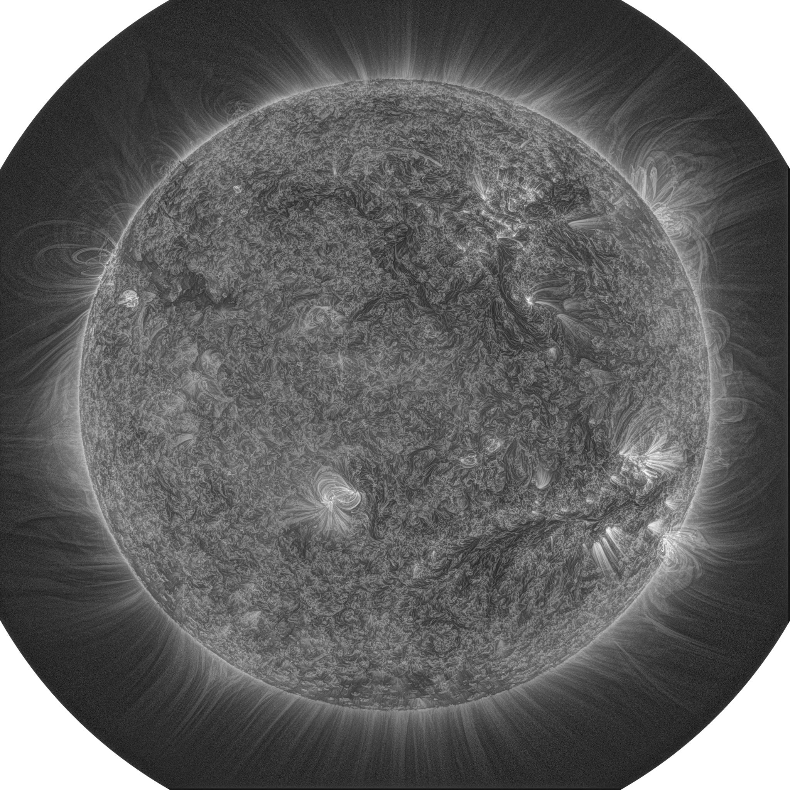
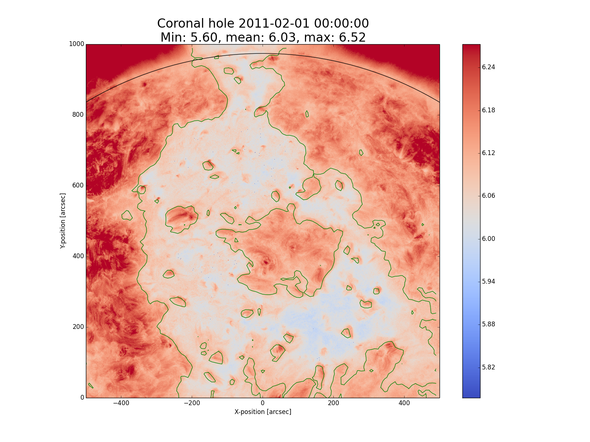
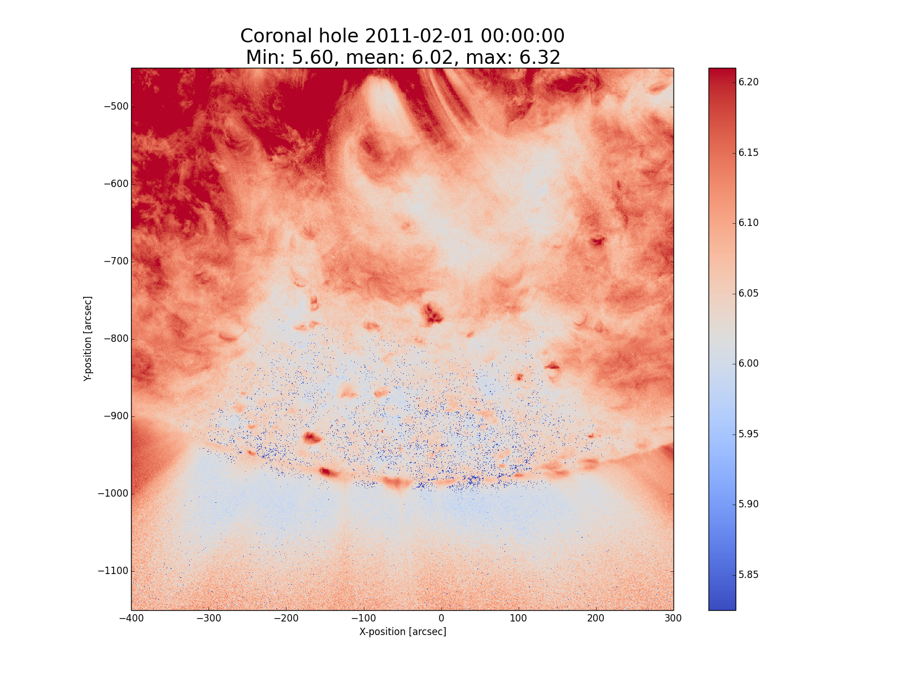
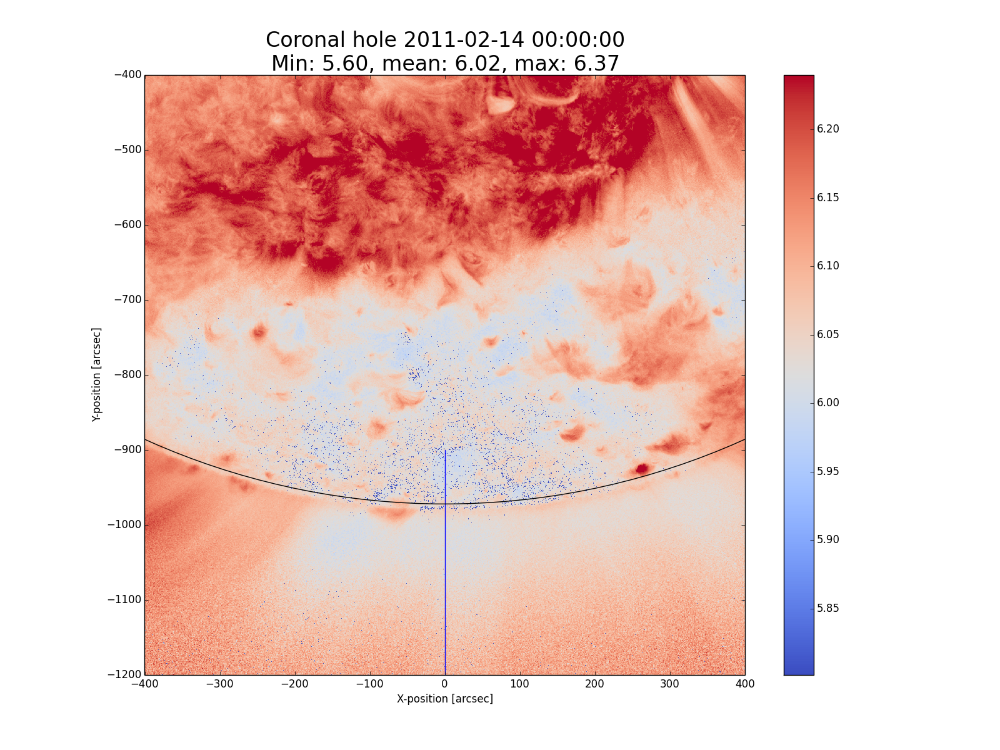
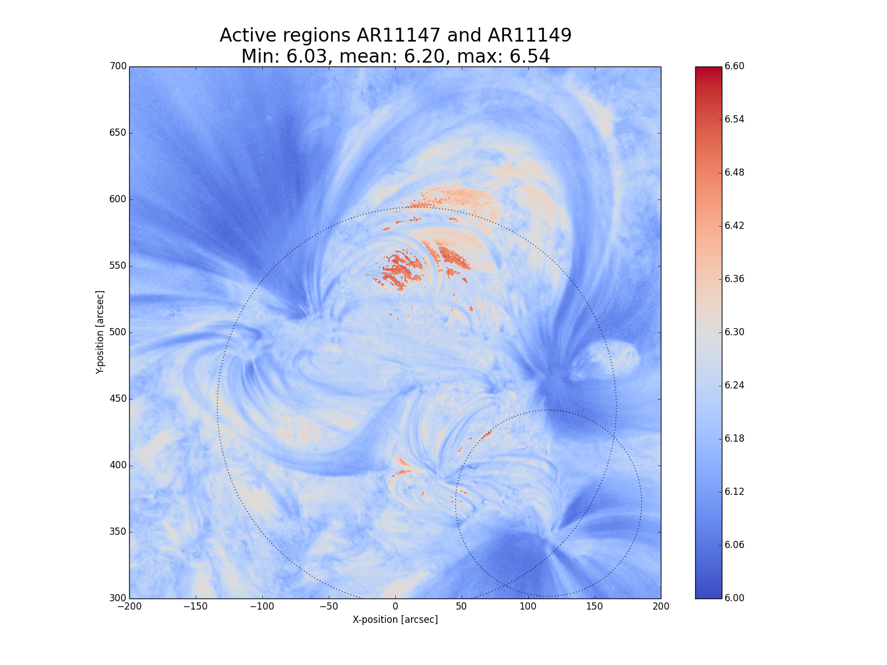
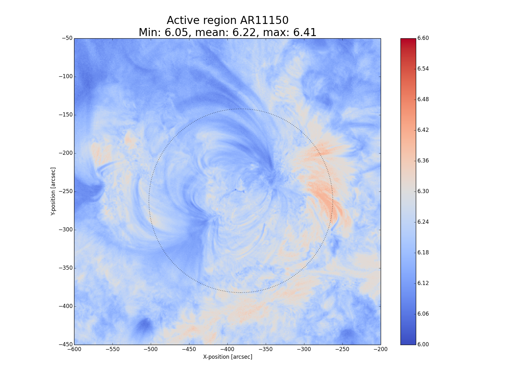
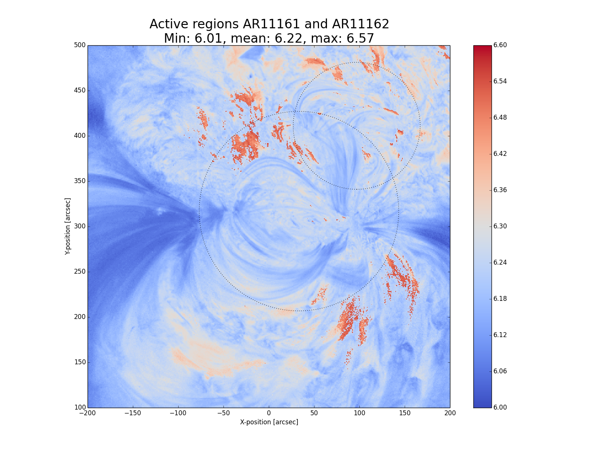

:author: Andrew Leonard
:email: ajl7@aber.ac.uk
:institution: Institute of Mathematics, Physics and Computer Science, Aberystwyth University, Ceredigion, SY23 3BZ, Wales

:author: Huw Morgan
:email: hum2@aber.ac.uk
:institution: Institute of Mathematics, Physics and Computer Science, Aberystwyth University, Ceredigion, SY23 3BZ, Wales

-----------------------------------------------------------
Temperature diagnostics of the solar atmosphere using SunPy
-----------------------------------------------------------

.. class:: abstract

    The solar atmosphere is a hot (~1MK), magnetised plasma of great 
    interest to physicists. There have been many previous studies of the 
    temperature of the Sun's atmosphere. Almost all of these studies use the 
    SolarSoft software package written in the commercial Interactive Data 
    Language (IDL), which has been the standard language for solar physics.
    The SunPy project aims to provide an open-source library for solar physics. 
    This work presents (to the authors' knowledge) the first study of its type 
    to use SunPy rather than SolarSoft.

    This work uses SunPy to process multi-wavelength solar observations made by 
    the Atmospheric Imaging Assembly (AIA) instrument aboard the Solar Dynamics 
    Observatory (SDO) and produce temperature maps of the Sun's atmosphere. The 
    method uses SunPy's utilities for querying databases of solar events, 
    downloading solar image data, storing and processing images as spatially 
    aware Map objects, and tracking solar features as the Sun rotates. An 
    essential consideration in developing this software is computational 
    efficiency due to the large amount of data collected by AIA/SDO, and in 
    anticipating new solar missions which will result in even larger sets of 
    data. An overview of the method and implementation is given, along with 
    tests involving synthetic data and examples of results using real data for 
    various regions in the Sun's atmosphere.

.. class:: keywords

    solar, corona, data mining, image processing

Introduction
------------

The solar corona is a hot (~1MK) magnetised plasma. Such an environment, 
difficult to reproduce in a laboratory, is of great importance in physics (e.g. 
basic plasma physics, development of nuclear fusion). It is important also in 
the context of general astronomy, in understanding other stars and the 
mechanisms which heat the corona - considered one of the major unanswered 
questions in astronomy. On a more practical level, with our society's 
growing reliance on space-based technology, we are increasingly prone to the
effects of geoeffective solar phenomena such as flares and Coronal Mass 
Ejections (CMEs). These can damage the electronic infrastructure which plays an
essential role in our modern society. In order to be able to predict these
phenomena, we must first understand their formation and development. The
sources of energy for these events can cause localised heating in the corona,
and coronal temperature distributions are therefore a widely studied topic
within solar physics. Active regions, which are regions of newly-emerged
magnetic flux from the solar interior associated with sunspots, are of
particular interest since they are often the source regions for the most
damaging eruptive events and the distribution of temperatures can give us
unique and valuable information on the initial conditions of eruptions.

It is not yet technologically feasible to send probes into the low coronal 
environment. Our current understanding of the corona is based on remote-sensing 
observations across the electromagnetic spectrum from radio to X-ray. Previous 
studies have found coronal temperatures ranging from ~0.8MK in coronal hole 
regions, ~1MK in quiet Sun regions and from 1-3MK within active regions. 
Eruptive events and flares can produce even higher temperatures in small 
regions for a short period of time (see, e.g., [Awasthi2014]_). This work is 
based exclusively on images of the low corona taken in Extreme Ultra-Violet 
(EUV) using AIA/SDO [Lemen2011]_. AIA allows us, for the first time, to produce 
reliable maps of the coronal temperature with very fine spatial and temporal 
resolution.

An overview of the AIA instrument is given in section :ref:`instmeth`, along 
with an introduction to the theory of estimating temperature from spectral 
observation. The method is tested by creating synthetic AIA data created from a 
coronal emission model in section :ref:`modeltests`. The method is applied to 
AIA data in section :ref:`results` and the results compared to those of 
previous studies. Discussion and Conclusions are given in section :ref:`disc`.

Instrumentation & Method
------------------------
:label:`instmeth`

Overview of AIA/SDO
~~~~~~~~~~~~~~~~~~~~~~~~~~~~~~~~~

The AIA on NASA's SDO satellite [Lemen2011]_ was launched in February 2010 and started 
making regular observations in March 2010. AIA takes a 4096 x 4096 full-disk image of 
the corona in each of ten wavelength channels every ~12 seconds, with a 
resolution of ~1.2 arcsec per pixel. Seven of these channels observe within the
EUV wavelength range, of which six are each dominated by emission from a 
different Fe ion. Figure :ref:`exampleAIAimage` shows an example AIA image 
using the 17.1nm channel. It has been processed to enhance smaller-scale 
features using a newly-developed method [Morgan2014]_. The intensity measured 
in each of the six narrow-band Fe channels (9.4nm, 13.1nm, 17.1nm, 19.3nm, 21.1nm
and 33.5nm) is dominated by a spectral line of iron at a specific stage of 
ionisation. Simply speaking, therefore, they correspond to different 
temperatures of the emitting plasma. The fact that there are six channels 
observing simultaneously means that the temperature of the corona can be 
effectively constrained [Guennou2012]_. Another advantage is that relative 
elemental abundances do not need to be considered when using emission from only 
one element, thus reducing the associated errors. AIA is therefore beginning to 
be widely used for this type of study (e.g. [Aschwanden2011]_), as its very high 
spatial, temporal and thermal resolution make it an excellent source of data 
for investigating the temperatures of small-scale and/or dynamic features in 
the corona, as well as for looking at global and long-term temperature 
distributions. 

It is important that the large amount of data produced by AIA 
can be analysed quickly. A way of calculating coronal temperatures in real-time 
or near real-time would be extremely useful as it would allow temperature maps 
to be produced from AIA images as they are taken. Computational efficiency was 
therefore one of our most important criteria when designing the method for use 
with AIA data.

    A typical image from the 17.1nm channel of AIA, which has been enhanced to
    show small-scale features more clearly.
    :label:`exampleAIAimage`

The Differential Emission Measure
~~~~~~~~~~~~~~~~~~~~~~~~~~~~~~~~~

Coronal emission lines originate from a wide range of ions which form at 
different temperatures. By using multi-wavelength observations of the corona to
compare the brightnesses of the emission due to these ions, one can infer the 
temperature of the corona at the location of the emission. This temperature is 
usually expressed in terms of the Differential Emission Measure (DEM), which 
describes the column electron density for a given line-of-sight (LOS) as a 
function of temperature:

.. math::
    
    \textrm{DEM}(T)=n_{e}^{2}\frac{\textrm{d}z}{\textrm{d}T}

where :math:`n_{e}^{2}\,\textrm{d}z` is the emission measure (EM), which tells 
us the total electron density along that LOS for all temperatures. The width of
the DEM provides a measure of how multi-thermal the plasma is, and the peak 
temperature is the dominant temperature, i.e., the temperature of the majority
of the plasma.

The intensity measured by pixel :math:`x` of a particular channel :math:`i` on
an instrument can be expressed as a convolution of the DEM and the temperature
response function :math:`K_{i}` of the instrument:

.. math::
    :label: pixelval

    I_{i}(x)=\int_{0}^{\infty}K_{i}(T)\,\textrm{DEM}(T,x)\,\textrm{d}T

The temperature response combines the wavelength response of the instrument and
the contribution function, which describes the emission of the plasma at a 
given temperature based on atomic physics models. Unfortuately, equation 
:ref:`pixelval` is an ill-posed problem and as such there exists no unique 
solution without imposing physical contraints [Judge1997]_. Multiple schemes
have been designed to invert this equation and infer the DEM by applying
various physical assumptions. However, these assumptions are sometimes
difficult to justify and the accuracy of the results is also reduced by the
typically high errors on solar measurements. The physical constraints assumed
by this method are discussed in Section :ref:`DEMfinding`.

This work presents an extremely fast method of estimating the temperature of 
coronal plasma from AIA images. This method is implemented using the 
SunPy solar physics library (www.sunpy.org_) and produces results comparable to 
those of other methods but in a fraction of the time. The current 
implementation of the method is designed primarily with efficiency in mind.

Preprocessing
~~~~~~~~~~~~~

Level 1.0 AIA data were obtained using SunPy's wrappers around the Virtual 
Solar Observatory. These data were corrected for exposure time and further 
processed to level 1.5. This extra level of processing provides the correct spatial coalignment necessary for a quantitative comparison of the different channels. To this end, the AIA images 
used were processed using the SunPy ``aiaprep()`` function to ensure that all 
images used were properly rescaled and coaligned. ``aiaprep()`` rotates the
images so that solar north points to the top of the image, scales them so that
each pixel is exactly 0.6 arcsec across (in both the x and y directions), and
recentres them so that solar centre coincides with the centre of the image.
This is achieved using an affine transform and bi-cubic interpolation. 
All images were then normalised by dividing the intensity measured in each
pixel by the intensity in the corresponding pixel in the 17.1nm image. The
17.1nm image was therefore 1 in all pixels, and the images from all other
channels are given as a ratio of the 17.1nm intensity.

Temperature response functions
~~~~~~~~~~~~~~~~~~~~~~~~~~~~~~

Temperature response functions can be calculated for each of the AIA channels 
using the equation:

.. math::
    :label: temp_response

    K_{i}(\mathrm{T})=\int_{0}^{\infty}G(\lambda,\mathrm{T})\, R_{i}(\lambda)\,\mathrm{d}\lambda

where :math:`R_{i}(\lambda)` is the wavelength response of each channel 
:math:`i` and :math:`G(\lambda,\mathrm{T})` is the contribution function 
describing how radiation is emitted by the coronal plasma. For this work the 
AIA temperature response functions were obtained using the IDL aia_get_response
function (for which no equivalent exists yet in SunPy) and an empirical 
correction factor of 6.7 was applied to the 9.4nm response function for 
:math:`log(T)\le 6.3`, following the work of [Aschwanden2011b]_. These response 
functions were saved and reloaded into Python for use with this method. As with 
the AIA images, each of these response functions was normalised to the 17.1nm 
response by dividing the value at each temperature by the corresponding value 
for 17.1nm.

DEM-finding procedure
~~~~~~~~~~~~~~~~~~~~~
:label:`DEMfinding`

The general method for estimating the DEM is an iterative procedure which tests
multiple possible DEMs. Each DEM is substituted into equation 1 to produce a 
synthetic pixel value for each AIA wavelength channel (i). This expected 
outcome is then compared to the actual values measured for all pixel positions 
(x) in each wavelength, giving a goodness-of-fit value for each pixel for a 
given DEM (equation :ref:`goodness-of-fit`), defined by the difference in pixel
values averaged over all wavelength channels:

.. math::
    :label: goodness-of-fit

    \mathrm{fit}(x)=\frac{1}{n_{i}}\sum_{i}{|I_{measured}(x,i)-I_{synth}(x,i)|}

Since the synthetic emission values do not change unless one wishes to apply 
different assumptions which affect the temperature response (electron density, 
ionisation equilibrium, etc.), the calculation time for the method can be 
reduced by saving these emission values and reusing them for each comparison. 
By repeating this calculation with a number of assumed DEMs, the DEM 
corresponding to the smallest goodness-of-fit value provides an estimate of the
actual plasma temperature distribution.

For this kind of iterative method to find a solution within a feasible amount 
of time, a general DEM profile must be assumed. A Gaussian profile is a good choice for the following reasons:

- it can be fully described 
  by only three parameters, i.e.: the mean, width and height of the Gaussian, 
  which correspond to the dominant temperature, the degree of multithermality 
  and the EM respectively. Because of this parameterisation, a Gaussian is 
  well-suited to this type of method and is also a useful way to describe 
  important properties of the plasma even if it does not perfectly represent 
  the actual distribution of temperatures;
- other authors have typically found multithermal DEMs, but with relatively 
  narrow widths ([Warren2008]_). [Aschwanden2011b]_ found that a narrow 
  Gaussian DEM fit the observations with :math:`\chi^{2}\leq 2` for 66% of 
  cases studied, so this distribution should provide a good approximation for 
  the plasma in the majority of pixels. In particular, it is likely that active
  region loops have a distribution of temperature and density which makes 
  a narrow Gaussian a physically sensible choice for the shape of the plasma 
  DEM. It is likely that emission from loops will dominate the measured
  emission in the corresponding pixels;
- since other studies have used a Gaussian DEM, using the same shape in this 
  work allows a direct comparison between the relative merits of the 
  methods themselves, without any disparity in the results caused by different DEM profiles.

Though this particular study uses a Gaussian DEM, the method could also be used
with DEMs of any other form, such as a delta function,
top hat function, polynomial, etc. A comparison of the effect of using some of 
these shapes can be found in [Guennou2012a]_. An active area of research is the 
emission of plasma with a Kappa energy distribution |---| which approximates
the bulk Gaussian DEM with a high-energy population [Mackovjak2014]_.

A Fortran extension to the main code was written to iterate through each 
DEM peak temperature value for each pixel in the image, and to calculate the
corresponding goodness-of-fit value. Since the images used are very large (six
4096 x 4096 images for each temperature map), only the running best fit value 
and the corresponding temperature are stored for each pixel. The temperatures 
which best reproduce the observations are returned to the main Python code.
Although the DEM inherently describes a multi-thermal distribution,
only the temperature of the peak of the DEM is stored and displayed in the 
temperature maps. This value is useful as it is the temperature which 
corresponds to the bulk temperature, and expressing the
DEM as a single value also aids visualisation.

The DEM peak temperatures considered ranged from :math:`\log T = 5.6 - 7.0`, in
increments of 0.01 in log temperature. Outside this range of temperatures, AIA
has significantly lower temperature response and cannot provide meaningful
results. Within this range, however, the temperature is well constrained by the
response functions of the AIA channels [Guennou2012]_ and can in principle be 
calculated with a precision of ~0.015 [Judge2010]_.

The code takes a simplified approach by finding only the peak temperature of 
the DEM, and assuming the height and width to be fixed. They could instead be
found using the same iterative approach, but this would significantly increase
the paramater space and reduce the method's efficiency. A proper comparison of
the results of this method and of one with a larger parameter space are beyond
the scope of this work, and will be the topic of a subsequent paper.

The width of the DEM was set to be 0.1 and since the data are normalised
relative to a given wavelength, the DEM is also normalised to unity. A narrow
width is selected for the DEM because, as shown by [Guennou2012a]_, the greater
the width of the plasma DEM, the less likely it is that the inversion will
correctly determine the DEM peak temperature (this is also shown by the tests
described in section :ref:`modeltests`. With a narrow assumed width, plasmas
which do have narrow DEMs will at least be correctly identified, whereas
plasmas with a wide DEM would not necessarily be correctly identified by using 
a model DEM with a similar width. A Gaussian with a width of ~0.1 
is the narrowest multi-thermal distribution which can be distinguished from an 
isothermal plasma [Judge2010]_, so a narrower distribution would not 
necessarily provide meaningful results.

This method is very similar in principle to the Gaussian fitting methods used 
by [Warren2008]_ and [Aschwanden2011]_. However, great computational efficiency
is achieved by only varying one parameter (the bulk temperature). Since the
height and width of the DEM are not investigated, this method may be less
accurate than a full parameter search would be and does not provide a full DEM
which could be used to estimate the emission measure. The width and height of
the Gaussian would need to be taken into account for a more formal
determination of the thermal structure, but this approach aims only to estimate
the dominant temperature along the LOS. The introduction of a full parameter
search will be investigated in a future work by comparing the temperature maps
produced using this implementation with those of a multi-parameter version. The
simpler implementation means that full AIA resolution temperature maps (4096 x
4096 pixels) can be calculated within ~2 minutes. This is extremely fast when
compared to, for example, the multi-Gaussian fitting method used by
[DelZanna2013]_ (which took ~40 minutes to compute temperatures for 9600 pixels),
and even beats the fast DEM inversion of [Plowman2012]_ (estimated ~1 hour for
a full AIA-resolution temperature map) by a significant margin.

Software features
~~~~~~~~~~~~~~~~~

This method stores the temperature maps as instances of  SunPy's Map object. As 
such, temperature maps can easily be manipulated using any of the Map methods. 
For example, a temperature map of the full solar disk can be cropped using 
Map.submap() in order to focus on a smaller region of the image. The Map.plot()
method also makes displaying the temperature maps very easy.

Another advantage to using SunPy for this work is that SunPy's abilities to 
query online databases makes it very easy to get AIA data and to search for 
events and regions worth investigating. 

The method is also able to 'track' regions over time. Since the object returned 
by a database query for solar regions or events usually contains coordinate 
information, those coordinates can be given to the temperature map method as a 
central point around which to display the temperatures. Since the motion of 
solar features is usually only dependent on the rotation of the Sun, these 
features can be given a single pair of coordinates which will describe the 
location of the region at any time using the Carrington Heliographic coordinate 
system (which rotates with at the same rate as the Sun). Therefore, any feature 
can easily be 'tracked' across the Sun by this method by repeatly mapping 
around these coordinates.

Validation using synthetic data
-------------------------------
:label:`modeltests`

Given the non-uniform nature of the instrument temperature response functions 
and the "smoothing" effect of the integral equations, the accuracy of any DEM 
solution will not necessarily be the same for all plasma DEMs. For instance, if 
the plasma has a wide temperature distribution, the inverted DEM is less likely 
to correctly identify the peak temperature than if the plasma is isothermal, 
due to a reduced dependence of the DEM function on temperature [Guennou2012a]_. 
It is therefore important to quantify the accuracy of DEM solutions with 
respect to different plasma conditions as well as looking at the performance of 
the method overall.

To achieve this, the method was tested by using a variety of model Gaussian 
DEMs to create synthetic AIA emission, which was used as the input to the 
method. The peak temperature of the model DEMs varied between 4.6 and 7.4 in 
increments of 0.005, the width varied from 0.01 to 0.6 in increments of 0.005, 
and the height was set at values of 15, 25 and 35. Values outside the range 
scanned by the method were used in order to investigate how such values would 
manifest in the temperature maps should they be present in the corona. 
Similarly, the peak temperatures of the model DEMs have reduced spacing 
relative to the resolution of the method in order to determine the effect 
this has on the output. Only Gaussian model DEMs were used because different 
multi-thermal distributions are difficult to distinguish using only AIA data 
[Guennou2012a]_ and other such shapes would therefore likely be reproduced with 
similar accuracy to Gaussian DEMs. Gaussians were therefore used for 
consistancy with the method itself. In any case, a full comparison of different 
forms of DEM is beyond the scope of this study.

Attempting to reconstruct known DEM functions also makes it possible to 
directly compare the input and output DEM functions, which is of course not 
possible when using real observations. This allows a better assessment of the 
accuracy of the inversions.

Figure :ref:`model-wid001` demonstrates the accuracy of the temperature map 
method when used to find model DEMs from synthesised emission. For a range of 
model DEM peak temperatures and Gaussian widths and a fixed emission measure, 
the plot shows (from left to right), the peak DEM temperature inferred by the 
method, the percentage diference between the solution and the true DEM peak 
temperature, and the goodness-of-fit values associated with the solutions. The 
temperatures obtained using this method vary only with the peak temperature and 
width of the model DEM; varying the emission measure of the model appears to 
cause no change in the solution.

For model DEM widths of < 0.1, model DEM peak temperatures within the range 
considered by the temperature map method are generally found with reasonable 
accuracy, and with similar accuracy for all temperatures in this range apart 
from a sharp drop in solution temperature at a model DEM temperature of 
log(T) = 6.4 - 6.45. Hotter model DEMs are also fairly well matched as they 
produce solution temperatures of log(T) :math:`\approx` 7.0, though the 
solution temperature drops off slightly as the model DEM peak temperature 
increases, reducing the accuracy. Cooler model DEMs are less well reproduced 
by the method, with the solution increasing as the model peak temperature 
decreases down to log(T) :math:`\approx` 5.1, and falling again thereafter. 
The goodness-of-fit values are lowest for model DEM peaks between log(T) = 5.6 
and :math:`\approx` 6.1, and generally increase for temperatures above this 
range, whereas they are relatively low at cooler temperatures.

The results are significantly better for model DEMs with a width of 0.1, which 
is equal to the width assumed by the method. Model temperatures within the 
range of the method are reproduced almost exactly and with goodness-of-fit 
values :math:`\ll` 1 in most cases. Again, the solution temperature drops with 
increasing model temperature above log(T) = 7.0. Below log(T) = 5.6, however,
the method returns a temperature of log(T) :math:`\approx` 6.1 for all model 
temperatures. Goodness-of-fit values at temperatures above and below the 
method's range are relatively low (~0.01 - 1.0), with those at higher
temperatures being larger.

In the case of much wider model DEMs (> 0.45) the solution temperature has no 
dependence at all on the model peak temperature, and returns log(T) 
:math:`\approx` 6.1 for all model DEMs. However, the goodness-of-fit values are 
still quite low (:math:`<` 0.01) for all model DEMs despite the significant 
failure of the method for these conditions.

.. figure:: tempsolutions.png
    :align: center

    Assessment of method accuracy for model DEMs with various peak temperatures
    and widths, and with a constant emission measure (height). Results for all 
    values of emission measure tested were found to be identical. Left: peak 
    DEM temperature found by method. Middle: absolute difference between 
    solution and model DEM peak temperature as a percentage of the latter. 
    Right: goodness-of-fit values corresponding to solution temperatures, shown 
    on a logarithmic scale. :label:`model-wid001`

Results
-------
:label:`results`

The results have been sectioned to three general regions of the quiet corona - 
quiet sun, coronal holes and active regions.

Quiet sun
~~~~~~~~~
Three large regions of quiet sun were selected during Carrington rotations (CR) 
2106-2107. The criteria for selection was simply a nondescript region of the 
disk near disk centre not containing active regions, coronal holes or dynamic 
events (e.g. coronal jets). Figures :ref:`qs20110128`, :ref:`qs20110208` and 
:ref:`qs20110221` show three regions on 2011-01-28 00:00, 2011-02-08 00:00 
and 2011-02-21 00:00 respectively (these figures have all been plotted to the 
same colour scale for ease of comparison). The quiet sun regions on 2011-01-28 
and 2011-02-08 were found to have very similar temperature distributions, with 
minima of log(T) = 5.97 and 5.99, means of log(T) = 6.08 and 6.09, and maxima 
of log(T) = 6.31 and 6.31 respectively. The temperature map for 2011-02-21 
found mostly similar temperatures to the previous two regions, apart from a few 
isolated pixels with spurious values. The mean for this region was log(T) = 
6.08. The minimum value, excluding spurious pixels, is log(T) = 5.96 and the 
maximum is log(T) = 6.29.

In all three temperature maps the hottest temperatures are found in relatively 
small, localised regions (which appear in red in figures :ref:`qs20110128` and 
:ref:`qs20110208`), with the temperatures changing quite sharply between these 
regions and the cooler background plasma. These hotter regions appear to 
consist of small loop-like structures, though none of these correspond to any 
active region. The hot structures in the region shown in figure 
:ref:`qs20110221` take up a slightly larger portion of the region and are more 
strongly concentrated in one location. Temperatures of around log(T) 
:math:`\approx` 6.15 also appear to form even smaller loops in some cases, 
which are more evenly distributed than the hotter regions. Temperatures below 
this are more uniform and have no clearly visible structure.

.. figure:: qs_2011-01-28T0000.png
    :align: center

    :label:`qs20110128`
    Temperature map for quiet sun region on 2011-01-28 00:00.
    The X-position and 
    Y-position of the axis refer to arc seconds from solar disk centre in the 
    observer's frame of reference, with the Y-position aligned to solar north. 

.. figure:: qs_2011-02-08T0000.png
    :align: center

    :label:`qs20110208`
    Temperature map for quiet sun region on 2011-02-08 00:00.

.. figure:: qs_2011-02-21T0000.png
    :align: center

    :label:`qs20110221`
    Temperature map for quiet sun region on 2011-02-21 00:00. Spurious 
    low-temperature pixels have been removed.

    

Coronal holes
~~~~~~~~~~~~~

Figures :ref:`ch20110201a`, :ref:`ch20110201b` and :ref:`ch20110214` show 
temperature maps for coronal holes. Note that these figures are shown with 
different colour scales to each other and to figures :ref:`qs20110128`, 
:ref:`qs20110208` and :ref:`qs20110221`. The coronal holes shown in figures 
:ref:`ch20110201a` and :ref:`ch20110201b` (henceforth coronal holes 1 and 2), 
were observed at 2011-02-01 00:00 in the northern and southern hemispheres 
respectively, and the one in figure :ref:`ch20110214` (coronal hole 3) was 
observed at 201-02-14 00:00. The minimum, mean and maximum temperatures found 
for the regions mapped were: log(T) = 5.6, 6.03 and 6.52 for coronal hole 1; 
log(T) = 5.6, 6.02 and 6.32 for coronal hole 2; and log(T) = 5.6, 6.02 and 6.37 
for coronal hole 3. The somewhat higher maximum temperature for coronal hole 1 
appears to be due to hotter material above the solar limb over the quiet sun 
regions. Such unavoidable contamination of the coronal hole data by other 
non-coronal hole structures along the line of sight can, in principle, be 
reduced using tomographical reconstruction techniques such as the one described 
by [Kramar2014]_.

In all three figures, the coronal hole region is clearly visible as a region of
significantly cooler plasma than the surrounding quiet sun regions, with the former 
mostly exhibiting temperatures in the range log(T) :math:`\approx` 5.9 - 6.05,
and the latter being mostly above log(T) :math:`\approx` 6.1. In all three 
coronal holes, though to a much greater extent in coronal holes 2 and 3, a 
'speckling' effect is observed, which is caused by numerous very small low 
temperature regions. Each of these consists only of a few pixels and were found
to have temperatures of log(T) :math:`\approx` 5.6-5.7. This speckling is 
similar to the individual low-temperature pixels found for the quiet sun region
for 2011-02-21 (figure :ref:`qs20110221`), but is much more prominent. 

All three coronal holes also contain small hotter regions (log(T) :math:`\ge` 
6.1), which appear to be similar to quiet sun regions and in some cases seem to 
consist of closed loop-like structures within the larger open magnetic field of 
the coronal hole. In addition to these regions, coronal hole 1 contains a large 
quiet sun region.

The temperature above coronal holes 2 and 3 was found to increase slightly with
distance from the solar surface, as can be seen in figures :ref:`ch20110201b` 
and :ref:`ch20110214`. In both cases, the temperature is log(T) :math:`\approx` 
6.0 at the limb and rises to log(T) :math:`\approx` 6.05 at the edge of the 
mapped region.

    Temperature map of the northern coronal hole at 2011-02-01 00:00 (coronal 
    hole 1). The coronal hole itself is clearly visible as the blue-white 
    region, with the surrounding quiet sun plasma appearing in red. A few 
    isolated low-temperature pixels can be seen inside the boundaries of the 
    coronal hole, as well as a large quiet sun region and several smaller ones.
    :label:`ch20110201a`

    Temperature map of the southern coronal hole at 2011-02-01 00:00 (coronal 
    hole 2). As with figure :ref:`ch20110201a`, the coronal hole stands out 
    against the hotter quiet sun. This region shows much more 'speckling' 
    within the coronal hole from low-temperature pixels, but contains several 
    small quiet sun like regions similar to those seen in coronal hole 1.
    :label:`ch20110201b`

    Temperature map of a coronal hole at 2011-02-14 00:00 (coronal hole 3). 
    Again, this coronal hole contains significant speckling and several small 
    quiet sun like regions. :label:`ch20110214`

Active regions
~~~~~~~~~~~~~~

Active regions show the greatest variation in temperature, as can be seen in 
figures :ref:`ar20110122`, :ref:`ar20110201` and :ref:`ar20110219`. These 
figures show temperature maps of active regions AR11147 and AR11149 (henceforth 
region 1), active region AR11150 (region 2) and active regions AR11161 and 
AR11162 (region 3), respectively. Regions 1 and 3 are much more complex than 
region 2, as each consists of a larger main active reigon and a smaller region 
which has emerged nearby. The minimum, mean and maximum temperatures found were: 
log(T) = 6.03, 6.2 and 6.54 for region 1; log(T) = 6.05, 6.22 and 6.41 for 
region 2; and log(T) = 6.01, 6.22 and 6.57 for region 3.

In each of these regions, the coolest temperatures are found in the largest 
loops (or possibly open field lines) with footpoints at the edges of the active
region, which were found to have temperatures between log(T) = 6.05 and 
log(T) = 6.1. Smaller loops with footpoints closer to the centre of the active
region show higher temperatures (log(T) :math:`\approx` 6.1 - 6.3). Hotter 
temperatures again (log(T) :math:`\ge` 6.3) were also found in all three active
regions, though in different locations. In region 1 these temperatures can be 
seen in parts of the very small loops in AR11149, as well as in what may be 
small loops or background in AR11147. In region 2 they are found in loops which
appear to be outside the main active region. In region 3 they are found in a 
few relatively large loops - in contrast to the much smaller loops found to 
have those temperatures in the other regions - and there are also several small 
hot regions around AR11162 near the top of figure :ref:`ar20110219`.

All three regions also show the presence of cooler quiet sun-like plasma 
surrounding the active regions (log(T) :math:`\approx` 6.1 - 6.2), and figure 
:ref:`ar20110201` shows a filament found to have a fairly uniform temperature of
log(T) :math:`\approx` 6.3.

    Temperature map of active region AR11147 and AR11149 at 2011-01-22 00:00. 
    AR11147 is the region seen in most of the figure, and AR11149 is the much 
    smaller region in the bottom right quarter of the image. Large, cool loops 
    appear in dark blue, with loop temperatures generally increasing as the 
    loop size decreases. Quiet sun-like plasma is also visible around the 
    active region in shades of light blue. :label:`ar20110122`

    Temperature map of active region AR11147 at 2011-02-01 00:00. As in figure
    :ref:`ar20110122`, the largest loops exhibit the lowest temperatures and 
    cool quiet sun plasma surrounds the region. Also seen is a filament with a 
    roughly uniform temperature of log(T) ~6.3. :label:`ar20110201`

    Temperature map of active region AR11161 and AR 11162 at 2011-02-19 00:00. 
    AR11161 is the region seen in most of the figure, and AR11162 is the much 
    smaller region in the top right quarter of the image. Again, low 
    temperatures are found in large loops and quiet sun like plasma is seen 
    around AR11161. However, uinlike regions 1 and 2, the hottest temperatures 
    here are found in some relatively large loops and in small patches around 
    AR11162 where one would expect to find much cooler plasma.
    :label:`ar20110219`

Discussion
----------
:label:`disc`

The proposed method produces results many times faster than typical DEM methods,
with a full-resolution temperature map being produced in ~2 minutes. The great
efficiency of the method makes it well suited for realtime monitoring of the 
Sun. The challenge lies in finding connections between changes of temperature
with time, or between changes in the spatial distribution of temperature, with
events of interest (e.g. large flares). The realtime prediction of large events
would be a very desirable goal. This is work we are currently undertaking.
Results over the whole solar disk with reasonably high time resolution also
allows us to make statistical studies of the way temperature changes within
certain regions over long time periods. This is another approach we are
currently using to study active regions in particular.

For some quiet sun regions and coronal holes, the method found 
low-temperature values for isolated pixels or for small groups of pixels. 
It is possible that these isolated pixels are due to one or more channels being
dominated by noise which is amplified by the normalisation of the images. 
However, these pixels are also seen far more in coronal holes 2 and 3 (figures 
:ref:`ch20110201b` and :ref:`ch20110214`), which were observed at the pole, 
than in coronal hole 1 (figure :ref:`ch20110201a`), which ranged from near the 
pole to near the equator. It is therefore also possible these cold pixels are 
at least partly due to some LOS effect.

The temperature values found for active regions are largely as was expected, 
though they are slightly cooler in places than some other studies have found. 
It is important to bear in mind when considering active regions that the 
assumptions on which the temperature map method depends may not be met, such as 
the assumption of local thermal equilibrium. Additionally, no background 
subtraction has been applied to the AIA images used, which may account for some 
of the discrepancy between these results and those of other authors.

Figure :ref:`ar20110201` includes a filament, which was found to have a fairly 
uniform temperature of log(T) :math:`\approx` 6.3. This contradicts the 
established wisdom that filaments consist of cooler plasma than much of the 
rest of the corona, and probably indicates a failing of this temperature method.
Since filaments are relatively dense structures and this method does not take 
into account density, it is likely that the plasma conditions found in 
filaments are poorly handled by the method. This suggests it may be unwise to 
rely too heavily on this method for temperatures of filaments or similarly 
dense coronal structures.

As discussed in section :ref:`modeltests`, narrow DEMs with are 
reconstructed much more accurately than wide ones, with solutions tending
towards ~1MK with increasing DEM width. Such results in these temperature maps 
should therefore be treated with a certain amount of caution. Overall, however, 
the temperature map method performs very well and produces temperatures which are 
consistent with the results of previous studies. A slower but more complete 
version which fits a full DEM to the observations will be the focus of a later 
work and will provide more information on the corona's thermal structure. 

An important point is that producing temperature maps across such large regions 
was impossible until AIA/SDO began observations. The results presented in this 
paper are therefore unique and new. Code written amost exclusively in the 
Python language has been used to produce the results, and Python has been 
instrumental in ensuring the efficiency of the processing. Whilst many other 
groups are using AIA/SDO to estimate or constrain temperatures, our approach is 
to develop the most efficient and quick code that will allow us to make large 
statistical studies, studies of temporal changes, and search for predictable 
connections between temperature changes and large events. 

Acknowledgements
----------------
This work is funded by an STFC student grant.

This research has made use of SunPy, an open-source and free 
community-developed solar data analysis package written in Python 
[Mumford2013]_.

References
----------

.. [Lemen2011] J. R. Lemen, A. M. Title, D. J. Akin, P. F. Boerner, C. Chou, 
   J. F. Drake, D. W. Duncan, C. G. Edwards, F. M. Friedlaender, G. F. Heyman, 
   N. E. Hurlburt, N. L. Katz, G. D. Kushner, M. Levay, R. W. Lindgren, 
   D. P. Mathur, E. L. McFeaters, S. Mitchell, R. a. Rehse, C. J. Schrijver, 
   L. a. Springer, R. a. Stern, T. D. Tarbell, J.-P. Wuelser, C. J. Wolfson, 
   C. Yanari, J. a. Bookbinder, P. N. Cheimets, D. Caldwell, E. E. Deluca, 
   R. Gates, L. Golub, S. Park, W. a. Podgorski, R. I. Bush, P. H. Scherrer, 
   M. a. Gummin, P. Smith, G. Auker, P. Jerram, P. Pool, R. Soufli, D. L. Windt,
   S. Beardsley, M. Clapp, J. Lang, and N. Waltham, "The Atmospheric Imaging 
   Assembly (AIA) on the Solar Dynamics Observatory (SDO)", Solar
   Physics, vol. 275, pp. 17-40, June 2011.

.. [Aschwanden2011b] M. J. Aschwanden and P. Boerner, "Solar Corona Loop 
   Studies With the Atmospheric Imaging Assembly. I. Cross-Sectional 
   Temperature Structure", The Astrophysical Journal, vol. 732, p. 81, May 2011.

.. [Guennou2012] C. Guennou, F. Auchère, E. Soubrié, K. Bocchialini, S. Parenti, 
   and N. Barbey, "On the Accuracy of the Differential Emission Measure 
   Diagnostics of Solar Plasmas. Application To Sdo /Aia. I. Isothermal Plasmas", 
   The Astrophysical Journal Supplement Series, vol. 203, p. 25, Dec. 2012.

.. [Judge2010] P. G. Judge, "Coronal Emission Lines As Thermometers", The 
   Astrophysical Journal, vol. 708, pp. 1238-1240, Jan. 2010.

.. [Warren2008] H. P. Warren, I. Ugarte-Urra, G. a. Doschek, D. H. Brooks, and 
   D. R. Williams, "Observations of Active Region Loops with the EUV Imaging 
   Spectrometer on Hinode", The Astrophysical Journal, vol. 686, pp. L131-L134, 
   Oct. 2008.

.. [Aschwanden2011] M. J. Aschwanden, P. Boerner, C. J. Schrijver, and 
   A. Malanushenko, "Automated Temperature and Emission Measure Analysis of 
   Coronal Loops and Active Regions Observed with the Atmospheric Imaging 
   Assembly on the Solar Dynamics Observatory (SDO/AIA)", Solar Physics, Nov. 
   2011.

.. [DelZanna2013] G. Del Zanna, "The multi-thermal emission in solar active 
   regions", Astronomy & Astrophysics, vol. 558, p. A73, Oct. 2013.

.. [Plowman2012] J. Plowman, C. Kankelborg, and P. Martens, "Fast Differential 
   Emission Measure Inversion of Solar Coronal Data", arXiv preprint 
   arXiv: . . . , 2012.

.. [Guennou2012a] C. Guennou, F. Auchère, E. Soubrié, K. Bocchialini, 
   S. Parenti, and N. Barbey, "On the Accuracy of the Differential Emission 
   Measure Diagnostics of Solar Plasmas. Application To Sdo /Aia. II. 
   Multithermal Plasmas", The Astrophysical Journal Supplement Series, vol. 203, 
   p. 26, Dec. 2012.

.. [Mumford2013] S. Mumford, D. Pérez-suárez, S. Christe, F. Mayer, and 
   R. J. Hewett, "SunPy : Python for Solar Physicists", no. Scipy, pp. 74.77, 
   2013.

.. [Morgan2014] H. Morgan and M. Druckmüller, "Multi-Scale Gaussian 
   Normalization for Solar Image Processing", Solar Physics, vol. 289, pp. 
   2945-2955, Apr. 2014.

.. [Mackovjak2014] S. Mackovjak, E. Dzifcáková, and J. Dudík, "Differential 
   emission measure analysis of active region cores and quiet Sun for the 
   non-Maxwellian :math:`\kappa`-distributions", Astronomy & Astrophysics, vol. 
   564, p. A130, Apr. 2014.

.. [Awasthi2014] A. K. Awasthi, R. Jain, P. D. Gadhiya, M. J. Aschwanden, 
   W. Uddin, A. K. Srivastava, R. Chandra, N. Gopalswamy, N. V. Nitta, 
   S. Yashiro, P. K. Manoharan, D. P. Choudhary, N. C. Joshi, V. C. Dwivedi, 
   and K. Mahalakshmi, "Multiwavelength diagnostics of the precursor and main 
   phases of an M1.8 flare on 2011 April 22", Monthly Notices of the Royal 
   Astronomical Society, vol. 437, pp. 2249-2262, Nov. 2014.

.. [Kramar2014] M. Kramar, V. Airapetian, Z. Mikic, and J. Davila, "3D Coronal 
   Density Reconstruction and Retrieving the Magnetic Field Structure during 
   Solar Minimum", Solar Physics, pp. 1-22, 2014.

.. [Judge1997] P. G. Judge, V. Hubeny, and J. C. Brown, "Fundamental 
   Limitations of Emission-Line Spectra as Diagnostics of Plasma Temperature 
   and Density Structure", The Astrophysical Journal, vol. 475, pp. 275-290, 
   Jan. 1997.

.. _www.sunpy.org: http://www.sunpy.org/
