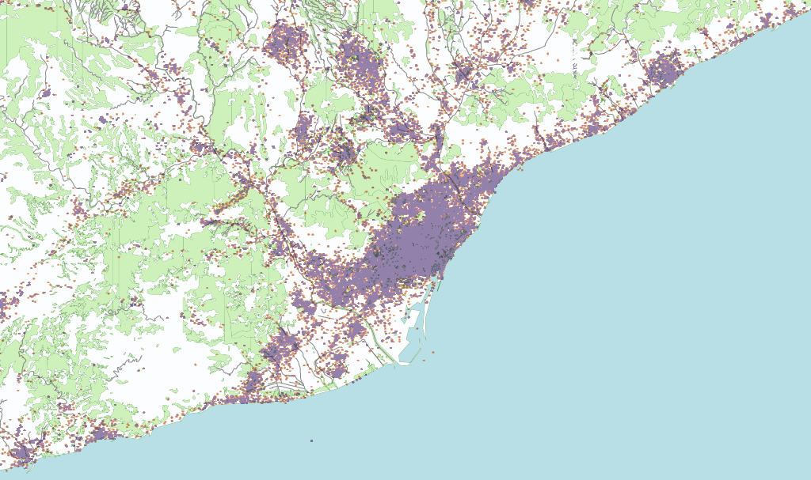
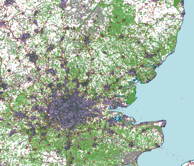

:author: Antònia Tugores
:email: antonia@ifisc.uib-csic.es
:institution: Institute for Cross-Disciplinary Physics and Complex Systems, IFISC (UIB-CSIC)
:author: Pere Colet
:email: pere@ifisc.uib-csic.es
:institution: Institute for Cross-Disciplinary Physics and Complex Systems, IFISC(UIB-CSIC)

------------------------------------------------
Social networks mobility data storage
------------------------------------------------

.. class:: abstract

Social networks have evolved quickly the last years and nowadays a large number of
people has several accounts in them. Besides, the emergence of
smartphones helped people to use these accounts constantly, and all these generate
new sources of information with large and public datasets to be studied. Under
this conditions, data acquisition and storage is a key point to allow
data analysis. In this context, we are gathering geolocated tweets as a source
of information for mobility patterns.

.. class:: keywords

big data, noSQL, data acquisition, benchmark

Introduction
============

Even that social networks appeared in the old nineties, they matured in the last decade
at the same time that mobile internet connections has grown. Even that some
social networks data is not freely accessible, others like Twitter are totally
public and includes geolocation data. This information can be used to study mobility
behaviour of people in urban areas, such as attitudes and lifestyle, which are
particularly important, e.g., for developing demand
management concepts aiming to influence mobility decisions.

In the framework of EUNOIA project we are currently gathering information related to
mobility and in this context we are using geolocated tweets as a source of information
for
mobility patterns. In order to collect this data we make use of Python and Tweepy.
Storing this data and accessing them quickly is a challenging task for which we rely
on MongoDB, a noSQL database, and its Python driver.

The objective of this paper is to discuss efficient ways to retrieve,
and store large amounts of data from social networks such as
Twitter to study human mobility patterns. The paper is organized as
follows, SQL and noSQL databases are described in section 2, section 3 explains
how data acquisition is achieved. Section 4 checks performance benchmarks to MongoDB and
MySQL, preliminary results are shown in section 5 and finally,
concluding remarks are given in section 6.

Data storage
============

The large amount of data to be stored and managed, the need to access the
information in a efficient way (quick and easy), to add, update and
delete data, and finally a secure multi-access made data suitable to be stored
in a database instead of simply using files.

SQL vs noSQL
------------

In the last decade data has been growing rapidly day by day and hardware has
not developed as that of data growth. Traditional solutions, relying on
relational databases (RBMS or SQL databases) have not been adapted to new large
datasets and new technologies such as Not Only SQL (noSQL) databases have emerged.

Popular SQL databases rely on collections of tables with data records, all of
which are formally described and organized according to a relational model.
On the contrary, noSQL databases employ less constrained consistency models to
gain simplicity  of design, horizontal scalability and finer control over
availability.

NoSQL databases are schema free, distribute data among different computers,
that gives them the ability to horizontally scale up and rely on simple APIs.
Queries are distributed between the different computers that hold the data and
that improves its performance. Apart from that, Atomicity, Consistency, Isolation
and Durability (also known as ACID [ACID]_) that guarantees SQL database transactions,
are not correctly achieved by noSQL. Consistency is guaranteed after a sufficient
period of time in which the changes are propagated through the system. All this
makes noSQL database management systems very useful when working with large
datasets or when the nature of the data does not require a relational model.
Besides, for relational data, indexing and duplication of information is essential
to avoid performance breakdowns.

High availability, high performance, high scalability, high recoverability,
rapid development and preferably open source are some of the musts
of a database to store large amounts of data for a long period of time.

SQL databases are widely adopted and proven and support ACID, crash recovery, and
master-slave configuration makes high availability easy to implement.
They have been used for a long time, there are lots of tools but SQL language is
not known amongst scientists and requires a relational model design, with a parsing
cost, so, it puts a break to rapid development cycles. Apart from that, servers
usually store small amounts of data, performance depends on the hardware of a
single computer and scalability involves improving this hardware.

On the other hand, noSQL databases read and write throughput is related to the
number of computers data is stored in (without taking into account replication) and
scalability is achieved by adding computers to the cluster instead of improving
the single server. Crash recovery and high availability are obtained by data
replication, a configuration similar to master-slave well known in SQL.

The volume of data we receive in a interval of time is not constant, nowadays
exceeds ten million statuses per day, and grows over the time. Political or
social events can cause traffic spikes, thus the database must have the ability
to handle large and steadily increasing volume of data while providing enough
flexibility to deal with unexpected traffic peaks.

In addition, tweets format
can change over the time. The data we receive from streaming is JavaScript Object
Notation, JSON [JSON]_ encoded and data we gather from other APIs can be
easy converted to JSON format by using jsonpickle package [jsonp]_. This format
is used to transmit human readable data through a network connection as a
alternative to XML. The attributes of JSON encoded objects are unsorted and the
format of the attributes is not fixed. JSON information can change over time
(fields can be added or removed) and the format of the field values
(integer, string, datetime, ... ) can also change.

This need of scalability and high performance reads and writes make us focus
on noSQL databases that store documents.
CouchDB, [Couch]_, and MongoDB, [Mongo]_, have been considered. Even that
CouchDB uses JSON to store data, provides ACID and queries are map/reduce
operations, the need to define a view for every query to be executed made it
difficult to be used by interdisciplinar scientists.

On the other hand, MongoDB uses [BSON]_ to store data (JSON-like documents with
dynamic schemas), supports SQL-like and map/reduce queries, aggregation, thus
not restricting scientists to a predefined set of queries. Indexing, including
geo indices, allows queries to be run in real time, and replication and failover
security are achieved by replicating data on different servers, as it does CouchDB.

Both databases are quite similar. Even that
MongoDB lacks real ACID transactions, it is more suitable when using
large amounts of data. Horizontal scalability is much clear in MongoDB
and the possibility to allow users to run their own queries without
requiring additional configuration made MongoDB more suitable to our
needs.

MongoDB configuration
---------------------

MongoDB minimal configuration involves a single computer with all the data and
a Mongo client the user application connects to. In order to ensure automatic
failover recovery, a cluster of mongo
daemons that replicate amongst one another is needed, a Replica Set.
Replica sets consist of a minimum of three daemon instances, one of them
designated as the primary and the others as secondaries. The primary one receives
all the write connections while secondaries replicate from the primary asynchronously
with a delay of milliseconds and can receive read connections. Even that
data replication uses much more space that the one really needed,
it ensures high availability and increases the read capacity. Apart from that,
a good practice, although no read queries can be directed to this nodes,
is to configure a secondary of each replica set with a predefined
replication delay time and use it as backup.

This ReplicaSet configuration is suitable when one single computer can store all
the data and the read/write performance is good enough. In our case, taking into
account September 2012 stream rate, the database could increase in 6TB per year.
In MongoDB the way to scale up the database is sharding: the collection is
partitioned by using a key defined by the database administrator
and the different chunks or portions
are stored in different replica sets or shards. Sharding automatically
balances data and load across the shards and increases write and read capacity.
In addition to that,
when a database collection becomes too large for the existing configuration, a
new shard (horizontal scalability) can be added and sharding
automatically distributes collection data to the new group of servers.

.. figure:: mongo_struct.eps

   Global MongoDB configuration. :label:`fig:config`

In addition to shards or replica sets, in a sharded cluster there are
config servers (CS) that store metadata relating shard with chunks and
route reads and writes from mongo client (CL) to the appropiate shard. Notice
that client applications connect to mongo client (CL) and do not know any
information related to shards or configuration servers.

In our case (Fig.  :ref:`fig:config`), we use six replica sets with three
members each. There are two elegible primary members and the third one
is a delayed copy by 72 hours. This gives us failover security because
if primary server crashes the secondary one becomes primary. And
the third member helps us to recover from human errors
such as inadvertently deleted databases or botched application upgrades.
In production environments three config servers are required and in our case
we started with a single client instance (see Fig :ref:`fig:config`) but then
we added a second one to increase the insertion rate. The shard key used
is the tweet identifier and we added indices by user
identifier and latitude/longitude to speed up usual queries.

To improve writing performance we took into account several MongoDB
features when customizing the operating system in the servers that form
the replica sets.

Data acquisition
================

Geolocated tweets can be used to study urban mobility in highly populated
cities such as London or Barcelona. Even that Twitter provides mechanisms to
retrieve a small real-time random sample of the total amount of statuses, it
gives us a large amount of data distributed all over the world, but just about
12 % of this data is geolocated and a small part of it is located in the cities
we are focusing in. As a consequence, the number of tweets that can be used for
mobility studies are not enough. To solve this issue, a set of users from the
random sample was selected to download their wall for a long period of time.

Twitter APIs
------------

Twitter data access can be achieved through ad hoc APIs that represent
different Twitter features. As well as helpers to easy integrate Twitter with
websites like '*Twitter for Websites*' and a '*Search API*' to query for
content, we can find a data mining focused API with real-time sample of the
Twitter ('*Stream API*'). Apart from that, the '*REST API*' enables developers
to access some of the core primitives of Twitter including timelines, status
updates, and user information.

Even that Twitter offers access to their data, accessing directly the service
is not immediate and using a library is recommended [Twilib]_. Even that we can
find libraries in most of the main programming languages, we focused on Python.
The code readability and the smooth learning curve, amongst the quick
development or the dynamic typing makes it a suitable language to be used by
software engineers and scientists. In our case, *tweepy* [Tweepy]_
was selected for its simplicity and flexibility, because it covered both Stream
and REST APIs, and it is open source (MIT License).

Random sample
-------------

Twitter data is public, and the *Stream API* allows developers to receive a
sample of all Twitter statuses. This API caps the number of messages sent to the
client to a small fraction of the total volume of tweets at any given moment,
perfectly suitable for data mining.

Connecting to the streaming API requires keeping a persistent HTTP connection
open to receive the data instead of actively requesting the statuses. Streaming
APIs do not allow clients to establish a connection in response to a request.
This avoids the limitations imposed by
Representational State Transfer (REST) APIs. The only limitation is that
each account can create only one standing connection to the public
endpoints, and connecting to a public stream more than once with the
same credentials causes the oldest connection to be disconnected. In the
same way, IPs of clients that make excessive connection attempts run the
risk of being automatically banned.

As the process that opens the connection receives raw tweets, it has to perform
all parsing, filtering, and aggregation needed before storing the result.

A particularity of the *Streaming API* is that messages are not
delivered in the same precise order as they were generated. In
particular, messages can be slightly shifted in time and it is also
possible that deleted messages are received before the original tweet.
This is not critical for the case considered here because we are
interested at slower time scales (from minutes to hours) and therefore
we do not need to have an exact timing and order of the messages.

In our case, connections to Twitter API are achieved by using *tweepy*.
It allows the implementation of a listener that activates when a tweet arrives
and it can be processed as the user wants. Connection to the API requires user
authentication, instantiation of the own listener implementation and finally the
connection can be open.

A example of the code to simply print the tweets to the standard output is:

|

.. code-block:: python

  from tweepy import Stream, OAuthHandler
  from tweepy.streaming import StreamListener

  class BasicListener(StreamListener):
    """
      A listener handles tweets are the received from
      the stream.
    """
    def on_data(self, data):
        # print received tweet to stdout
        print data
        return True

    def on_error(self, status):
        # print error when data is not correctly
        # received
        print "Error: " + status

  if __name__ == '__main__':

    # authentication
    auth = OAuthHandler(CONSUMER_KEY, CONSUMER_SECRET)
    auth.set_access_token(ACCESS_KEY, ACCESS_SECRET)

    # listener instance
    listen = BasicListener()

    # open connection
    stream = Stream(auth, listen, gzip=True)

    # start receiving data
    stream.sample()

In our case, we store the tweets we download
in the same format they are received, JSON, while deleted tweets have to be
modified since they have a different structure with just *deleted* information
in the highest document level. To facilitate data
search and manipulation we use the tweet id as one of the indices of the
database and it is necessary to appear in the highest level of the document.

Users selection
---------------

Geo-tweets located in the cities of interest received through *Streaming API*
are not enough to study mobility patterns. In order to increase its number we
identify the users with geolocated tweets in those cities. As physical people
is needed, we detect and remove bots (software applications that run automated
tasks) because the geolocation does not change over the time and corporate accounts.
We sort other users by number of already collected geo-tweets to
priorize the most active ones.

Identification of geo-tweets located in the areas of interest is achieved
by using *geoNear* MongoDB command [geoNear]_. In this case, a 2d index on latitude and longitude is
used to increase performance of the geospatial query that returns the closest
documents not exceeding the desired distance (radius) from the given point.

An example of how to use geoNear command with MongoDB Python driver is

::

  db.command(SON([('geoNear', collection),
                  ('near', [lon, lat]),
                  ('maxDistance', max_dist),
                  ('num', max_num_results)
                 ]))

MongoDB limits the size of the results document returned by a query to 16MB if
not using GridFS [GridFS]_. In our case, we are not using GridFS, and
in order to avoid exceeding this
limitation we use a value for the radius of exploration of one mile and in
order to cover all space in the city we make use of a fine grained mesh in
which the points are separated by one mile. In the future we plan to use GridFS
to be able to store results as chunked files instead of returning a single
document and accessing the results several times without need to run the queries again.

Users wall
----------

Retrieving the tweets posted by an specific user can be done through *REST API*.
One of the main limitations of this API is that every method has a number
of requests limit. In current version of the API, 1.1, the rate limiting is considered per access token, not per-user basis and the timing windows or
intervals have been reduced to fifteen minutes [limit]_ and in the case of
user_timelime is set to 180 requests every fifteen minutes [timeline]_.

The method *user_timeline* returns a collection of the most recent tweets posted
by the user indicated by the user_id parameter. In case of requesting tweets
belonging to users that protected their tweets we will be able to get them just
if the authenticated user (we) has been authorized by the user. In our case
we are not interested in these users and we avoid requesting their data and
focus on users with open data. In order to retrieve the maximum possible tweets
and avoid having duplicated tweets, we request just results with an identifier
greater than the highest tweet id we have in the database for that user.

Even that we try not to do unnecessary requests, and that we try to get each
selected users timeline once per month, the method we are using, user_timeline,
can return a maximum of 3200 tweets an in the case of very active users some
tweets can be lost.

An example of use:

.. code-block:: python

    from tweepy import OAuthHandler, API
    ...

    OAuth = OAuthHandler(CONSUMER_KEY, CONSUMER_SECRET)
    OAuth.set_access_token(ACCESS_KEY, ACCESS_SECRET)
    tAPI = API(OAuth)

    try:
        timeline = tAPI.user_timeline(count=3200,
                                      user_id=uid,
                                      since_id=last_id)
    except Exception as except:
        print except

Users network
-------------

Retrieving the tweets posted by an specific user can be done through *REST API*.
In this case we need the list of user identifiers the specified user is following
[friends]_ (called friends) and the list of users following [follow]_
(reading the wall) of the user we are getting information of at the moment we do
the query.

Again, the queries are limited, in this case to 15 requests every fifteen minutes.
And to avoid IP banning we try to keep away from the maximum. In order to see the
network evolution, the process is continuously running to get the network in
different moments of time.

The code to get the followers and friends is:

.. code-block:: python

    # add following
    userData["friends"] = []
    for friend in api.friends_ids(uid):
        userData["friends"].append(friend)

    # add followers
    userData["followers"] = []
    for follower in api.followers_ids(uid):
        userData["followers"].append(follower)

Database performance
====================

Even that MongoDB seemed to be a better option that SQL databases, a benchmark
to check insertion rate in MySQL and MongoDB has been done. The physical
computers we used had 8 cores (2x Xeon L5520 at 2.27GHz ), 16GB of DDR3 RAM and 2TB
disk space (7200rpm).

MySQL Insertion performance
---------------------------

When using MySQL, parsing JSON to a relational model had to be done, and we
relied on Django [Django]_ Object Relational Model, ORM. In this case, after
creating a Django project we set the database connection information in the
project configuration file settings.py. The database information needed is the
following:

.. code-block:: python

  DATABASES = {
      'default': {
          'ENGINE': 'django.db.backends.mysql',
          'NAME': 'twitterdb',
          'USER': 'theuser',
          'PASSWORD': 'thepassword',
          'HOST': 'mysqlHost',
          'PORT': '3360',
      }
  }

In the project's application, we created a relational model with some classes (Tweet, User, HashTag,
URL, ... ). Primary keys were used and relations between registers were used avoiding
data duplication. An example of the main model class:

.. code-block:: python

  class Tweet(Model):
      twid = BigIntegerField(primary_key=True,
                             db_index=True)
      place = ForeignKey(Place, null=True)
      text = CharField(max_length=2048, blank=True)
      retweet_count = IntegerField(null=True)
      parent_id = BigIntegerField(null=True)
      source = CharField(max_length=2048)
      coordinates = ForeignKey(BoundingBox, null=True)
      contributors = CharField(max_length=2048,
                               null=True)
      retweeted = BooleanField()
      truncated = BooleanField()
      created_at = DateTimeField(null=True)
      user = ForeignKey(User)
      entities = ForeignKey(Entities, null=True)
      in_reply_to_status_id = BigIntegerField(
                                null=True)
      in_reply_to_user_id = BigIntegerField(
                                null=True)
      in_reply_to_screen_id = BigIntegerField(
                                null=True)
      deleted = BooleanField()

      class Meta:
          app_label = 'twitter'

An finally, for every JSON document, a parsing method was needed to store the data into
the database. A sample of the parsing function is:

.. code-block:: python

  def fillTweet(jsondata):
    t = Tweet()

    if propertyExists(jsondata, "delete"):
        logger.info("Deleted tweet")
        # do some magic
    else:
        logger.info("New tweet")

        twlist = Tweet.objects.filter(
                              twid=jsondata["id"])
        if len(twlist) == 1:
            logger.info("already added")
            return twlist[0].twid

        t.contributors = fillContributors(jsondata)
        t.coordinatespt = fillPointBBox(jsondata)
        t.created_at = fillCreatedAt(jsondata)
        t.entities = fillEntities(jsondata)
        t.in_reply_to_screen_id =
                    fillReplyScreen(jsondata)
        t.in_reply_to_status_id =
                    fillReplyStatus(jsondata)
        t.in_reply_to_user_id =
                    fillReplyUser(jsondata)
        t.place = fillPlace(jsondata)
        t.retweet_count = fillRTCount(jsondata)
        t.retweeted = fillRT(jsondta)
        t.source = fillSource(jsondata)
        t.text = fillText(jsondata)
        t.truncated = fillTruncated(jsondata)
        t.twid = jsondata["id"]
        t.user = fillUser(jsondata)

        # is retweet
        rtstatus = "retweeted_status"
        if propertyExists(jsondata, rtstatus):
            logger.info("Is Retweet of ")
            rtdata = jsondata[rtstatus]
            t.parent_id = fillTweet(rtdata)

        # use Django DB connection to save to DB
        t.save()

.. figure:: mysql_insert_empty.eps

   Time to insert 100000 tweets in MySQL using an empty database and tweets
   processed with ORM. Linking (green) and duplicating information (red).
   :label:`fig:mysqlinsertion`

In :ref:`fig:mysqlinsertion` the green line shows the time to insert 100000
relational tweets in a completely empty MySQL database running on a single
physical computer. As seen in the code, when inserting tweets in MySQL,
as it is a relational
database, we first perform a search to find if the twitter low level entities
such as user, hashtag, URL, ... exist,
if not, a new record is created, while if the entity is already there, a
link to the existing register is performed. This requires some searches for
every tweet to be inserted which results in a larger storage time and in
the fact that as the database grows the search takes longer and the
insertion rate decreases. It takes 1000 s when it is empty, above 1500 s
when there are four million tweets and almost 4000 s when the database
has twelve million tweets.

To avoid this search issue, we tested the same with no relations between
tweets data  even that it means not using the relational properties of
a relational database such as MySQL. In this case, in Fig. :ref:`fig:mysqlinsertion`
red line, we just used the ORM to convert from JSON to MySQL objects avoiding searches. The
insertion limit is almost constant while inserting 4 million tweets,
just showing a minor reduction when the number of tweets increases.

MongoDB Insertion performance
-----------------------------

Finally, the connections to MongoDB were done by using *pymongo* [pymongo]_, the
official Python driver:

.. code-block:: python

    mongoserver_uri = "mongodb://" + user + ":" +
                      pwd + "@" + host + ":" +
                      port + "/" + dbname
    conection = MongoClient(host=mongoserver_uri)
    db = conection[dbname]
    collection = db[collname]

And tweets received from stream API, JSON objects, were inserted with no
preprocessing:

.. code-block:: python

    collection.insert(json_tweet)

When dealing with tweets queried by getting a users' wall, we received a Python
object, and we convert it to JSON before inserting to the collection:

.. code-block:: python

    pickled = jsonpickle.encode(python_tweet)
    json_tweet = json.loads(pickled)
    collection.insert(json_tweet)

.. figure:: mongo_insertion_calm.eps

   Time to insert 100000 tweets in MongoDB by using direct insertion in a database with millions of tweets. :label:`fig:mongoinsert`

In figure :ref:`fig:mongoinsert` time to insert 100000 tweets in a MongoDB
database with three shards (replica sets) on physical computers, just one client (virtual machine) is
shown. In this case, instead of being empty, the database had 850 million documents.
As can be seen, storage time is much smaller that in MySQL, around 500 s for the
100000 tweets, which
is a speed up factor two with respect to the MySQL when no search is
performed. Although the speed up is smaller than the factor three
expected from the fact of having three replica sets, it is still
substantial. What is more important, since we do not need to perform
searches, this performance is maintained as the database size grows

.. figure:: mongo_insertion_queries.eps

    MongoDB insertion with a database with millions of tweets while querying the DB with CPU and memory consuming geoqueries. :label:`fig:queriesinsertion`

Inserting in a database with no queries is not usual.
In Fig :ref:`fig:queriesinsertion` we show the insertion rate in
MongoDB when simultaneously performing queries on a database which has
already stored 850 million tweets, so that queries require searching
over a large amount of data. The configuration of MongoDB allows the
queries to be performed on the primary nodes or on the secondary ones.
The most disturbing situation for the insertion rate is querying the
primary nodes because insertions are performed there, and this is the case shown in Fig.
:ref:`fig:queriesinsertion`. The presence of the queries clearly
induce peaks in the time to insert 100000 which can go over 1000 s but nevertheless the
overall response of the system is quite satisfactory and the performance
sufficient to keep storing all the tweets and  in practice, queries are
performed over secondary nodes and in that way the insertion data rate
is practically unaffected.

Apart from that, we tested the insertion from two different clients at the same
time and inserting a bunch of tweets, not one by one, and the insertion rate increased almost
a factor 2.

MongoDB Query performance
-------------------------

As our goal is to analyse the fraction of geolocated tweets stored in the database,
MongoDB spatial indexing and querying are a key point.

MongoDB offers a specific geospatial index 2d for data stored as points
on a two-dimensional plane. As of version 2.4 MongoDB also includes the
index 2dsphere which conveniently supports queries that calculate
geometries on a sphere. This index supports data stored as GeoJSON
objects which is the way geospatial data is stored in the tweets.
Despite that, since we started with MongoBD 2.2, we are currently using
2d indices (latitude, longitude) to determine the localization of the
use when the tweet was posted.

.. figure:: times_scanned.eps

    Queries timing histogram for Barcelona metropolitan area. Blue line shows the median and red line the 70th percentile. :label:`fig:queries`

By using already mentioned geoNear command one can get the documents on the
database which have a geolocation closer to a given point.
In Fig. :ref:`fig:queries` the histogram of geoNear queries in a database of
850 million documents can be seen. We used a fine grained mesh with points
separated by one mile that covered Barcelona metropolitan area and for each
point we ran a geoNear query with a radius of one mile.

Even there is a group of slow queries, more than thirty seconds, the
median is just of three seconds, and in 70% of the queries to get the
tweets localized in a radius of one mile of a given point lasted less
than nine seconds.

Preliminary results for mobility patterns
=========================================

Preliminary results after retrieving data for ten months show a good
agreement with population in London and Barcelona metropolitan areas and the
transportation network of these cities. See Fig. :ref:`fig:bcn` and :ref:`fig:lon`.
It means that ten months sampling is representative of the mobility in these
areas.

In order to further assess that the data is
statistically adequate we plan to compare the statistics obtained from
this ten months retrieval with the ones obtained after two years.

    Geo-tweets in the area of Barcelona. :label:`fig:bcn`

    Geo-tweets in the area of London. :label:`fig:lon`

Finally, in the framework of EUNOIA project, public transport data and
Twitter data amongst other data will be used to characterise and compare
mobility and location patterns in different European cities. Besides,
urban land use and transportation models will be studied by integrating the role of the social network and new models of joint trips and joint resource use.

Concluding remarks
==================

In summary, we have presented an example of efficient social networks data acquisition
and data storage by using Python programming language and specific packages to connect
user's applications to Twitter APIs and to MongoDB.

Acknowledgements
================

Financial support from CSIC through project GRID-CSIC (Ref. 200450E494),
from MINECO (Spain) and FEDER (EU) through projects FIS2007-60327
(FISICOS) and FIS2012-30634 (INTENSE@COSYP) and from European Comission
through project FP7-ICT-2011-8 (EUNOIA) is acknowledged.

References
----------
.. [Twilib] Twitter Libraries. https://dev.twitter.com/docs/twitter-libraries

.. [Tweepy] tweepy. https://github.com/tweepy/tweepy

.. [Atr03] P. Atreides. *How to catch a sandworm*,
           Transactions on Terraforming, 21(3):261-300, August 2003.

.. [Lan01] Douglas, Laney. "3D Data Management: Controlling Data Volume, Velocity
           and Variety". Gartner. 6 February 2001. http://blogs.gartner.com/doug-laney/files/2012/01/ad949-3D-Data-Management-Controlling-Data-Volume-Velocity-
           and-Variety.pdf

.. [Lan12] Douglas, Laney. "The Importance of ’Big Data’: A Definition". Gartner.
	   Retrieved 21 June 2012. http://www.gartner.com/resId=2057415

.. [Twitter] Twitter web page. http://www.twitter.com

.. [Couch] CouchDB web page. http://couchdb.apache.org

.. [Mongo] MongoDB web page. http://www.mongodb.org

.. [Django] Django project. https://www.djangoproject.com/

.. [geoNear] geoNear documentation.
	   http://docs.mongodb.org/manual/reference/command/geoNear

.. [BSON] BSON document size limitation.
	   http://docs.mongodb.org/manual/reference/limits

.. [GridFS] GridFS. http://docs.mongodb.org/manual/core/gridfs/

.. [limit] Twitter rate limiting. https://dev.twitter.com/docs/rate-limiting/1.1

.. [timeline] user_timeline documentation. https://dev.twitter.com/docs/api/1.1/get/statuses/user_timeline

.. [JSON] JSON specification. http://www.json.org/

.. [jsonp] jsonpickle documentation. http://jsonpickle.github.io/

.. [friends] Friends documentation. https://dev.twitter.com/docs/api/1.1/get/friends/ids

.. [follow] Followers documentation. https://dev.twitter.com/docs/api/1.1/get/followers/ids

.. [pymongo] pymongo documentation. http://api.mongodb.org/python/current/

.. [ACID] ACID. http://en.wikipedia.org/wiki/ACID

.. [GeoJS] GeoJSON. http://geojson.org/geojson-spec.html

