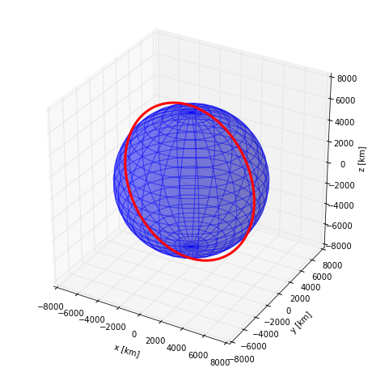
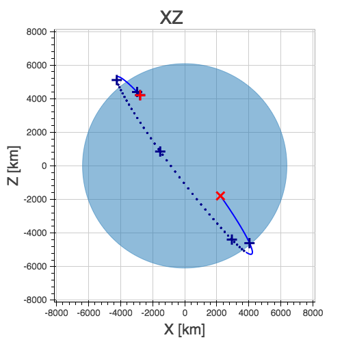
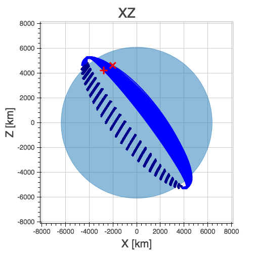
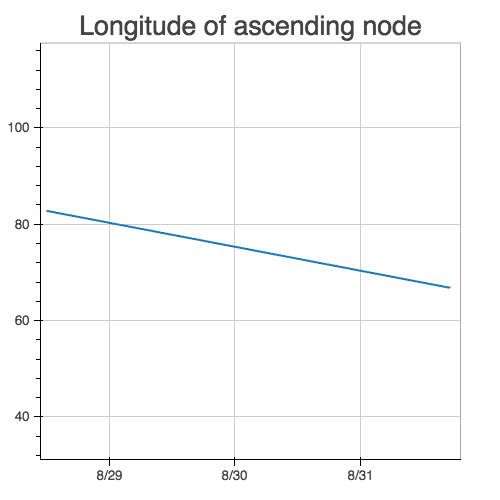

:author: Helge Eichhorn
:email: eichhorn@dik.tu-darmstadt.de
:institution: Technische Universität Darmstadt, Department of Computer Integrated Design

:author: Reiner Anderl
:email: anderl@dik.tu-darmstadt.de
:institution: Technische Universität Darmstadt, Department of Computer Integrated Design

--------------------------------------------------
Plyades: A Python Library for Space Mission Design
--------------------------------------------------

.. class:: abstract

    TODO
    Designing a space mission is a computation-heavy task.
    Software tools that conduct the necessary numerical simulations and optimizations are therefore indispensable.
    Since the beginning of computational astrodynamics the language of choice has been Fortran and more recently MATLAB.
    This talk explores how Python's unique strengths and its ecosystem make it a viable alternative for future missions.

.. class:: keywords

   data modeling, object-oriented programming, orbital mechanics, astrodynamics

Introduction
------------

Designing a space mission trajectory is a computation-heavy task.
Software tools that conduct the necessary numerical simulations and optimizations are therefore indispensable and high numerical performance is required.
Since no mission or spacecraft is alike the ever-changing requirements and constraints also demand high development speed and programmer productivity.
Due to its supreme numerical performance Fortran has been the top programming language in many organizations within the astrodynamics community.

At the European Space Operations Center (ESOC) of the European Space Agency (ESA) a large body of sometimes decades old Fortran77 code remains in use for mission analysis tasks.
While this legacy code mostly fulfills the performance requirements [#]_ usability and programmer productivity suffer.
One reason for this is that Fortran is a compiled language which hinders exploratory analyses and rapid prototyping.
The low level of abstraction supported by Fortran77 and programming conventions, like 6-character variable name limits and fixed-form source code, that are in conflict with today's best practices are a more serious problem, though.
The more recent Fortran standards remedy a lot of these shortcomings, e.g free-form source in Fortran90 or object-oriented programming features in Fortran2003, but also introduce new complexity, e.g. requiring sophisticated build systems for dependency resolution.
Compiler vendors have also been very slow to implement new standards.
For example this year the Intel Fortran compiler achieved full support of the Fortran2003 standard, which was released in 2005 [IFC15]_.

.. [#] Many routines were not written with thread-safety and re-entrancy in mind and can therefore not be used in parallel codes.

Due to these reasons Fortran-based tools and libraries have been generally supplanted with programming environments with better usability such as MATLAB.
A common approach for developing mission design software at ESOC is prototyping and implementing downstream processes such as visualization in MATLAB and then later porting performance-intensive parts or the whole system to Fortran77.
The results are added complexity through the use of the MEX-interface for integrating Fortran and MATLAB, duplicated effort for porting, and still a low-level of abstraction because the system design is constrained by Fortran's limitations.

Because of the aforementioned problems some organizations explore possibilities to replace Fortran for future developments.
The French space agency CNES (Centre Nationale D'Études Spatiale) for instance uses the Java-based Orekit library [Ore15]_ for its flight dynamics systems.

In this paper we show why Python and the scientific Python ecosystem are a viable choice for the next generation of space mission design software and present the Plyades library.
Plyades is a proof-of-concept implementation of an object-oriented astrodynamics library in pure Python.
It makes use of many prominent scientific Python libraries such as Numpy, Scipy, Matplotlib, Bokeh, and Astropy.
In the following we discuss the design of the Plyades data model and conclude the paper with an exemplary analysis.

Why Python?
-----------

Perez, Granger, and Hunter [PGH11]_ show that the scientific Python ecosystem has reached a high level of maturity and conclude that "Python has now entered a phase where it's clearly a valid choice for high-level scientific code development, and its use is rapidly growing".
This assessment also holds true for astrodynamics work as most of the required low-level mathematical and infrastructural building blocks are already available, as shown below:

* Vector algebra (``numpy``)
* Visualization (``matplotlib``, ``bokeh``)
* Numerical integration (``scipy.integrate``)
* Numerical optimization (``scipy.optimize``)
* High performance numerics (``cython``, ``numba``)
* Planetary ephemerides (``jplephem``)

Another advantage is Python's friendliness to beginners.
In the US Python was the most popular language for teaching introductory computer science (CS) courses at top-ranked CS-departments in 2014 [PGu14]_.
Astrodynamicists are rarely computer scientist but mostly aerospace engineers, physicists and mathematicians.
Most graduates of these disciplines have only little programming experience.
Moving to Python could therefore lower the barrier of entry significantly.

It is also beneficial that the scientific Python ecosystem is open-source compared to the MATLAB environment and commercial Fortran compilers which require expensive licenses.
 
Requirements for the Plyades Library
------------------------------------

Based on the previous discussion we derive the following requirements for the Plyades library.
Within these the keywords *shall*, *should*, and *may* are to be interpreted as specified in ISO 29148 [ISO11]_.

The library should be written in pure Python
~~~~~~~~~~~~~~~~~~~~~~~~~~~~~~~~~~~~~~~~~~~~

blob

Cython shall be the only extension language
~~~~~~~~~~~~~~~~~~~~~~~~~~~~~~~~~~~~~~~~~~~

blob

All low-level functionality shall be based on pure functions
~~~~~~~~~~~~~~~~~~~~~~~~~~~~~~~~~~~~~~~~~~~~~~~~~~~~~~~~~~~~

blob

The library shall be able to use SPICE kernels to compute ephemerides of celestial bodies
~~~~~~~~~~~~~~~~~~~~~~~~~~~~~~~~~~~~~~~~~~~~~~~~~~~~~~~~~~~~~~~~~~~~~~~~~~~~~~~~~~~~~~~~~

blob

Each object shall provide commonly used visualizations as instance methods
~~~~~~~~~~~~~~~~~~~~~~~~~~~~~~~~~~~~~~~~~~~~~~~~~~~~~~~~~~~~~~~~~~~~~~~~~~

blob

Design of the Plyades Object Model
----------------------------------

blob

The Body Class
~~~~~~~~~~~~~~

The Body class is a simple helper class that holds physical constants and other properties of celestial bodies such as planets and moon.
These include

* the name of the body
* the gravitational parameter :math:`\mu`
* the mean radius :math:`r_m`
* the equatorial radius :math:`r_e`
* the polar radius :math:`r_p`
* the :math:`J_2` coefficient of the bodies gravity potential
* and the identification code used within the JPL ephemrides.

The State Class
~~~~~~~~~~~~~~~

The Orbit Class
~~~~~~~~~~~~~~~

The Orbit class is a simple helper class

Exemplary Usage
---------------

In this example we use the Plyades library to conduct an analysis of the orbit of the International Space Station (ISS) [#]_.
We obtain the inital state data on August 28, 2015, 12:00h from NASA realtime trajectory data [NAS15]_ and  use it to instantiate a Plyades ``State`` object as shown below.

.. [#] A Jupyter Notebook with with this analysis can be obtained from `Github <https://github.com/helgee/euroscipy-2015>`_.

.. code-block:: python

    iss_r = np.array([
        -2775.03475,
        4524.24941,
        4207.43331,
        ]) * astropy.units.km
    iss_v = np.array([
        -3.641793088,
        -5.665088604,
        3.679500667,
        ]) * astropy.units.km/units.s
    iss_t = astropy.time.Time('2015-08-28T12:00:00.000')
    frame = 'ECI'
    body = plyades.bodies.EARTH

    iss = plyades.State(iss_r, iss_v, iss_t, frame, body)

The position (``iss_r``) and velocity (``iss_v``) vectors use the functionality units from the Astropy package [ASP13]_ while the timestamp (``iss_t``) is an Astropy ``Time`` object.
The constant ``EARTH`` from the ``plyades.bodies`` module is a ``Body`` object and provides Earth's planetary constants.

* Semi-major axis: :math:`a=6777.773` km
* Eccentricity: :math:`e=0.00109`
* Inclination: :math:`i=51.724` deg
* Longitude of ascending node: :math:`\Omega=82.803` deg
* Argument of periapsis: :math:`\omega=101.293` deg
* True anomaly: :math:`\nu=48.984` deg

.. code-block:: python

    kepler_orbit = iss.kepler_orbit()
    kepler_orbit.plot3d()

    A three-dimensional visualization of the orbit based on Matplotlib. :label:`3d`

.. code-block:: python

    newton_orbit = iss.propagate(
        iss.period*1.3,
        max_step=500,
        interpolate=200
    )
    newton_orbit.plot_plane(plane='XZ', show_steps=True)

    Visualization of a numerically propagated orbit with intermediate solver steps (+, blue), start point (+, red), and end point (x, red). :label:`numerical`

.. code-block:: python

    @iss.gravity
    def newton_j2(f, t, y, params):
        r = np.sqrt(np.square(y[:3]).sum())
        mu = params['body'].mu.value
        j2 = params['body'].j2
        r_m = params['body'].mean_radius.value
        rx, ry, rz = y[:3]
        f[:3] += y[3:]
        pj = -3/2*mu*j2*r_m**2/r**5
        f[3] += -mu*rx/r**3 + pj*rx*(1-5*rz**2/r**2)
        f[4] += -mu*ry/r**3 + pj*ry*(1-5*rz**2/r**2)
        f[5] += -mu*rz/r**3 + pj*rz*(3-5*rz**2/r**2)

    Visualization of the perturbed orbit. :label:`perturbed`

The perturbation of the orbit is clearly visible within the visualization in figure :ref:`perturbed`.
A secular (non-periodical) precession of the orbital plane is visible.
Thus a change in the longitude of the ascending node should be present.

We can plot the longitude of the ascending node by issuing the following command:

.. code-block:: python

        j2_orbit.plot_element('ascending_node')

The resulting figure :ref:`osculating` shows the expected secular change of the longitude of the ascending node.

    Secular perturbation on the longitude of the ascending node. :label:`osculating`

Future Development
------------------

As of this writing Plyades has been superseded by the Python Astrodynamics project [PyA15]_.
The project aims to merge the three MIT-licensed, Python-based astrodynamics libraries Plyades, Poliastro [JCR15]_ and Orbital [FML15]_ and provide a comprehensive Python-based astrodynamics toolkit.

Conclusion
----------

References
----------

.. [Ore15] CS Systèmes d'Information. *Orekit: An accurate and efficient core layer for space flight dynamics applications*,
           http://www.orekit.org, last visited: September 17, 2015.

.. [RCM08] Robert C. Martin. *Clean Code: A Handbook of Agile Software Craftsmanship*, Prentice Hall, 2008.

.. [DAV13] David A. Vallado, Wayne D. McClain. *Fundamentals of Astrodynamics and Applications*, 4th Edition, Microcosm Press, 2013.

.. [HEi15] Helge Eichhorn. *Plyades: A Python astrodynamics library*, http://github.com/helgee/plyades, last visited: September 17, 2015.

.. [PyA15] Juan Luis Cano Rodriguez, Helge Eichhorn, Frazer McLean. *Python Astrodynamics*, http://www.python-astrodynamics.org, last visited: September 17, 2015.

.. [JCR15] Juan Luis Cano Rodríguez, Jorge Cañardo Alastuey. *Poliastro: Astrodynamics in Python*, Zenodo, 2015. `doi:10.5281/zenodo.17462 <http://dx.doi.org/10.5281/zenodo.17462>`_.

.. [FML15] Frazer McLean. *Orbital*, https://github.com/RazerM/orbital, last visited: September 17, 2015.

.. [NAS15] National Aeronautics and Space Association. *ISS Trajectory Data*, http://spaceflight.nasa.gov/realdata/sightings/SSapplications/Post/JavaSSOP/orbit/ISS/SVPOST.html, last visited: August 28, 2015.

.. [ASP13] The Astropy Collaboration. *Astropy: A community Python package for astronomy*, Astronomy & Astrophysics, 558(2013):A33.

.. [ISO11] TODO

.. [IFC15] TODO

.. [PGH11] Fernando Perez, Brian Granger, John D. Hunter. *Python: An Ecosystem For Scientific Computing*, Computing in Science & Engineering 13.2(2011):13-21.

.. [PGu14] Philip Guo. *Python is Now the Most Popular Introductory Teaching Language at Top U.S. Universities*, ACM Communications, July 7, 2014.
.. , `<http://cacm.acm.org/blogs/blog-cacm/176450-python-is-now-the-most-popular-introductory-teaching- language-at-top-us-universities/fulltext>`_, last visited: September 18, 2015.
