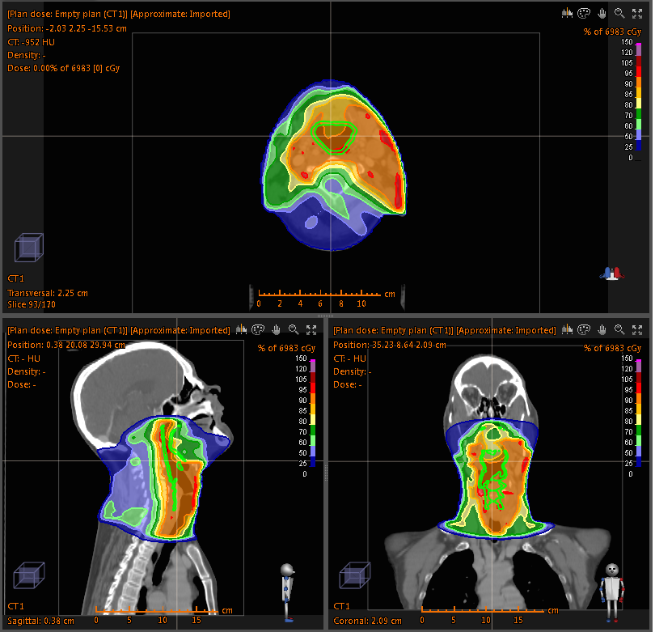
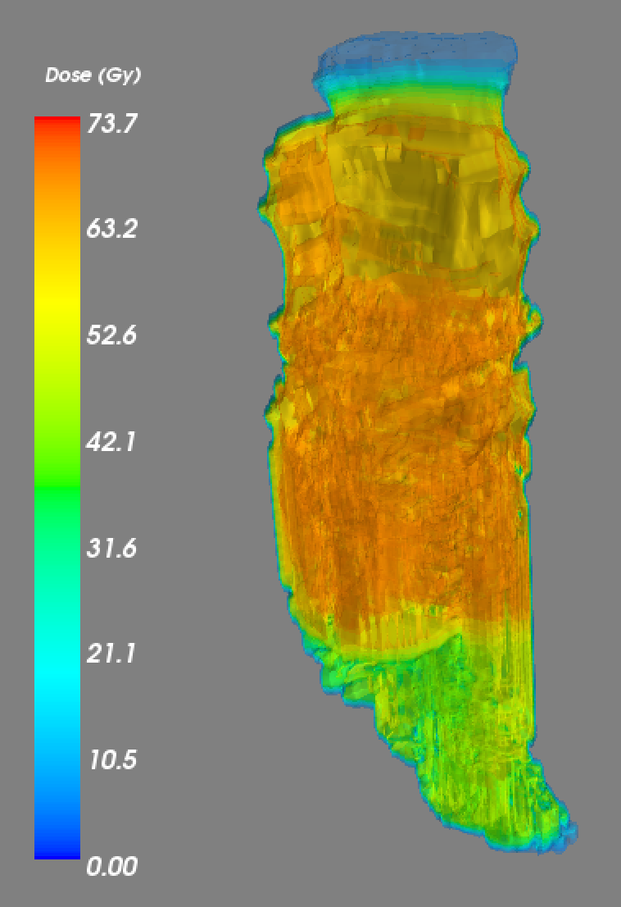
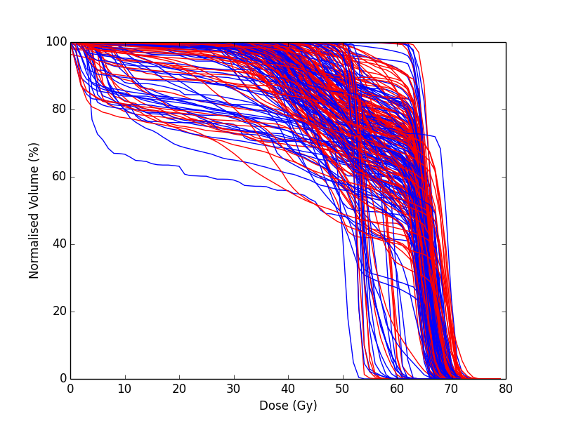
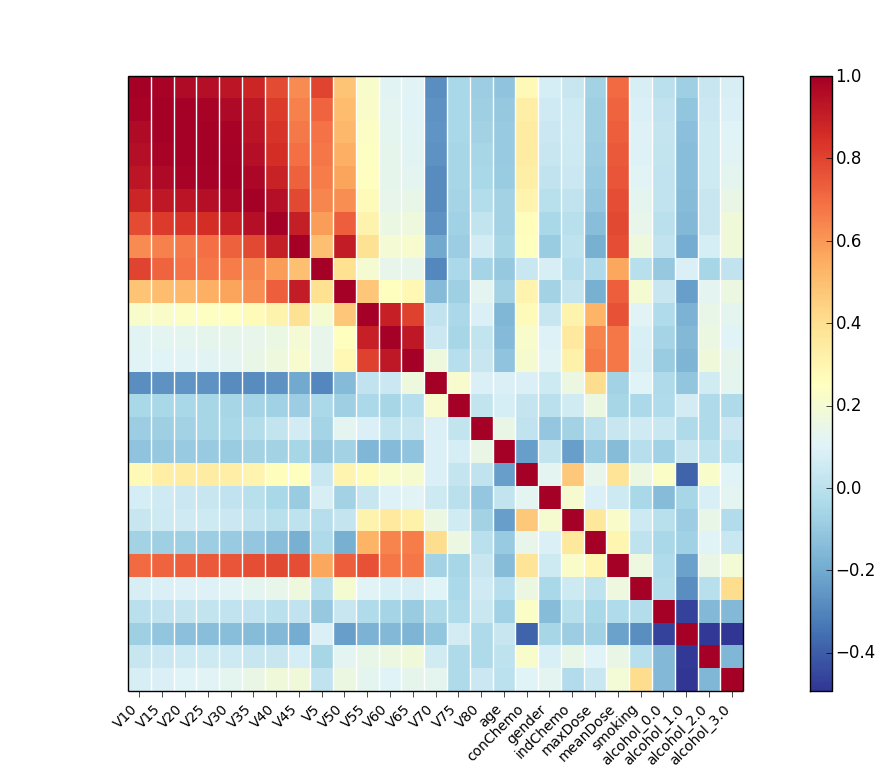
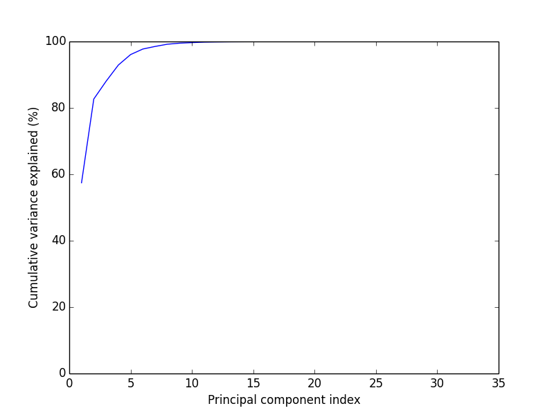
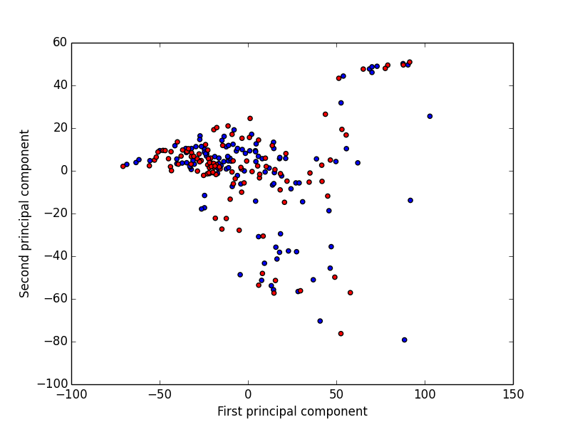

:author: Jamie A Dean
:email: jamie.dean@icr.ac.uk
:institution: The Institute of Cancer Research and The Royal Marsden NHS Foundation Trust, London, UK

:author: Liam Welsh
:email: liam.welsh@rmh.nhs.uk
:institution: The Institute of Cancer Research and The Royal Marsden NHS Foundation Trust, London, UK

:author: Kevin J Harrington
:email: kevin.harrington@icr.ac.uk
:institution: The Institute of Cancer Research and The Royal Marsden NHS Foundation Trust, London, UK

:author: Christopher M Nutting
:email: chris.nutting@rmh.nhs.uk
:institution: The Institute of Cancer Research and The Royal Marsden NHS Foundation Trust, London, UK

:author: Sarah L Gulliford
:email: sarah.gulliford@icr.ac.uk
:institution: The Institute of Cancer Research and The Royal Marsden NHS Foundation Trust, London, UK

-----------------------------------------------------------------------------------------------
Predictive Modelling of Toxicity Resulting from Radiotherapy Treatments of Head and Neck Cancer
-----------------------------------------------------------------------------------------------

.. class:: abstract

   **Introduction:** The aims of radiotherapy treatments of head and neck cancer are to control the disease whilst preserving organ function. However, there are still high rates of toxicity with a variation in the severity of toxicity between patients. The radiation dose delivered to the pharyngeal mucosa (mucosal lining of the throat) is thought to be a major contributing factor to dysphagia (swallowing function), the most commonly reported severe toxicity. Understanding the role of the dose distribution in dysphagia would allow improvements in the radiotherapy technique to be explored.

   **Materials and methods:** The 3D dose distributions delivered to the pharyngeal mucosa of 249 patients treated as part of clinical trials were reconstructed. Pydicom was used to extract DICOM data (the standard file formats for medical imaging and radiotherapy data). NumPy and SciPy were used to manipulate the data to generate 3D maps of the dose distribution delivered to the pharyngeal mucosa. Multivariate predictive modelling of severe dysphagia, including descriptions of the dose distribution and relevant clinical factors, was performed using Pandas and SciKit-Learn. Matplotlib and Mayavi were used for 2D and 3D data visualisation.

   **Results:** Python was successfully used to manipulate radiotherapy data and calculate metrics describing the radiotherapy dose distribution. A support vector classification model, with feature selection using randomised logistic regression, to predict radiation-induced severe dysphagia, was trained. When this model was independently validated, the area under the receiver operating characteristic curve was 0.54.

   **Conclusions:** A combination of Python modules has been used to generate 3D maps of the dose distribution delivered to the pharyngeal mucosa and characterise the dose distribution. Classification models are being developed, using machine learning approaches, to predict severe dysphagia resulting from radiotherapy for head and neck cancer. It is hoped that this will lead to further improvements in radiotherapy treatments with fewer patients experiencing severe dysphagia than the current technique.

.. class:: keywords

   radiotherapy, radiation oncology, head and neck cancer, dysphagia, pharyngeal mucosa, toxicity, predictive modelling, machine learning, statistical learning

Introduction
------------

Head and neck cancer is the fifth most common cancer worldwide, with an annual incidence of approximately 500,000 cases globally. Radiotherapy is the primary non-surgical treatment of head and neck cancer and is commonly given in combination with chemotherapy and/or surgery. The aims of the treatment are to achieve loco-regional disease control whilst preserving organ function. Modern radiotherapy techniques allow the radiation dose delivered to the patient to be modulated in order to create highly conformal dose distributions, which minimise the doses delivered to normal tissues in close proximity to the tumour. A typical example of a head and neck radiotherapy treatment plan dose distribution is shown in figure :ref:`treatmentPlan`. However, there are still high rates of toxicity, which reduce patients’ quality of life and limit the amount of dose that can be delivered to the tumour and hence the probability of controlling the disease. The most commonly reported severe radiation-induced toxicity, during and following treatment, is dysphagia (swallowing dysfunction). A variation in the severity of radiation-induced dysphagia between patients is observed. The radiation dose delivered to the pharyngeal mucosa (mucosal lining of the throat) is thought to be a major contributing factor to this side effect. Understanding the role of the radiotherapy dose distribution in the onset of dysphagia would allow further improvements to the radiotherapy technique, aiming to reduce the number of patients who experience severe dysphagia, to be explored.

   Example of a head and neck treatment plan. The colour wash shows the calculated 3D dose distribution and the pharyngeal mucosa contours, delineated by a radiation oncologist, are shown in green. :label:`treatmentPlan`

Python allows seamless integration of radiotherapy data handling, manipulation, processing and statistical modelling using machine learning through the Pydicom, NumPy, SciPy, Pandas and SciKit-Learn modules. In this manuscript we outline our application of Python to manipulate radiotherapy treatment plan data to map the planned dose distribution onto the pharyngeal mucosa, compute metrics describing the dose distributions delivered to the mucosa, and train and assess multivariate predictive models of radiation-induced severe dysphagia.

Materials and Methods
---------------------

Patient Data
============

Data were available for 249 head and neck cancer patients treated in clinical trials at The Royal Marsden NHS Foundation Trust. All data were anonymised. Toxicity outcome data were collected for patients as part of the trial protocols. The severity of dysphagia was graded, according to the Common Terminology Criteria for Adverse Events [CTCAE]_, on a scale from 0 to 5, with higher grades representing higher severity. These toxicity grades were dichotomised into ‘mild’ and ‘severe’ dysphagia, with severe defined as grade 3 or higher. Grade 3 dysphagia corresponds to the patient requiring the insertion of a percutaneous endoscopic gastrostomy (feeding) tube. It requires a surgical procedure and represents a pronounced detriment to a patient’s quality of life and is thus of high clinical importance. This reasoning warranted the decision to dichotomise the outcomes, as well as the choice of threshold. In addition to its clinical importance, the cut point of grade 3 dysphagia is relatively objective compared with other toxicity outcome measures and so minimises noise in the outcome data. Clinical factors that are potentially relevant to dysphagia were also collected as part of the trial protocols. These included patient age, gender, comorbidities and concomitant treatments.

Preparation of Radiotherapy Treatment Plan Data
===============================================

The pharyngeal mucosa was defined by head and neck radiation oncologists, who contoured the structure on axial slices of computed tomography (CT) scans using either the Pinnacle (Philips Radiation Oncology Systems, Fitchburg, WI), CadPlan (Varian Medical Systems, Palo Alto, CA) or Eclipse (Varian Medical Systems, Palo Alto, CA) proprietary radiotherapy treatment planning software and the structure definition described in [Bhide]_. The treatments were planned and the doses calculated by physicists and dosimetrists, following the trial protocols, using the same software.

All scientific computing tasks were performed using Python v.2.7.6 [Python]_. A script was used to anonymise the identifying data in the radiotherapy treatment plan files. When treatment planning is performed the radiation oncologist names the organs that they delineate. This commonly leads to inconsistencies in the names given to the same organ between patients. A script was written to change the name of the pharyngeal mucosa structure from the one assigned by the radiation oncologist to ‘PM’. This allowed for batch processing of the tasks relating to the radiotherapy treatment plans. The user can pass a list of the patient identification numbers and the name of the organ of interest, in this case ‘PM’, and the dose maps and metrics outlined below are calculated for all patients, without the need for interventions from the user.

Generating 3D Dose Maps
=======================

Radiotherapy treatment plans are produced using proprietary software. There is a standardised format for radiotherapy treatment plan data, DICOM RT, in which the treatment plan data is exported from the planning software. The information in a treatment plan is saved in four different types of file:

* **CT** - These files contain the computed tomography images used to model the patient and calculate the dose distribution in the treatment planning software. There is one file per 2D slice of the 3D image volume acquired.

* **RTDOSE** - This file contains the calculated dose distribution, described by points on a 3D grid.

* **RTSTRUCT** - This file contains the coordinates of the contours of the structures delineated by the radiation oncologist.

* **RTPLAN** - This file contains the parameters of the radiation beams.

To study the dose-toxicity response relationship for the pharyngeal mucosa it was necessary to reconstruct the planned dose to this structure from the DICOM RT files. This was achieved using Pydicom v.0.9.3-1 [Pydicom]_, NumPy v.1.8.1-1 [NumPy]_ and SciPy v.0.14.0-3 [SciPy]_. The resolutions of the dose grids are courser than the image grid upon which the structure contour points are defined. Moreover, the dose grid does not cover the entire image grid, only the volume that is irradiated. Therefore, the dose grid was linearly interpolated to match the resolution of the image grid and the translational offset between the dose grid and image grid calculated using the image coordinates located in the metadata of the RTSTRUCT files. The coordinates of the pharyngeal mucosa structure contours were used to determine which voxels were included in the structure. Since the pharyngeal mucosa is a ‘wall’-type structure as opposed to a ‘solid’ volume the NumPy logical_xor function was used to exclude those voxels located within one of the contours, but not part of the mucosa structure. This informed a binary mask consisting of ‘1’s for the voxels in the structure and ‘0’s for the voxels not included in the structure. Multiplying the 3D dose grid with this binary mask produced a 3D map of just the dose delivered to the pharyngeal mucosa. 

Extracting Dose Metrics
=======================

In most radiotherapy dose-outcome studies the 3D dose distribution is reduced to a cumulative dose-volume histogram (DVH), describing the volume of an organ that receives each dose level. DVHs were extracted from the 3D dose maps using the NumPy histogram function:

.. code-block:: python

   import numpy as np

   def dose_volume_histogram(organDose):
       """Computes the cumulative dose-volume
           histogram"""
       
       hist, binEdges = np.histogram(organDose,
           range = (0, 80), bins = 80, density = True)
       dvh = 1.0 - np.cumsum(hist)

       return dvh

The mean and maximum doses were also calculated using NumPy.

Statistical Modelling
=====================

The volumes of pharyngeal mucosa receiving doses equal to or less than 10 Gy (V10) to 80 Gy (V80) in 5 Gy intervals were extracted from the DVHs for inclusion as model covariates. The mean and maximum doses were also used as model inputs. The clinical factors included as covariates were: age, gender, smoking status (smoker at the time of treatment vs. non-smoker at the time of treatment), alcohol status (…), induction chemotherapy (binary) and concurrent chemotherapy (binary). Data preparation for statistical modelling was carried out using Pandas v.0.14.1-2 [Pandas]_.

In order for the model to be able to inform clinical practice it must have high interpretability and low dimensionality. These requirements informed the choice of modelling strategies employed. Feature selection is often challenging when working with high-dimensionality data. An additional complication to the feature selection problem associated with radiotherapy dose-outcome studies is high collinearity between covariates. This is due to the nature of the physical processes that govern how the radiation dose is deposited in the patient. Adjacent dose levels in the DVH are highly correlated making it challenging to distinguish the dose levels that are important for predicting toxicity outcomes from those that merely correlate with the dose levels that cause toxicity. To have the best chance of overcoming this problem a combination of large variation in the DVHs between patients and a suitable feature selection strategy must be employed.

Statistical modelling was performed using SciKit-Learn v.0.15.1-1 [SciKit-Learn]_. A subset of 25 patients (10 % of the entire cohort) were separated out for use as an independent test set of model performance:

.. code-block:: python

   import sklearn
   from sklearn import cross_validation

   # Split data into training set and independent test
   #    set
   xTrain, xTest, yTrain, yTest =
       cross_validation.train_test_split(xData, yData,
       test_size = 0.1, random_state = 42)

The model training pipeline consisted of data centering about 0 and scaling to unit variance followed by a feature selection step and, finally, a model fitting step:

.. code-block:: python

   from sklearn.preprocessing import StandardScaler
   from sklearn.linear_model
       import RandomizedLogisticRegression
   from sklearn import svm

   # z-scale data
   scaler = StandardScaler()
   # Feature selection method
   featureSelection = RandomizedLogisticRegression(
       fit_intercept = False)
   # Model fitting method
   modelFitting = svm.SVC(probability = True)

   # Create pipeline
   estimators = [('scaler', scaler),
       (‘featureSelection’, featureSelection),
       ('modelFitting’, modelFitting)]
   classifier = Pipeline(estimators)

Since the toxicity outcomes were known supervised learning techniques could be utilised. There is no obvious solution to the problem of collinearity between the variables. Discriminant analysis techniques, such as linear discriminant analysis and quadratic discriminant analysis, cannot robustly handle correlated variables, making them inappropriate. One potential strategy is to remove the collinearity by performing PCA. However, this results in a model with low interpretability and so would not allow the causal features to be determined. An alternative approach is to initially remove features using interpretable dimensionality reduction techniques, for example, univariate feature selection and recursive feature elimination and then remove remaining correlated variables. These approaches, however, may be unstable and suffer from reduced generalisability as different features may be selected with different datasets. Randomised logistic regression (RLR) [Meinshausen]_ was chosen for feature selection in order to maximise the stability of the selected features. Support vector classification (SVC) with linear and radial basis function kernels [Cortes]_ was employed for model fitting as this technique is capable of producing high performance, complex (incorporating non-linearity and interactions), yet interpretable, models. A cross-validated grid search, with stratified 5-fold cross-validation, was used over the whole pipeline to tune the hyper parameters of the models used for feature selection and model fitting on the reduced set of features:

.. code-block:: python

   from sklearn.grid_search import GridSearchCV

   featureSelectionParams = {
       ‘featureSelection__C’: [
       0.01, 0.1, 1.0, 10.0, 100.0],
       ‘featureSelection__scaling': [0.25, 0.5, 0.75],
       ‘featureSelection__selection_threshold': [
       0.3, 0.4, 0.5]}

   modelFittingParams = {
       'modelFitting__C’: [0.01, 0.1, 1.0, 10.0, 100.0],
       'modelFitting__kernel': ['linear', 'rbf'],
       'modelFitting__gamma': [0.01, 0.1, 1.0]}

   parameters = dict(featureSelectionParams.items()
       + modelFittingParams.items())
        
   skf = cross_validation.StratifiedKFold(yTrain,
       n_folds = 5)
   gridSearch = GridSearchCV(clf, param_grid =
       parameters, cv = 5, scoring = 'roc_auc')
   gridSearch.fit(xTrain, yTrain)
   bestParameters, bestScore = gridSearch.best_params_,
       gridSearch.best_score_

   print 'Best Parameters:', bestParameters
   print 'Best Score:', bestScore

To obtain an unbiased estimate of the model prediction score on new data a nested 5-fold cross-validation was carried out, with area under the receiver operating characteristic (ROC) curve used as the scoring function:

.. code-block:: python

   # Nested 5-fold stratified cross-validation for model
   #    evaluation
   scores = cross_validation.cross_val_score(gridSearch,
       xTrain, yTrain, cv = skf, scoring = 'roc_auc')
   print 'Cross-validation: ROC AUC =
       %0.2f (+/- %0.2f)' % (scores.mean(),
       scores.std()*2)

All cross-validations were stratified to reduce variance in the estimate of model performance. Data from the 25 patients in the independent test dataset, not used in any part of the model training process, were used to perform an independent test of model performance:

.. code-block:: python

   # Test classifier on independent test data
   yPred = gridSearch.predict(xTest)
   print classification_report(yTest, yPred)
   print 'ROC AUC: ', roc_auc_score(yTest, yPred)
 
Results
-------

Figure :ref:`pharyngealMucosa` shows an example of a 3D map of the dose delivered to the pharyngeal mucosa. Mayavi v.4.3.1-2 [Mayavi]_ was used for 3D data visualisation. This pharyngeal mucosa dose distribution is typical of head and neck radiotherapy treatments. The region receiving the highest doses is included in the treatment target volume and there is a dose fall-off superiorly and inferiorly of this region.

   3D map of pharyngeal mucosa dose distribution for one patient. :label:`pharyngealMucosa`

Figure :ref:`dvhs` shows the dose-volume histograms of the 249 patients included in the analysis. Matplotlib v.1.3.1-9 [Matplotlib]_ was used for 2D data visualisation. It can be observed that there is variation in the pharyngeal mucosa DVHs across the cohort. This variation is largely due to the geometry of the treatment target volume: both its size and location within the pharynx (throat).

   DVHs for the 249 patients analysed. Blue curves represent patients who did not experience severe dysphagia and red curves represent patients who did. :label:`dvhs`

The correlation matrix for the input variables is shown in figure :ref:`correlationMatrix`. The correlation matrix highlights the high correlation coefficients between adjacent dose levels in the DVH suggesting high collinearity.

  Correlation matrix of model covariates. :label:`correlationMatrix`

PCA was used for data visualisation. Figure :ref:`pcaVarianceExplained` displays the variance explanation and figure :ref:`pca` shows the data projected into the first two principal components space. Visualising the data using PCA shows that the different outcomes are highly overlapping in the first two principal components space (the first two principal components explain a relatively large amount of the variance in the data).

   Variance explanation against principal component index from PCA analysis. :label:`pcaVarianceExplained`

  Data projection into the first two principal components space. Red points represent patients who experienced severe dysphagia, blue points represent patients who did not experience severe dysphagia. :label:`pca`

The model hyper parameters chosen were: RLR regularisation constant (C) = 1.0; RLR threshold = 0.4; RLR scaling = 0.75; SVC regularisation constant (C) = 100.0; SVC kernel = radial basis function; SVC kernel hyper parameter (gamma) = 1.0. During model training the area under the ROC curve was determined to be 0.54 +/- 0.23 and when the model was validated on the independent dataset it was 0.54. Figure :ref:`roc` shows the ROC curve for the independent validation.

.. figure:: roc.png

   ROC curve for the independent validation. :label:`roc`

Discussion
----------

Python was deemed to be a well suited platform for achieving our aims of training predictive models of severe radiation-induced dysphagia. This is due to its strong functionality in handling DICOM data, manipulation, processing and visualisation of 3D data, and machine learning.

The overlap of the two outcome classes in the first two principal components space upon PCA suggests that generalised linear models, such as logistic regression, are unlikely to make good classifiers in this instance. Non-linear kernel modelling is likely to result in models with greater predictive power for this dataset. During model hyper parameter tuning the SVC kernel selected was the radial basis function, supporting this observation.

The area under the ROC curve is low for both the internal and external validation indicating that the model is unable to correctly classify patients better than chance. The uncertainty on the area under the ROC curve from the nested cross-validation is large suggesting that the model is unstable. Our present model is thus unsuitable to support clinical decision making and inform on the causal features of radiation-induced severe dysphagia. However, we are currently exploring improvements to our methodology with promising preliminary results.

There are many potential reasons why our model suffers from low predictive power. These include insufficient characterisation of chemotherapy treatments, smoking status or alcohol status, the influence of other organs, not considered in our study, involved in the onset of severe dysphagia, and the impact of other factors not considered, such as surgery or genetic susceptibility to radiation-induced mucosal damage.

However, we suspect that the low predictive power may, at least in part, be due to limitations associated with the dosimetric input data. In reducing the 3D dose distribution to a DVH the spatial information is discarded. We believe that spatial aspects of the dose distribution are likely to be important for predicting toxicity. We are developing several novel dose metrics that we aim to use as model inputs in the future. We anticipate that these may improve the predictive power of the models.

Furthermore, there are discrepancies between the planned doses calculated using the treatment planning software (and extracted for use in our study) and the doses that are actually delivered to the patients. These are due to movement of the patients’ internal anatomy whilst the radiation is delivered and weight loss over the course of treatment. In the future we plan to explore the magnitude of these effects and attempt to develop strategies to minimise their impact.

The machine learning pipeline developed has been designed to enable simple addition of different feature selection and model fitting algorithms enabling alternative statistical techniques to be utilised in the future.

Conclusions
-----------

In this study we have shown that Python can be successfully applied to studies of radiotherapy dose-toxicity relationships. The Pydicom, NumPy, SciPy, Pandas and SciKit-Learn modules allow for both manipulation and processing of the treatment planning data, and statistical modelling using machine learning, making Python well suited to this type of study. Whilst initial attempts to generate a predictive model of severe dysphagia were unsuccessful, preliminary investigation of using novel dose metrics to characterise the dose distribution appear promising. Ongoing work involves using NumPy and SciPy to calculate novel dose metrics, describing spatial features of the dose distributions expected to influence toxicity and the application of alternative statistical methods within the machine learning pipeline.

.. Customised LaTeX packages
.. -------------------------

.. Please avoid using this feature, unless agreed upon with the
.. proceedings editors.

.. ::

..   .. latex::
..      :usepackage: somepackage

..      Some custom LaTeX source here.

References
----------

.. [CTCAE] The National Cancer Institute. *Common terminology criteria for adverse events v3.0*, 2006.
.. [Bhide] S.A. Bhide et al. *Characteristics of response of oral and pharyngeal mucosa in patients receiving chemo-IMRT for head and neck cancer using hypofractionated accelerated radiotherapy*, Radiotherapy and Oncology, 97:86-91, 2010.
.. [Python] Python Software Foundation. *Python Language Reference, version 2.7*, Available at http://www.python.org.
.. [NumPy] S. van der Walt, S. C. Colbert and G. Varoquaux. *The NumPy array: A structure for efficient numerical computation*, Computing in Science & Engineering, 13:22-30,2011.
.. [SciPy] E. Jones et al. *SciPy: Open source scientific tools for Python*, http://www.scipy.org/ [Online; accessed 2014-08-20], 2001.
.. [Pydicom] D. Mason. *Pydicom*, https://code.google.com/p/pydicom/ [Online; accessed 2014-08-20].
.. [Pandas] W. McKinney. *Data structures for statistical computing in Python*, Proceedings of the 9th Python in Science Conference, 51-56, 2010.
.. [SciKit-Learn] F. Pedregosa et al. *Scikit-learn: Machine learning in Python*, Journal of Machine Learning Research, 12:2825-2830, 2011.
.. [Matplotlib] J.D. Hunter. *Matplotlib: A 2D graphics environment*, Computing in Science and Engineering, 9:90-95, 2007.
.. [Mayavi] P. Ramachandran and G. Varoquaux. *Mayavi: 3D visualization of scientific data*, IEEE Computing in Science & Engineering, 13:40-51, 2011.
.. [Meinshausen] N. Meinshausen and P. Buhlmann. *Stability selection*, Journal of the Royal Statistical Society: Series B, 72:417-473, 2010.
.. [Cortes] C. Cortes and V. Vapnik. *Support-vector networks*, Machine learning, 20:273-297, 1995.