:author: Kelsey D'Souza
:email: kelsey@dsouzaville.com
:institution: Senior at Westwood High School

------------------------------------------------------
PySTEMM: Executable Concept Modeling for K-12 Learning
------------------------------------------------------

.. class:: abstract

    Although models are central to the STEM disciplines, they are not taught
    much in K-12 education in the US. In this paper I describe modeling STEM
    concepts using executable concept models based on objects and pure
    functions in Python. The approach applies to all STEM areas and supports
    learning with pictures, narrative, animation, graph plots, and both
    exploratory and top-down modeling. Models can extend other models,
    making it easy to get started. Incidental complexity and code debugging
    are reduced by using objects and pure functions. I describe a
    proof-of-concept tool called PySTEMM and sample models covering topics
    in math, physics, chemistry, and engineering.

.. class:: keywords

    STEM education, concept models, pure functions

Introduction
============

A model is a simplified representation of part of some world, focusing
on selected aspects while ignoring others. A model underlies every
scientific theory, and models are central to all STEM areas — math,
science, technology, and engineering — helping us conceptualize,
understand, explain, and predict phenomena in an objective way. As part
of childhood learning and exploration, we intuitively form mental
models, and create physical models in childhood play. Computational
modeling has revolutionized science and engineering. Previous research
has shown significant learning benefits when model-building and
exploring is included in STEM education.

Unfortunately, STEM Education through middle and high school teaches
very little about modeling, and students do not create or explore
models. Students should learn to explore, create, refute, and validate
models, and use models to better understand the deep connections across
subject areas. In this paper I demonstrate that executable concept
models, based on using objects and pure functions in Python:

-  apply across multiple STEM areas and learning modes,
-  are more feasible and approachable than previously thought,
-  invite bottom-up exploration and assembly, yet build deep
   understanding.

Executable Concept Models
-------------------------

A Concept Model describes things in some “world”, capturing relevant
concepts, attributes, and rules about those attributes. A *concept
instance* is a specific individual of a *concept type* e.g. NO2 is a
concept instance of the general concept type Molecule.

You choose concepts and attributes based on the things you want to focus
on. For example, one concept model of a molecule, focused just on its
formula, simply needs to list what kinds of atoms, and how many of each,
are in that molecule. This could be modeled with the *concept type*
Molecule having a *formula* attribute, listing the kind and quantity of
each atom. The *concept instance* NO2 has 1 Nitrogen atom and 2 Oxygen
atoms.

An Executable Concept Model is represented on a computer, which can
check concept instances against concept types, increasing confidence in
the model. But “executable” typically implies programming language
complexity, debugging headaches, and distractions from the the actual
concepts under study. By using only objects and pure functions in our
models, and providing useful visualizations, we reduce debugging issues
and needless complexity.

The next several sections will present a series of models covering math,
chemistry, physics, and engineering. They will introduce PySTEMM
features as they go, showing the Python model source code as well as the
resulting artifacts generated by PySTEMM. The last section will outline
some key points of the implementation of PySTEMM.

Mathematics
===========

We want to use a pure “functional” approach to our models, and expect
(functional) concept models to generate (functional) math models. So we
start with model of math functions:

Basic Numeric Functions
-----------------------

We model the domain of a function as a list of integers, and the
evaluation of a function as a method *eval(int)*. We model two kinds of
functions: RuleFunctions are functions whose value is defined by a
Python expression, and TableFunctions are functions whose value is
defined by a list of x-y pairs. The model in Python defining the
*concept types* is:

.. code-block:: python

    class Function(Concept):
        domain = Property(List(Int))
        class_template = {K.gradient_color: 'Green'}

    class TableFunction(Function):
        points = List(Tuple(Int, Int))
        domain = Property(List(Int))

        def _get_domain(self):
            return [x for x, y in self.points]

        def eval(self, x):
            for (x1, y1) in self.points:
                if x == x1:
                    return y1

        class_template = {K.gradient_color: 'Maroon'}

    class RuleFunction(Function):
        rule = TR.Callable
        domain = List(Int)

        def eval(self, x):
            return self.rule(x)

    class_template = {K.gradient_color: 'Yellow'}

The *class\_template* is a dictionary of visualization properties, some
of whose values can be *functions* of the object being visualized.
PySTEMM generates the following visualization of these concept types,
including the English narrative description:

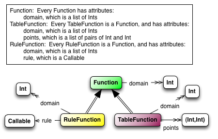

    Three Function Concept Types.

We extend this model to explore some concept instances, with the
following Python code and corresponding PySTEMM visualization:

.. code-block:: python

    tf = TableFunction(points=[(1, 10), (2, 15)])

    M = Model()
    M.addInstances(tf)
    M.showMethod(tf, 'eval')
    M.showEval(tf,'eval',[1])

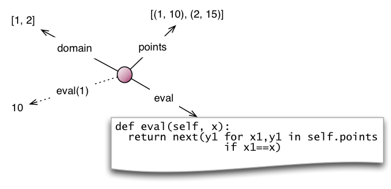

    Concept Instance of TableFunction.

Note that *tf*, the instance of TableFunction, is shown in the same
color as the TableFunction class. It’s domain was calculated from its
list of points, its value at x=1 evaluates to 10, and the logic for its
eval() is shown in the context of the instance, so it is quite easy to
understand.

In subsequent sections, I will usually elide the original Python code,
and show what the PySTEMM tool generates.

Inverse Functions
-----------------

An InverseFunction inverts some other function. InverseFunction is a
*high-order function*, since it receives a function to invert, and
results in a new function. It has its own rule for *eval()*, which
effectively flips the *x,y* pairs of the function that it inverts. It’s
domain is computed as the set of *y* values of the function it inverts.
The model below was generated by extending the previous model, adding
the InverseFunction class and one instance of an inverse function.

.. code-block:: python

    inv = InverseFunction(inverts=tf)

    M.addClasses(InverseFunction)
    M.addInstances(inv)
    M.showEval(inv, 'eval',[15])

The instance visualization generated by PySTEMM shows the inverse
function in blue, with the correct *domain* and *eval(10)*.

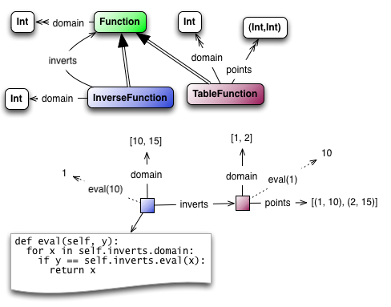

    Concept Instance of InverseFunction.

Function Transforms as High-Order Functions
-------------------------------------------

Functions become very useful when we understand *high-order* functions
like *inverse*. The graph-transforms commonly taught in middle school —
translation, scaling, even rotation — can all be defined as functions
that operate on other functions, resulting in a transformed function. In
the example below, PySTEMM generates a graph plot of the original
function, a shifted version of that function, and a “bumped” version of
the shifted function.

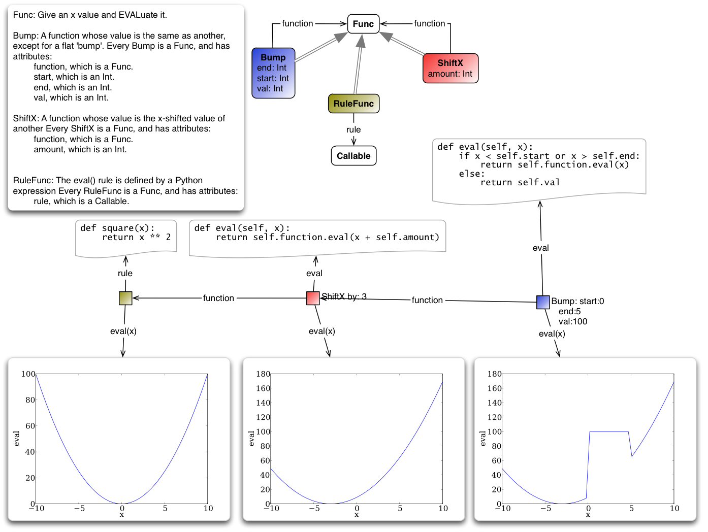

    Function Tranforms: Bump of Shift of f.

The *limit* of a function is itself a high-order function: it operates
on another function and a target point, and evaluates to a single
numeric value (if the limit exists). More advanced concepts, such as
*differentiation* and *integration*, can also be modeled as high-order
functions: they operate on a given function, and result in a new
function.

Chemistry: Reaction
===================

An Atom is modeled as just a name, since our model will not focused on
things like electron or nuclear structure. We use a very simple model of
a Molecule: a formula with a list of pairs of types of atom & a number
indicating how many of that atom. A Reaction has reactants and products,
each being some quantity of a certain kind of molecule. Here is the
model of the *concept types* in Python, and visualized by PySTEMM. Note
that convenient Python constructs, like *lists* of *tuples*, are
visualized in a correspondingly convenient manner.

.. code-block:: python

    class Molecule(Concept):
        formula = List(Tuple(Instance(Atom), Int))

    class Reaction(Concept):
        products = List(Tuple(Int, Instance(Molecule)))
        reactants = List(Tuple(Int, Instance(Molecule)))

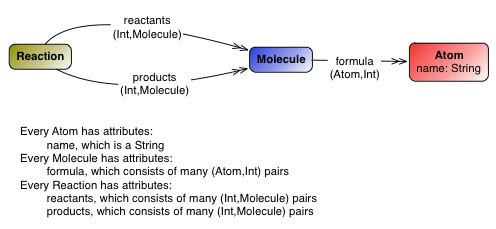

    Reaction Concept Type.

Here is an instance of a molecule:

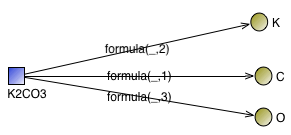

    An Instance of a Molecule.

And here is an instance of a reaction, where the visualization stops at
the molecules and displays a computed label for the reaction and for the
molecules, but elides the detailed structure within molecules.

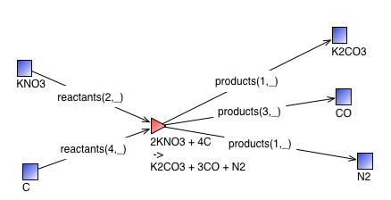

    An Instance of a Reaction.

Chemistry: Reaction Balancing
-----------------------------

Our next model will do the complex computation of reaction balancing for
basic chemical reactions. We start with a model of an unbalanced
reaction: it just has a list of input molecules, and a list of output
molecules, without any coefficients.

We formulate the reaction-balancing problem as an *integer-linear
programming* problem, which we want to solve for the molecule
coefficients, and use the *pylpsolve* module to do the solving. The
input and output molecules impose a set of constraints on the
coefficients: the number of atoms of every element has to cancel out
between inputs and outputs. We write a function *elem\_balance\_matrix*
to compute a matrix of *molecule* vs. *element*, showing the number of
atoms of each element in each molecule, with *+* for reactants and *-*
for products. This matrix, when multiplied by the vector of solution
coefficients, must be *0*. Additionally, all coefficients have to be
positive integers, and the *objective\_function* specifies finding the
smallest coefficients that satisfy these constraints.

PySTEMM generates this visualization, showing the balancing coefficients
for an initially unbalanced reaction, and also displaying the values of
the *elem\_balance\_matrix* and other intermediate variables.

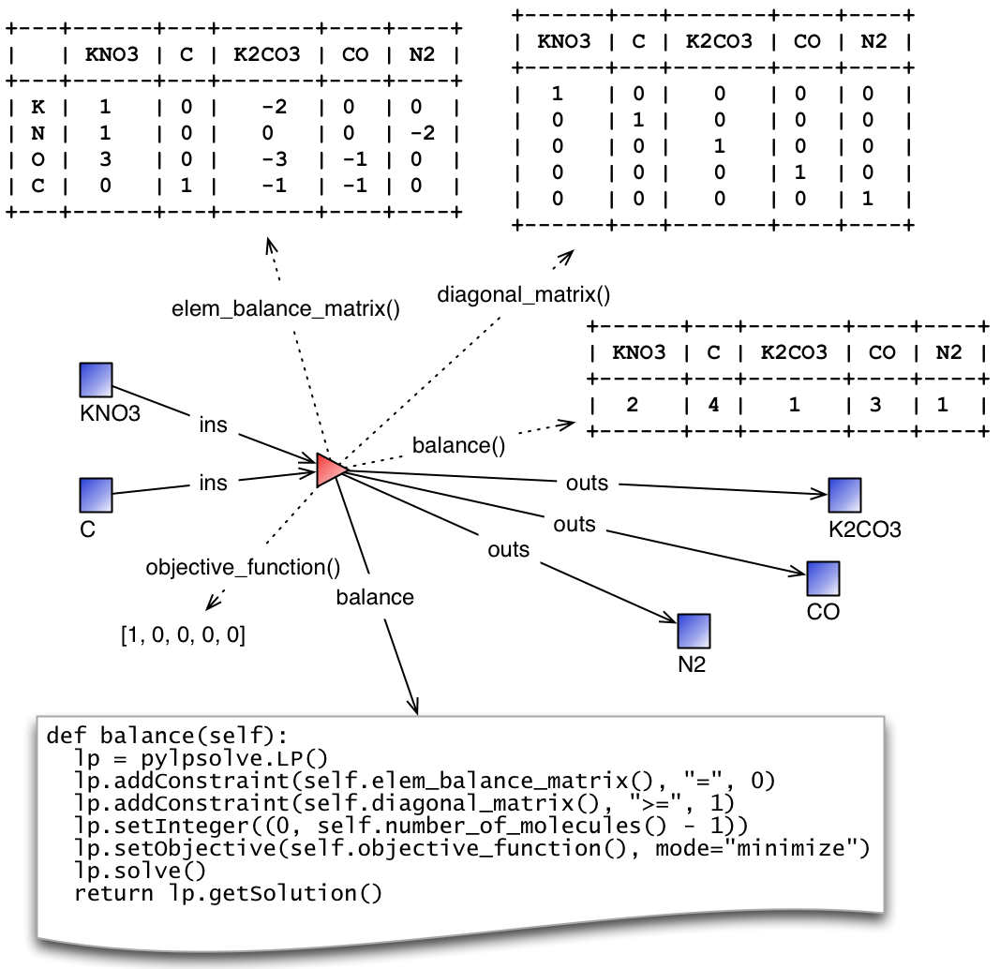

    Reaction balance matrix and solved coefficients.

Chemistry: Layered Models
-------------------------

The previous example illustrates an important advantage of PySTEMM
concept modeling. We do not directly jump in and try to model the
mathematics of reaction balancing. Instead, the focus is on the
structure of the concept instances e.g. What is the model structure for
molecules? For reactions?

Once we have a this represented, we decide what the mathematics should
be, based on that structure. The math version of a molecule is simply a
single column of numbers. The math for a reaction collates these columns
into a matrix. It is a relatively simple task to write functions that
traverse the concept instances and their attributes, and build up the
corresponding math models (matrices of numbers, in this example).

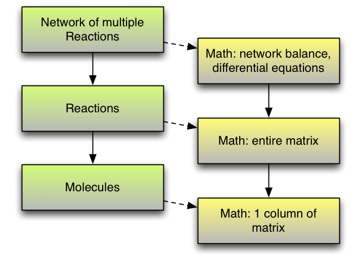

    Layered concept models and generated Math

Below is the initial model for a reaction network, in Python code, and
as visualized by PySTEMM including *instance-level* English narrative.
This model does not include any network-level math models.

.. code-block:: python

    class Network(Concept):
        reactions = List(Instance(Reaction)

    R1 = Reaction(reactants=[(2, NO2)],
                      products=[(1, NO3), (1, NO)])

    R2 = Reaction(reactants=[(1, NO3), (1, CO)],
                      products=[(1, NO2), (1, CO2)])

    Net = Network(reactions=[R1, R2])

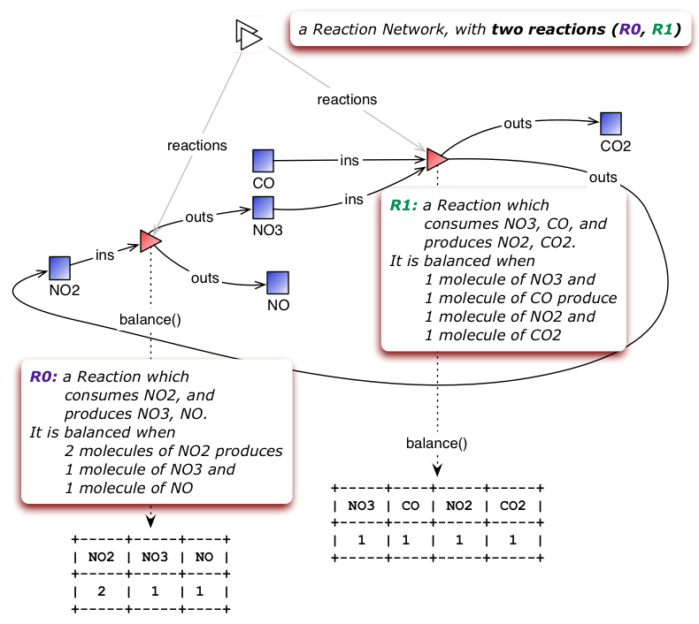

    A reaction network with two reactions

Physics
=======

We model the motion of a ball in 2-dimensions under forces. The ball has
vector-valued attributes for initial position, velocity, and forces. It
also has functions *acceleration*, *velocity*, and *position*, as pure
functions of time, using *numpy* for numerical integration. PySTEMM
generates visualizations that include graphing of the time-varying
functions, and animating the position and velocity (vectors) of the ball
over time (Figure :ref:`phyfig`).

Like all the other visualizations, the animation is specified by a
*template*: a dictionary of visual properties, except that these
property values can now be *functions* of both the *object* being
animated, and the *time* at which its attributes values should be
computed, to determine the visual property values.

.. code-block:: python

    class Ball(Concept):
        forces = List(vector)
        mass, p0, v0 = Float, Instance(vector), ...
        def net_force(self):
            return sum(lambda a, b: a + b, self.forces....))

        def position(self, time):
            return self.p0 + integrate_vec(self.velocity....)

        def p_x(self, time): ....      
        def p_y(self, time): ....

    b = Ball(p0=..., v0=..., mass=..., forces=...)
    m = Model(b)
    m.showGraph(b, 'p_y', (0,10) )
    m.animate(b,    
        (0,10),
        [{k.origin: lambda b,t: [b.p_x(t), b.p_y(t)]]},
         {k.new: k.line, point_list=lambda b, t: ....},
         {k.new: k.line, point_list=lambda b, t: ....}] )

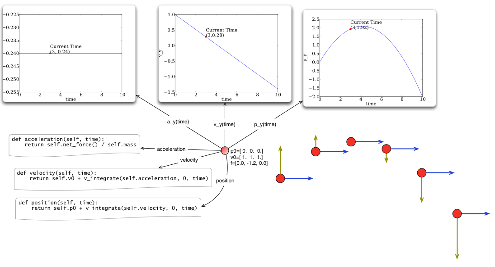

    Ball in motion as functions of time: graphs, integration, animation :label:`phyfig`

Engineering
===========

In summer 2012 I attended the Ocean Engineering Experience program at
MIT, where we designed and built a marine remote-operated vehicle (ROV),
constructed primarily out of sealed PVC pipes. In spring 2013, I used
PySTEMM to re-do some of the 3-D modeling, and generate some engineering
calculations and 3-D visualizations from the model. Here too the models
were defined in a pure functional style e.g. to create a number of pipes
positioned and sized relatively to each other, the model uses pure
functions like *shift* and *rotate* that take a *PVCPipe* and some
geometry transform, and return a new *PVCPipe* with transformed
geometry. This makes it simple to do parametric modeling and construct
and try out different *ROV* structures. The models shown here are
incomplete, as they do not include the motors and the micro-controller
assembly.

.. code-block:: python

    class PVCPipe(Concept):
        density = Float
        def shift(self, v): 
            return PVCPipe(self.p0 + v, self.r, self.axis)
        def rotate(self, a):
            return PVCPipe(self.p0, self.r, self.axis + a)

    class ROV(Concept):
        body = List(PVCPipe)
        def mass(self): ...
        def center_of_mass(self): ...
        def moment_of_inertia(self): ...

    p1 = PVCPipe(....)
    p2 = p1.shift((0,0,3), ...)
    c1, c2 = p1.rotate((0,0,90))...
    rov = ROV(body=p1, p2, c1, c2)

The 3-D visualization, including some of the computed engineering
attributes.

.. figure:: PastedGraphic.pdf

    ROV made of PVCPipes

Implementation
==============

The overall architecture of PySTEMM is illustrated in Figure :ref:`archfig`, and consists
of two main parts: the *tool*, and the *model library*. The tool is
implemented with 3 primary classes:

- Concept: a superclass that triggers special handling of the concept class being defined by the *traits* module.
- Model: a collection of concepts classes and concept instances.
- View: an interface to a desktop scriptable drawing application (via AppleScript).

The diagram below explains the operation of PySTEMM in some more detail,
and lists external modules that were used for specific purposes.

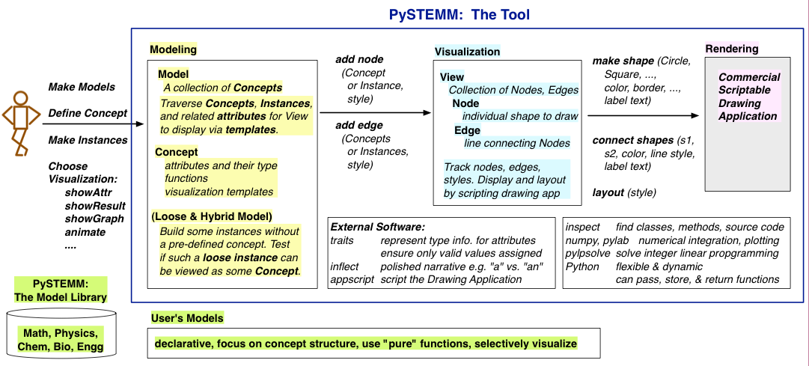

    Architecture of PySTEMM. :label:`archfig`

By requiring all models to be built consistently with objects and pure
functions, we gain several benefits:

-  The user models can be manipulated by the tool more easily, to
   provide tool capabilities like animation and graph-plotting.
-  The values of intermediate values and other computed attributes can
   be as easily displayed as any stored attributes.
-  Debugging becomes less of an issue, as the models are very close to
   the math taught in schools for physics, chemistry, etc.

Templates
---------

All visualization is defined by *templates*, such as the one below:

.. code-block:: python

    Concept_Template = {
        K.text: lambda concept: classLabel(concept),
              K.name: 'Rectangle',
              K.corner_radius: 6,
              ...
              K.gradient_color: "Snow"}

The primary operation on a template is to *apply* it to some modeling
object, typically a concept class, or a concept instance. The
*apply\_template* method is:

.. code-block:: python

    def apply_template(t, obj):
      # values are OG values or functions
      # obj: any object, passed into template functions
      # returns: copy of t, functions F replaced by F(obj)
        if isinstance(t, dict):
            return {k: apply_template(v, obj, time)
                     for k, v in t.items()}
        if isinstance(t, list):
            return [apply_template(x, obj, time)
                     for x in t]
        if callable(t):
            return t(obj)
        return t

Animation Templates have some special case handling (not shown here)
since their functions take 2 parameters: the *instance* to be rendered,
and the value of *time* at which to render it’s attributes.

Summary
=======

I have described PySTEMM, a tool and model library for building
executable concept models for a variety of STEM subjects. Potential
extensions include:

-  Making the models more directly interactive: the main challenge here
   is that rendering is done via scripting of a desktop application,
   making such interaction difficult.
-  Publication and sharing of models via the web: since the models are
   defined as Python code, this would depend on Python’s ability to
   import over the web
-  Making more generic concept models of systems that involve
   differential equations.

References
==========

.. [R1] White, Barbara Y. *ThinkerTools: Causal Models, Conceptual Change, and Science Education*,
        Vol. 10. Berkeley: Taylor & Francis, 1993. Print. Cognition and Instruction.

.. [R2] Ornek, Funda. *Models in Science Education: Applications of Models in Learning and Teaching Science*,
        Turkey: International Journal of Environmental & Science Education, 2008. Print.

.. [R3] Edwards, Jonathan. *Example Centric Programming*,
        The College of Information Sciences and Technology. The Pennsylvania State University, 2004.

.. [R4] "9.8. Functools — Higher-order Functions and Operations on Callable Objects.",
        2013. http://docs.python.org/2/library/functools.html.

.. [R5] Blais, Martin. *True Lieberman-style Delegation in Python*, 
        (Python Recipe)." Active State Code. Active State Software Inc, 14 May 2007.

.. [R6] Sen, S. K., Hans Agarwal, and Sagar Sen. *Chemical Equation Balancing: An Integer Programming Approach*, 
        S.A.: Elsevier, 2006.

.. |image11| image:: PastedGraphic.pdf

