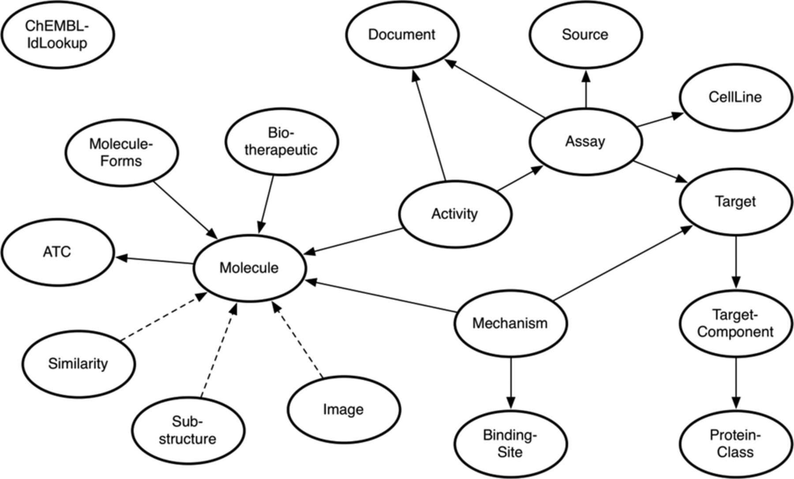
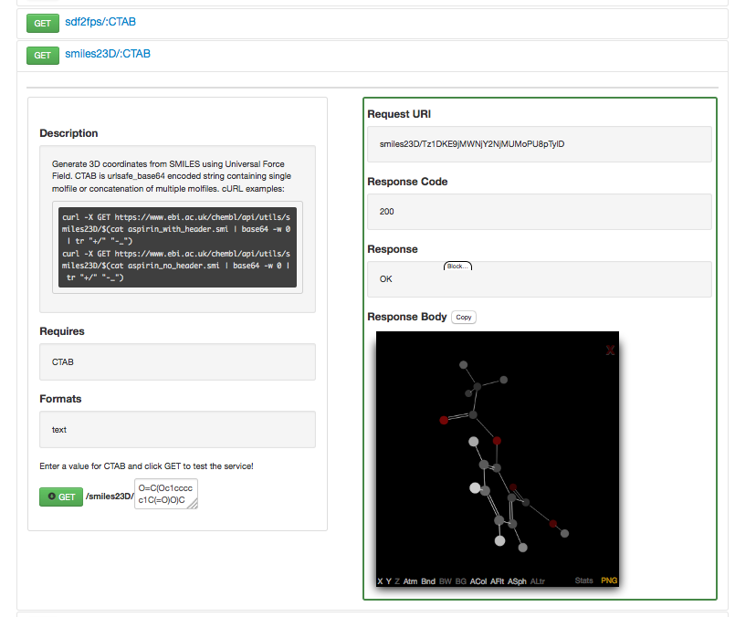
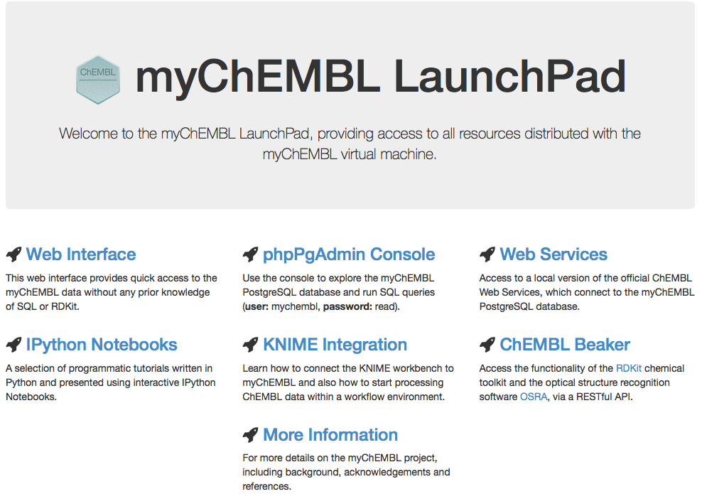
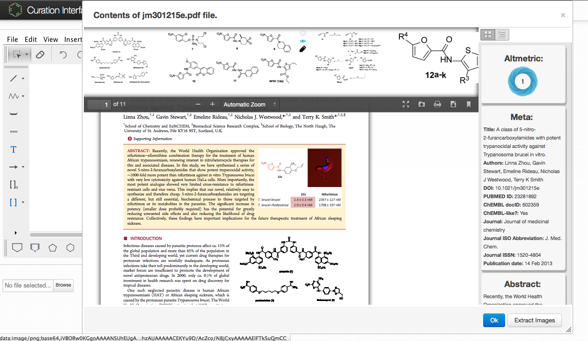

:author: Michał Nowotka
:email: mnowotka@ebi.ac.uk
:institution: European Bioinformatics Institute

:author: George Papadatos
:email: georgep@ebi.ac.uk
:institution: European Bioinformatics Institute

:author: Mark Davies
:email: mdavies@ebi.ac.uk
:institution: European Bioinformatics Institute

:author: Nathan Dedman
:email: ndedman@ebi.ac.uk
:institution: European Bioinformatics Institute

------------------------------------------------
Want Drugs? Use Python.
------------------------------------------------

.. class:: abstract

   We describe how Python is leveraged to streamline the modelling of drug
   discovery data and the development of tools for the scientific community.
   We look at various examples, e.g. chemistry toolkits, machine-learning
   applications and web frameworks and show how Python can glue it all together
   to create efficient data science pipelines.

.. class:: keywords

   drugs, drug-design, chemistry, cheminformatics, pipeline

Introduction
------------

ChEMBL [ChEMBL14]_ is the largest open access database resource in the fields of
computational drug discovery, chemoinformatics and chemical biology.
Developed by the `Chemogenomics team`_ at the `European Bioinformatics
Institute`_, the ChEMBL database stores curated two-dimensional chemical
structures and standardised quantitative bioactivity data alongside calculated
molecular properties.
The majority of the ChEMBL data is derived by manual extraction
and curation from the primary scientific literature, and therefore cover a
significant fraction of the publicly available chemogenomics space.

In this paper, we describe how Python is used as the cornerstone and
foundation inside the ChEMBL group, in order to support and streamline many
facets of the group's work, tools and resources.
In particular, we cover the following topics:

1. Distributing data
2. Performing core cheminformatics operations
3. Rapid data analysis and prototyping
4. Curating data

Data distribution
-----------------

As with most other scientific databases, ChEMBL offers two essential
channels to share its data: `SQL dump downloads`_ *via* FTP and `web services`_.
Both channels have different characteristics - FTP should be used by
organizations, that would like to have their own private instance of ChEMBL
database, with an ability to modify data and without any limitations of how
frequently data can be retrieved.
This method requires downloading a large SQL dump file and a private
machine (physical or virtual), which will host database server.
Because this method requires some non-trivial hardware infrastructure, it can be
expensive.
On the other hand, web services provide ChEMBL data over HTTP(S), using well
defined and documented RESTful protocol.
This method should be used by developers, who wish to create simple web
sites, RIAs or mobile applications, consuming chemical and biological data.

The ChEMBL team uses Python to streamline delivering data using both methods.
In case of SQL dumps, `Django ORM`_ is employed to export data from `Oracle`_
database, used by ChEMBL in production, into two other popular formats:
`MySQL`_ and `PostgreSQL`_.
The `Django data model`_, which describes the ChEMBL database schema, is
responsible for translating incompatible data types, indicating possible
problems with data during `migration process`_, which is fully automated.
After data is populated to separate Oracle, MySQL and PostgreSQL instances,
it is carefully verified and SQL dumps are produced.

Django ORM is used by web services [WS15]_ as well.
This technique simplifies implementing data filtering, ordering and pagination
without having to embed raw SQL statements inside the code.
The whole ChEMBL web services code base is written in Python using `Django
framework`_, `Tastypie`_ for exposing REST resources and `Gunicorn`_ as an
application server.
In production, Oracle is used as a database engine and `MongoDB`_ for caching
results.
Thanks to ORM, the same codebase can be used with open source database engines
as well, which is used in a project called MyChEMBL, described below.

Currently ChEMBL web services provide 18 distinct resource endpoints, each of
which allows to retrieve single resource by ID, multiple resources in bulk and
apply advanced filtering and ordering of data in JSON, JSONP, XML and YAML
formats.
For convenient use in web pages using AJAX technique, CORS mechanism is
implemented.
There is also an `online documentation`_, that allows users to perform web
services calls from a web browser.

   ChEMBL web service schema diagram.
   The oval shapes represent ChEMBL web service resources and the line between
   two resources indicates that they share a common attribute.
   The arrow direction shows where the primary information about a resource
   type can be found.
   A dashed line indicates the relationship between two resources behaves
   differently. :label:`egfig`

Whole `web services codebase`_ is Apache 2.0 licensed and available from
`GitHub`_.
The code is also registered in the Python Package Index (`PyPI`_) so that every
organization having their own ChEMBL server can immediately expose web services.

Performing core cheminformatics operations
------------------------------------------

There are some common computations and techniques, that are essential in the
field of cheminformatics.
Since chemical compounds are usually represented as graph structures these are
similar to the operations, that can be performed on graphs.
The most essential of them are:

1. 2D/3D compound depiction.
2. Finding compounds similar to the given query compound with some similarity
   threshold.
3. Finding all compounds, that have given query compound as substructure.
4. Computing some useful descriptors, such as molecular weight,
   polar surface area, number of rotatable bonds etc.
5. Converting between popular chemical formats/identifiers such as SMILES,
   INCHI, MDL molfile.

There are many software libraries, written in different languages, that
implement some operations described above (or all of them).
From the libraries, that are available with open source license, two are very
robust and comprehensive.
`RDKit`_ (developed and maintained by Greg Landrum) and `Indigo`_ (created by GGA
software, now `Epam`_) toolkits both offer all described functionality, provide
Python bindings and database cartridges (extentions), that allow performing
substructure and similarity searches on compounds stored in RDBMS.
Their quality made them very popular in cheminformatics community and ChEMBL
group in particular.

Both aforementioned toolkits are used for rendering compound images available
*via* ChEMBL web services.
RDKit is used even more extensively.
ChEMBL web services, as described so far, can be seen as a *data-focused*,
as they are responsible for retrieving data stored in the ChEMBL database.
To assist with data processing, loading and curating, a requirement to build
additional *cheminformatics-focused* services was identified.
As a result, `Beaker`_ project was created.
Beaker [Beaker14]_ exposes most functionality offered by RDKit *via* RESTful web
services.
This means that this functionality can be now accessed *via* HTTP, using any
programming language, without having to install RDKit locally.

Just like the *data* part of ChEMBL web services, the *utils* part (Beaker) is
written in pure Python (this time using `Bottle framework`_), Apache 2.0
licensed, available on GitHub, registered to PyPI and having its own `live
online documentation`_.
This means, that it is possible to quickly set up a local instance of beaker
server.

   ChEMBL Beaker online documentation :label:`egfig`

In order to facilitate writing Python software, that uses ChEMBL web services,
`ChEMBL client library`_ has been created.
This small Python package wraps around `Requests library`_, providing more
convenient API, similar to `Django QuerySet`_, offering lazy evaluation of
results, chaining filters and caching results locally.
This effectively reduces requests to remote server to the minimum, which speeds
up data retrieval process.
The package covers full ChEMBL web services functionality so allows to retrieve
data as well as perform chemical computations without installing chemistry
toolkits.

As an example the following code will retrieve all approved drugs for a given
target:

.. code-block:: python

   from chembl_webresource_client.new_client \
       import new_client

   # Receptor protein-tyrosine kinase erbB-2
   chembl_id = "CHEMBL1824"

   activities = new_client.mechanism\
       .filter(target_chembl_id=chembl_id)
   compound_ids = [x['molecule_chembl_id']
                   for x in activities]
   approved_drugs = new_client.molecule\
       .filter(molecule_chembl_id__in=compound_ids)\
       .filter(max_phase=4)

Another example will use Beaker to convert approved drugs from the previous
example to SDF file and compute maximum common substructure:

.. code-block:: python

   from chembl_webresource_client.utils import utils

   smiles = [drug['molecule_structures']['canonical_smiles']
             for drug in approved_drugs]
   mols = [utils.smiles2ctab(smile) for smile in smiles]
   sdf = ''.join(mols)
   result = utils.mcs(sdf)

Rapid data analysis and prototyping
-----------------------------------

Having a very comprehensive cheminformtics toolbox, consisting of chemical
database, efficient data access methods (ORM, web services, client library) and
specialized chemical frameworks and many other popular general purpose
libraries, implementing core data mining and machine learning algorithms, it is
now easier to perform sophisticated data analysis or quickly prototype advanced
cheminformatics applications.

The possibility to create such a toolbox, made Python language so appealing.
Another crucial component in ChEMBL's software stack is `IPython notebook`_
server, which allows to execute Python code along with rich interactive plots
and markdown formatting and rapidly share results with other scientists.

In order to demonstrate capabilities of the software environment used inside
ChEMBL a `collection of IPython notebooks`_ has been prepared.
They contain examples at different difficulty levels, covering following topics:

1. Retrieving data using raw SQL statements, Django ORM, web services and
   the client library.
2. Plotting charts using `matplotlib`_ and `D3.js`_.
3. Detailed RDKit tutorial.
4. Machine learning - classification and regression using `scikit-learn`_.
5. Building predictive models - ligand-based target prediction tutorial using
   RDKit and `Pandas`_.
6. Data mining - MDS tutorial, mining patent data provided by the `SureChEMBL`_
   project.
7. NoSQL approaches - data mining using `Neo4j`_, fast similarity search
   approximation using MongoDB.

Since many notebooks require quite complex dependencies (RDKit, numpy, scipy,
lxml etc.) in order to execute them, preparing the right environment may pose
a challenge to nontechnical users.
This is the reason why ChEMBL team has created a project called *MyChEMBL*
[MyChEMBL14].
`MyChEMBL`_ encapsulates environment consisting of the ChEMBL database running
on PostgreSQL engine with RDKit chemistry cartridge, web services, IPython
Notebook server hosting collection of notebooks described above,
RDKit and Indigo toolkits, data-oriented Python libraries, simple web interface
for performing substructure and similarity search by drawing a compound and many
more.

   MyChEMBL launchpad :label:`egfig`

MyChEMBL comes preconfigured and can be used immediately.
The project is distributed as a Virtual Machine, that can be `downloaded`_ *via*
FTP or obtained using `Vagrant`_ by executing the following commands::

   vagrant init chembl/mychembl_20_ubuntu
   vagrant up --provider virtualbox

There are two variants - one based on `Ubuntu 14.04 LTS`_ and the second
one based on `CentOS 7`_.
Virtual Machine disk images are available in vmdk, qcow2 and img formats.
`Docker`_ containers are available as well.
The scripts used to build and configure machines are available on GitHub so it
is possible to run them on physical machines instead of VMs.

Again, Python plays important role in configuring myChEMBL.
Since Docker is designed to run one process per container and ignores
OS-specific initialization daemons such as upstart, systemd etc. MyChEMBL ships
with `supervisor`_, which is responsible for managing and monitoring all core
MyChEMBL services (such as Postgres, Apache, IPython server) and providing a
single point of entry.

With the wealth of activity data that is present in the ChEMBL database, we can
also leverage this using Python (more specifically, Scikit-learn) to allow us to
build predictive models.
One such application of this currently available publicly, is `ADME SARfari`_,
which allows cross-species prediction and comparison of ADME related targets for
a particular compound or sequence.
This was created with a view to more efficient use of animal models and a
decrease in late stage attrition during the drug development process.
This is achieved by training a naive Bayesian classifier (scikit-learn), with
data extracted from the ChEMBL schema with `SQLAlchemy`_ (Object Relational
Mapping) contained within a web framework (`Pyramid`_ & `Cornice`_) to provide an API
and HTML5 interactive user interface.

Curation of data
----------------

Supporting the process of extracting and curation data from scientific papers
is another area where Python plays an important role.
The ChEMBL team is currently working on a web application, that can aid in-house
expert curators with this rather tedious and time-consuming process.
The application can open a scientific publication in PDF format or a scanned
image and extract compounds presented as images or identifiers.
Extracted compounds are presented to the user in order to correct possible
errors and save them to database.
The system can detect compounds already existing in database and take
appropriate action.

   Extracting data from a scientific publication. :label:`egfig`

Apart from the scientific papers and images, curation interface can handle
most popular chemical formats, such as SDF files, MDL molfiles, SMILES and
InChIs.
It uses `Celery`_ as synchronous task queue for performing the necessary
chemistry calculations when new a compound is inserted or updated.
With this system, a chemical curator no longer has to deal with raw SQL
statements, that can be hard to learn or debug, instead they can focus on domain
specific tasks.

Discussion
----------

Python is an essential technology in most critical aspects of the ChEMBL team
activities.
It streamlines data distribution, curation and analysis.
The tools build using Python language are robust, flexible and web friendly,
which makes them ideal for collaborating in a scientific environment.
As an interpreted, dynamically typed scripting language, Python is perfect for
prototyping different computing solutions and applications.
Many powerful general purpose libraries, that Python has at its
disposal, (e.g. scikit-learn, pandas, matplotlib) make it even more attractive
and along with domain specific frameworks provide a complete and versatile
computing toolbox.

Acknowledgments
---------------

We acknowledge the following people, projects and communities, without whom
described projects would not have been possible:

1. Greg Landrum and the RDKit community (http://www.rdkit.org/)
2. Francis Atkinson, Nathan Dedman, Gerard van Westen and all former and current
   members of the ChEMBL group.
3. All ChEMBL users, in particular those who have contacted chembl-help and
   suggested enhancements to the existing services

References
----------
.. [ChEMBL14] A.P. Bento. *The ChEMBL bioactivity database: an update*,
           Nucl. Acids Res., 42(D1):D1083-D1090, January 2014.
.. [WS15] M. Davies. *ChEMBL web services: streamlining access to drug discovery data and utilities*,
           Nucl. Acids Res., April 2015.
.. [Beaker14] M. Nowotka. *ChEMBL Beaker: A Lightweight Web Framework Providing Robust and Extensible Cheminformatics Services*,
           Challenges, 5(2):444-449, November 2014.
.. [MyChEMBL14] M. Davies. *MyChEMBL: A Virtual Platform for Distributing Cheminformatics Tools and Open Data*,
           Challenges, 5(2):334-337, November 2014.

.. _European Bioinformatics Institute: http://www.ebi.ac.uk/
.. _Chemogenomics team: https://www.ebi.ac.uk/chembl/
.. _SQL dump downloads: https://www.ebi.ac.uk/chembl/downloads
.. _web services: https://www.ebi.ac.uk/chembl/ws
.. _Django ORM: https://docs.djangoproject.com/en/1.8/topics/db/queries/
.. _Oracle: http://www.oracle.com/technetwork/database/enterprise-edition/overview/index.html
.. _MySQL: https://www.mysql.com/
.. _PostgreSQL: http://www.postgresql.org/
.. _Django data model: https://github.com/chembl/chembl_migration_model
.. _migration process: https://github.com/chembl/chembl_migrate
.. _Django framework: https://www.djangoproject.com/
.. _Tastypie: https://django-tastypie.readthedocs.org/en/latest/
.. _Gunicorn: http://gunicorn.org/
.. _MongoDB: https://www.mongodb.org/
.. _online documentation: https://www.ebi.ac.uk/chembl/api/data/docs
.. _live online documentation: https://www.ebi.ac.uk/chembl/api/utils/docs
.. _GitHub: https://github.com
.. _web services codebase: https://github.com/chembl/chembl_webservices_2
.. _PyPI: https://pypi.python.org/pypi
.. _RDKit: http://www.rdkit.org/
.. _Indigo: https://github.com/ggasoftware/indigo
.. _Epam: http://www.epam.com/
.. _Beaker: https://github.com/chembl/chembl_beaker
.. _Bottle framework: http://bottlepy.org/docs/dev/index.html
.. _ChEMBL client library: https://github.com/chembl/chembl_webresource_client
.. _Requests library: http://www.python-requests.org/en/latest/
.. _Django QuerySet: https://docs.djangoproject.com/en/1.8/ref/models/querysets/
.. _IPython notebook: http://ipython.org/notebook.html
.. _collection of IPython notebooks: https://github.com/chembl/mychembl/tree/master/ipython_notebooks
.. _matplotlib: http://matplotlib.org/
.. _D3.js: http://d3js.org/
.. _scikit-learn: http://scikit-learn.org/stable/
.. _Pandas: http://pandas.pydata.org/
.. _SureChEMBL: https://www.surechembl.org/search/
.. _Neo4j: http://neo4j.com/
.. _MyChEMBL: https://github.com/chembl/mychembl/
.. _downloaded: ftp://ftp.ebi.ac.uk/pub/databases/chembl/VM/myChEMBL/releases/myChEMBL-20_0/
.. _Vagrant: https://www.vagrantup.com/
.. _Ubuntu 14.04 LTS: http://releases.ubuntu.com/14.04/
.. _CentOS 7: https://www.centos.org/
.. _Docker: https://www.docker.com/
.. _supervisor: http://supervisord.org/
.. _Celery: http://www.celeryproject.org/
.. _ADME SARfari: https://www.ebi.ac.uk/chembl/admesarfari
.. _SQLAlchemy: http://www.sqlalchemy.org/
.. _Pyramid: http://www.pylonsproject.org/
.. _Cornice: https://cornice.readthedocs.org/en/latest/
