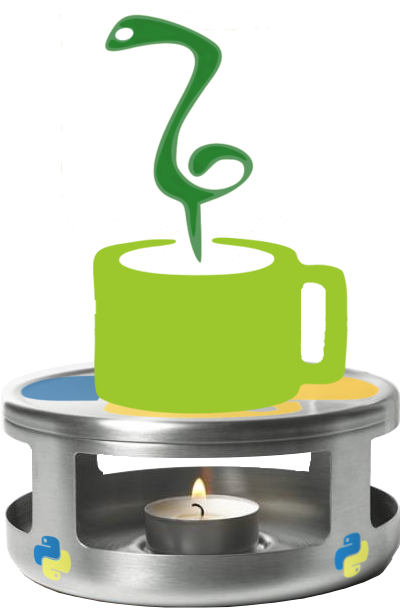
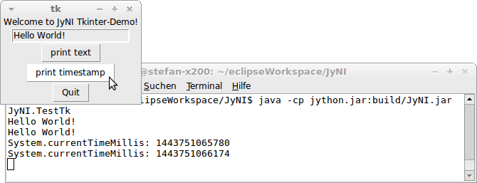

:author: Stefan Richthofer
:email: stefan.richthofer@gmx.de
:institution: Institute for Neural Computation, Ruhr-Universität Bochum

-------------------------------------------------------------------------------
Garbage Collection in JyNI – How to bridge Mark/Sweep and Reference Counting GC
-------------------------------------------------------------------------------

.. class:: abstract

   Jython is a Java based Python implementation and the most seamless way to
   integrate Python and Java. It achieves high efficiency by compiling
   Python-code to Java byte-code and thus letting Java's JIT optimize it – an
   approach that enables Python code to call Java functions or to subclass
   Java classes. It enables Python-code to leverage Java's
   multithreading-features and utilizes Java's built-in garbage collection.
   However, it currently does not support CPython's C-API and thus does not
   support native extensions like NumPy and SciPy. Since most scientific code
   depends on such extensions, it is usually not runnable with Jython.

   For various reasons, implementing CPython's C-API is not an easy task.
   Just to name a few issues – it offers macros to access CPython internals,
   uses a global interpreter lock in contrast to Jython and lets extensions
   perform reference-counting based garbage collection, which is incompatible
   to Java's gc-approach. For each of the arising issues, JyNI proposes a
   feasible solution; most remarkably it emulates CPython's reference counting
   garbage collection on top of Java's mark-and-sweep based approach (taking
   care of adjacent concepts like finalizers and weak references and their
   interference with Jython). (Note that there are vague considerations around
   to switch to mark-and-sweep based gc in a future CPython too. So this
   algorithm might one day be even relevant to CPython in terms of running
   legacy modules.) All this is designed to be binary compatible with existing
   extension builds so that Jython can import the original C-extensions (i.e.
   the same .dll- or .so-file that CPython would use).

.. class:: keywords

   Jython, Java, Python, CPython, extensions, integration, JNI, native, NumPy, C-API, SciPy, GC

Introduction
------------

As interpreter based languages, Python and Java both depend on native language bindings/extensions in many scenarios. Especially scientific code mostly relies on NumPy or native interfaces to some computation- or control-framework that connects Python to problem-specific hardware or libraries – a fact that usually ties this kind of code to CPython.
Developing and maintaining such bindings is usually a difficult and error-prone task. One major goal of the JyNI-project is to let Python and Java – with the help of [JYTHON]_ – share their pools of language-bindings, vastly enriching both ecosystems.

While Jython already enables Python-code to access Java-frameworks and also native JNI Java/C-extensions, it currently locks out all CPython-specific extensions. Remember that this does not only affect the actual C-extensions, but also all Python-frameworks that have a – maybe single, subtle – dependency on such an extension. Dependencies can include:

* Libraries like NumPy that are written directly in terms of the C-API. These libraries, which in turn link native libraries like BLAS, are widely used in the Python ecosystem, especially in scientific code.

* Cython is a popular tool to build optimized C-code from Python source that has been annotated with types and other declaration, using the C-API to link.

* The ctypes and CFFI modules, comparable to JNR, JNA and JFFI in the Java-world respectively, are other popular means of providing support for C bindings, also all written to use the C-API.

* SWIG, Pyrex (from which Cython was derived) and Boost.Python are further tools that create extensions using the C-API.

[JyNI]_ (Jython Native Interface) is going to improve this situation. It is a compatibility layer that implements CPython's C-API on top of JNI and Jython. This way it enables Jython to load native CPython-extensions and use them the same way as one would do in CPython. To leverage this functionality, no modification to Python code or C-extension source-code is required – one just needs to add JyNI.jar to Jython's classpath (along with its binary libraries). That means JyNI is binary compatible with existing builds of CPython-extensions.
 
Developing JyNI is no trivial task, neither is it completed yet. Main reason for this is Python's rather complex C-API that allows to access internal structures, methods and memory-positions directly or via C-macros (in some sense CPython simply exposes its own internal API via a set of public headers). Existing extensions frequently *do* make use of this, so it is not a purely academical concern. Concepts like Python's global interpreter lock (GIL), exception-handling and the buffer-protocol are further aspects that complicate writing JyNI. [PyMB_PLS15]_ mentions the same issues from PyPy's perspective and confirms the difficulty of providing CPython's native API.

By far the most complex issue overall – and main focus of this paper – is garbage collection. Unlike JNI, CPython offers C-level access to its garbage collector (GC) and extensions can use it to manage their memory. Note that in contrast to Java's mark-and-sweep based GC, CPython's GC uses reference-counting and performs reference-cycle-search. Adopting the original CPython-GC for native extensions is no feasible solution in JyNI-context as pure Java-objects can become part of reference-cycles that would be untraceable and cause immortal trash. Section :ref:`why-is-garbage-collection-an-issue` describes this issue in detail.

.. Further we plan to have a GIL-free mode. Note that CPython mainly needs the GIL, because reference 
   counters are not atomic. Our GIL-free mode would completely substitutes extensions' reference 
   counting by Java-GC. However this mode can break some extensions depending on how they internally 
   use Python-references. It additionally will have an increased demand on reference-handles on Java 
   side, so developers must consider for each extension individually whether GIL-free mode is feasible 
   and valuable (JyNI will presumably allow to set this mode per-extension).

While there are conceptual solutions for all mentioned issues, JyNI does not yet implement the complete C-API and currently just works as a proof of concept. However we are working to provide sufficient C-API to fully support ctypes (many Python-libraries, e.g. for graphics and 3D-plotting etc. have this as the single native dependency), NumPy, SciPy (multiarray libraries with blas- and lapack-bindings; frequently used in scientific code and machine learning frameworks) and other important extensions as soon as possible.

Overview
........

JyNI's basic functionality has been described in detail in [JyNI_ESCP13]_. After giving a short comprehension in section :ref:`implementation` we will focus on garbage collection in section :ref:`garbage-collection`. For usage examples and a demonstration-guide also see [JyNI_ESCP13]_.

Related Work
............
 
There have been similar efforts in other contexts.

* [JEP]_ and [JPY]_ can bridge Java and Python by embedding the CPython interpreter. However, none of 
  these approaches aims for integration with Jython. In contrast to that, JyNI is entirely based on 
  Jython and its runtime.

* [IRONCLAD]_ is a JyNI-equivalent approach for IronPython.

* [PyMB]_ provides C-extension API support in PyPy to some extent by embedding the CPython 
  interpreter. Thus its approach is comparable to [JEP]_ and [JPY]_.

* [CPYEXT]_ refers to PyPy's in-house (incomplete) C-extension API support.

None of the named approaches reached a sufficient level of functionality/compatibility, at least not for current language versions (some of them used to work to some extend, but became unmaintained). In the Python ecosystem the C-extension API has been an ongoing issue since its beginning. PyPy famously has been encouraging developers to favor CFFI above C-extension API, as it is the only existing approach that has been designed to be well portable to other Python implementations. However even if this effort would work out, there would be so many legacy extensions around that a serious move to CFFI won't be done in foreseeable future.

For some of these projects JyNI's GC-approach might be a relevant inspiration, as they face the same problem if it comes to native extensions. There are even vague considerations for CPython to switch to mark-and-sweep based GC one day to enable a GIL-free version (c.f. [PY3_PLS15]_). Background here is the fact that reference-counting based garbage collection is the main reason why CPython needs a GIL: Current reference counters are not atomic and switching to atomic reference counters yields insufficient performance.
In context of a mark-and-sweep based garbage collection in a future CPython the JyNI GC-approach could be potentially adopted to support legacy extensions and provide a smooth migration path.

.. - follow-up paper of [JyNI_ESCP13]_
   - issues stated by PyMBbiosis
   - CPython attempts to remove GIL in future
   - platforms
   - related work: PyMBbiosis, Jep, JPy, IronClad

Implementation
--------------

In order to bridge Jython's and CPython's concepts of PyObjects, we apply three
different techniques, depending on the PyObject's implementation details.

.. figure:: Modi.eps
   :scale: 26%
   :figclass: h

   Approaches to bridge PyObjects. *Left*: Native PyObject wraps Java. *Center*: Java-PyObject wraps native one. *Right*: Objects are mirrored. :label:`modi`

The basic approach is to back the C-API of PyObject by a Java-PyObject via JNI.
This would avoid data-synchronization issues, but is only feasible if there are matching counterparts of the PyObject type in Jython and CPython (fig. :ref:`modi`, left).
For CPython-specific types we can do it the other way round  (fig. :ref:`modi`, center). Another problem is that CPython API defines macros in pulic headers that access PyObjects' internal data. To deal with these, we sometimes have to mirror the object (fig. :ref:`modi`, right).
This might involve data-synchronization issues, but luckily macors mostly exist for immutable types, so initial synchronization is sufficient. [JyNI_ESCP13]_ describes this in more detail.

Global interpreter lock (GIL)
.............................

As mentioned before, CPython needs a global interpreter lock (GIL), because its reference-counting based garbage collection uses non-atomic reference counters. That means that CPython is entirely single-threaded in its usual operation mode.
A native extension can explicitly release the GIL by inserting the ``Py_BEGIN_ALLOW_THREADS`` and ``Py_END_ALLOW_THREADS`` macros to deal with multiple threads and related things like input events (e.g. Tkinter needs this). In the potentially multithreaded code between these macros it is the extension's own responsibility to refrain from non-thread-safe operations like incrementing or decrementing reference counters. This can be error-prone and challenging as the extension must ensure this also for eventually called methods.

Jython on the other hand has no GIL and is fully multithreaded based on Java's threading architecture. This does not mean multithreading would be trivial – one still has to care for concurrency issues and thread synchronization, but the whole machinary Java came up with for this topic is available to deal with it.

From JyNI's perspective this is a difficult situation. On the one hand we want to avoid regressions on Jython-side, especially regarding a killer-feature like GIL-freeness. On the other hand, native C-extensions might rely on CPython's GIL.
So as a compromise JyNI provides a GIL for native side that is acquired by any thread that enters native code. On returning to Java-code, i.e. finnishing the native method call, the JyNI-GIL is released. Note that re-entering Java-side by doing a Java call from a native method would *not* release the GIL. In case it is desired to release the GIL for such a re-entering of Java-side or in some other situation, JyNI also supports the ``Py_BEGIN_ALLOW_THREADS`` and ``Py_END_ALLOW_THREADS`` macros from CPython. This architecture implies that multiple threads can exist on Java-side, while only one thread can exist on native side at the same time (unless allow-threads macros are used). When combining multithreaded Jython code with JyNI it is the developer's responsibility to avoid issues that might arise from this design.

Garbage Collection
------------------

While there are standard approaches for memory management in context of JNI,
none of these is applicable to JyNI. In this section we sketch the default
approaches, illustrate why they fail and finally provide a feasible solution.

Why is Garbage Collection an issue?
...................................

Consider a typical JNI-scenario where a native object is accessed from Java.
Usually one would have a Java-object (a “peer”) that stores the native
memory address of the C-object (a pointer to it) in a ``long``-variable. The
naive approach to do memory management would be a ``finalize``-method
in the peer-class. This finalizer would then trigger a native ``free``-call
on the stored memory-handle. However, finalizers are considered bad style in
Java as they impact GC-efficiency. The recommended approach for this scenario
is based on weak references and a reference-queue (c.f. [JREF]_).

.. figure:: OrdinaryGC.eps
   :scale: 42%
   :figclass: H

   Ordinary JNI memory management :label:`oJNImm`

Figure :ref:`oJNImm` sketches the following procedure:

* a ``java.lang.ref.WeakReference`` is used to track the peer
* actually we use a subclass of ``java.lang.ref.WeakReference`` that stores
  a copy of the peer's stored native memory-handle
* a ``java.lang.ref.ReferenceQueue`` is registered with the weak reference
* after every run, Java-GC automatically adds cleared weak references to such
  a queue if one is registered
  (this is Java's variant of Python's weak reference callbacks)
* we poll from the reference queue and clean up the corresponding native resource
* since other native objects might need the resource we don't just call ``free``,
  but instead perform reference counting

So far, this would work. But remember, JyNI also needs the opposit scenario, where
a native peer is backed by a Java-object (see figure :ref:`nnJ0`).

.. figure:: NativeNeedsJava_0050.eps
   :scale: 42%
   :figclass: H

   A native peer backed by a Java-object :label:`nnJ0`

To prevent Java-GC from destroying the Java-backend while it is in use, JNI offers
the concept of global references – JNI-``GlobalRef``-objects. However, native code
must explicitly create and release such global references. During the lifetime of a
native global reference the Java-side referent is immortable. Now consider the referent
would hold further references to other Java-objects. The reference chain could at
some point include an object that is a peer like shown in figure :ref:`oJNImm`. This peer
would be keeping alive a native object by holding a reference-increment on it. If
the native object also holds reference-increments of other native objects this
can create a pathological reference cycle like illustrated in figure :ref:`aprc`.

.. figure:: NativeNeedsJava.eps
   :scale: 42%
   :figclass: H

   A pathological reference cycle :label:`aprc`

This kind of cycle cannot be cleared by Java-GC as the ``GlobalRef`` prevents it.
Native reference cycle search like known from CPython could not resolve the cycle
either, as it cannot be traced through Java-side. For debugging purposes we actually
added a traverseproc-mechanism to Jython that would allow to trace references
through Java-side, but to clear such a cycle in general just tracing Java-side
references is not sufficient; Java-side reference counting would be required. This
in turn would Jython require to have a GIL, which would be an unacceptable regression.

How JyNI solves it (basic approach)
...................................

To solve this issue, JyNI explores the native reference graph using CPython's traverseproc
mechanism. This is a mechanism PyObjects must implement in order to be tractable by
CPython's garbage collector, i.e. the code that searches for reference cycles. Basically
a ``PyObject`` exposes its references to other objects this way. While JyNI explores the native
reference graph, it mirrors it on Java-side using some minimalistic head-objects
(``JyNIGCHead`` s); see figure :ref:`rnrg`. Note that with this design, also Java-objects,
especially Jython-PyObjects can participate in the reference graph and keep parts of it alive.

.. latex::
   \begin{figure}[H]\noindent\makebox[\columnwidth][c]{\includegraphics[scale=0.42]{JyNIGCBasic_0108.eps}}
   \caption{reflected native reference graph \DUrole{label}{rnrg}}
   \end{figure}

If a part of the (native) reference-graph becomes unreachable (figure :ref:`cuo`), this is
reflected (asynchronously) on Java-side. At its next run, the Java-GC will collect this
subgraph and weak references registered to a reference queue can detect deleted objects and
then release native references.

.. figure:: JyNIGCBasic_0130.eps
   :scale: 42%
   :figclass: H

   clearing unreachable objects :label:`cuo`

How JyNI solves it (hard case)
..............................

The fact that the reference-graph is mirrored asynchronously can lead to bad situations.
While JyNI features API that allows C-code to report changes of the graph, we cannot
enforce native references to report such changes. However we made sure that all builtin
types instantaneously send updates to Java-side on modification.

Now consider that a native extension changes the reference graph silently and Java's GC
runs before this change was mirrored to Java-side. In that case two types of errors could
normally happen:

1) Objects might be deleted that are still in use
2) Objects that are not in use any more persist

The design applied in JyNI makes sure that only the second error can happen and that only
temporarily, i.e. objects might persist for an additional GC-cycle or two, but not forever.
To make sure that the first kind of error cannot happen, we check a to-be-deleted native
reference subgraph for inner consistency before actually deleting it. 

.. figure:: JyNIGCHard_0050.eps
   :scale: 42%
   :figclass: H

   graph must be checked for inner consistency (GC ran before orange connection was mirrored to Java-side) :label:`constcy`

If not all native reference counts are explainable within this subgraph
(c.f. figure :ref:`constcy`), we redo the exploration of participating
PyObjects and update the mirrored graph on Java-side.

.. figure:: JyNIGCHard_0080.eps
   :scale: 42%
   :figclass: H

   recreated graph :label:`recreated`

While we can easily recreate the GC-heads, there might be PyObjects that
were weakly reachable from native side and were sweeped by Java-GC. In order
to restore such objects, we must perform a resurrection
(c.f. figure :ref:`resurrected`).

.. figure:: JyNIGCHard_0090.eps
   :scale: 42%
   :figclass: H

   resurrected Java-backend :label:`resurrected`

The term object-resurrection refers to a situation where an object was
garbage-collected, but has a finalizer that restores a strong reference
to the object. Note that while resurrection is not recommended – actually the
possibility of a resurrection is the main reason why finalizers are
not recommended – it is a legal operation. So certain GC-heads need to be able
to resurrect an underlying Jython-PyObject and thus must have a finalizer.
Since only certain objects can be subject to a silent reference-graph
modification, it is sufficient to let only gc-heads attached to these objects
implement finalizers – we use finalizers only where really needed.

Testing native garbage collection
.................................

Since the proposed garbage collection algorithm is rather involved, it is
crucial to have a good way to test it. To achieve this we developed a
monitoring concept that is capable to track native allocations, finalizations,
re- and deallocations. The class ``JyNI.JyReferenceMonitor`` can – if native
monitoring is enabled – list at any time all natively allocated objects,
their reference counts, timestamps for allocation, finalization, re-
and deallocations and the corresponding code positions (file and line-number)
that performed the memory operations. Unless explicitly cleared, it can also
provide history of these actions. The method ``listLeaks()`` lists all currently
allocated native objects (actually these are not necessarily leaks, if the method
is not called at the end of a program or test). While ``listLeaks()`` is useful for
debugging, ``getCurrentNativeLeaks()`` provides a list that is ideal for unit
testing. E.g. one can assert that no objects are leaked:

.. code-block:: python

  from JyNI import JyReferenceMonitor as monitor
  #...
  self.assertEqual(
      len(monitor.getCurrentNativeLeaks()), 0)

The native counterpart of ``JyNI.JyReferenceMonitor`` is ``JyRefMonitor.c``.
Its header defines the ``JyNIDebug``-macro family, wich we insert into C-code
wherever memory operations occur (mainly in ``obmalloc.c`` and various inlined
allocations in ``stringobject.c``, ``intobject.c`` etc.).

Consider the following demonstration code:

.. code-block:: python

    import time
    from java.lang import System
    from JyNI import JyReferenceMonitor as monitor
    import DemoExtension
    JyNI.JyRefMonitor_setMemDebugFlags(1)
    lst = ([0, "test"],)
    l[0][0] = lst
    DemoExtension.argCountToString(lst)
    del lst
    print "Leaks before GC:"
    monitor.listLeaks()
    System.gc()
    time.sleep(2)
    print "Leaks after GC:"
    monitor.listLeaks()

It creates a reference cycle, passes it to a native function and deletes it
afterwards. By passing it to native code, a native counterpart of ``lst`` was
created, which cannot be cleared without some garbage collection (also in
CPython it would need the reference cycle searching garbage collector).
We list the leaks before calling Java's GC and after running it.
The output is as follows::

  Leaks before GC:
  Current native leaks:
  140640457447208_GC (list) #2:
      "[([...],), 'test']"_j *38
  140640457457768_GC (tuple) #1:
      "(([([...],), 'test'],),)"_j *38
  140640457461832 (str) #2: "test"_j *38
  140640457457856_GC (tuple) #3:
      "([([...],), 'test'],)"_j *38
  Leaks after GC:
  no leaks recorded

We can see that it lists some leaks before running Java's GC. Each line
consists of the native memory position, the type (in round braces), the
current native reference count indicated by ``#``, a string representation
and the creation time indicated by ``*`` in milliseconds after initialization
of the ``JyReferenceMonitor`` class. The postfix ``_GC`` means that the object
is subject to garbage collection, i.e. it can hold references to other objects
and thus participate in cycles. Objects without ``_GC`` will be directly freed
when the reference counter drops to zero. The postfix ``_j`` of the string
representation means that Jython generated the string rather than native code.
We close this section by discussing the observed reference counts:

* The list-object has one reference increment from its ``JyGCHead`` and the other
  from the tuple at the bottom of the output.
* The first-listed tuple is the argument-tuple and only referenced by its ``JyGCHead``.
* The string is referenced by its ``JyGCHead`` and the list.
* The tuple at the bottom is referenced by its ``JyGCHead``, by the list and by
  the argument-tuple.

Weak References
---------------

Supporting the ``PyWeakRef``-builtin type in JyNI is not as complicated as
garbage collection, but still a notably involved task. This is mainly due
to consistency-requirements that are not trivial to fulfill.

- If a Jython weakref-object is handed to native side, this shall be converted
  to a CPython weakref-object and vice versa.
- If native code evaluates a native weakref, it shall return the exactly same
  referent-PyObject that would have been created if the Java-pendant (if one exists)
  was evaluated and the result was handed to native side. And vice versa.
- If a Jython weak reference is cleared, its native pendant shall be cleared either.
  Still, none of them shall be cleared as long as its referent is still alive.
- This implies that even if a Jython referent-PyObject was deleted (can happen in mirror-mode)
  Jython weakref-objects stay alive as long as the native pendant of the referent is alive.
  If evaluated, such a Jython weakref-object retrieves the Jython referent by converting
  the native referent.
- An obvious requirement is that this shall of course work without keeping the referents
  alive or creating some kind of memory leak. JyNI's delicate garbage-collection mechanism
  must be taken into account to fulfill the named requirements in this context.

.. - Native and Java-side weakref-objects shall not be cleared significantly at different
   times (e.g. in different GC-cycles). I.e. it shall not happen that a native weakref
   is already cleared, while its Jython-pendant is still valid (or the other way round).
   This is required to ensure a consistent clear-status between Jython-side and native
   weakref-objects.

In the following, we explain JyNI's solution to this issue. We start by explaining the
weakref-concepts of Jython and CPython, completing this section by describing how JyNI
combines them to a consistent solution.
Note that CPython's weakref-module actually introduces three builtin types:

- ``_PyWeakref_RefType`` (“weakref”)
- ``_PyWeakref_ProxyType`` (“weakproxy”)
- | ``_PyWeakref_CallableProxyType``
  | (“weakcallableproxy”)

Weak References in Jython
.........................

In Jython the package ``org.python.modules._weakref`` contains the classes that implement
weak reference support.

- ``ReferenceType`` implements the “weakref”-builtin
- ``ProxyType`` implements the “weakproxy”-builtin
- ``CallableProxyType`` implements the “weakcallableproxy”-builtin

All of them extend ``AbstractReference``, which in turn extends
``PyObject``.

.. figure:: JythonWeakRef.eps
   :scale: 55%
   :figclass: H

   Jython's concept for weak references :label:`jythonwr`

As figure :ref:`jythonwr` illustrates, Jython creates only one Java-style weak reference
per referent. This is created in form of a ``GlobalRef``-object, which extends
``java.lang.ref.WeakReference``. It stores all Jython weak references pointing to it
in a static, weak-referencing map. This is needed to process potential callbacks when the
reference is cleared. Once created, a ``GlobalRef`` is tied to its referent, kept alive
by it and is reused throughout the referent's life-time. Finally,
``AbstractReference``-subclasses refer to the ``GlobalRef`` corresponding to their actual
referent.

Weak References in CPython
..........................

In CPython, each weakref-type simply contains a reference to its referent without increasing
reference count.

.. figure:: CPythonWeakRef.eps
   :scale: 55%
   :figclass: H

   CPython's concept for weak references :label:`cpythonwr`

Figure :ref:`cpythonwr` shows that – like in Jython – referents have a reference to
weak references pointing to them; in this case references are connected in a
double-linked list, allowing to iterate them for callback-processing.

Weak References in JyNI
.......................

JyNI's weak reference support is grounded on CPython's approach on native side and
Jython's approach on Java-side. However, the actual effort is to bridge these approaches
in a consistent way.

.. figure:: JyNIWeakRef.eps
   :scale: 42%
   :figclass: H

   JyNI's concept for weak references :label:`jyniwr`

To fulfill the requirement for consistent clear-status, we drive a “Java-referent dies
first”-politic. Instead of an ordinary ``GlobalRef``, JyNI uses a subclass called
``NativeGlobalRef``. This subclass holds a reference-increment for the native counterpart
of its referent. This ensures that the native referent cannot die as long as Jython-side
weak references exist (see figure :ref:`jyniwr`). Otherwise, native weak references could
be cleared earlier than their Jython-pendants. Note that the native ref-increment held by
``NativeGlobalRef`` cannot create a reference-cycle, because it is not reflected by a
``JyNIGCHead`` as seen in figure :ref:`rnrg`. Also, the consistency-check shown in figure
:ref:`constcy` takes this ref-increment into account, i.e. tracks ref-increments coming from
``NativeGlobalRef`` s separately.

.. figure:: JyNIWeakRef-NoJavaReferent.eps
   :scale: 42%
   :figclass: H

   JyNI weak reference after Java-referent was collected :label:`jyniwrnj`

If the Jython-side referent and its native pendant are handled in mirror-mode, it can happen
that the Java-referent is garbage-collected while the native one persists. As soon as the
Jython-side referent is collected, its ``NativeGlobalRef`` releases the native
reference-increment (see figure :ref:`jyniwrnj`). Still, it will not be cleared and process
callbacks, before also the native referent dies. Until then, ``NativeGlobalRef`` continues
to be valid – it implements its ``get``-method such that if the Jython-side referent is not
available, it is recreated from the native referent. As long as such a retrieved referent is
alive on Java-side, the situation in figure :ref:`jyniwr` is restored.

Examples
--------

The code-samples in this section are runnable with Jython 2.7.1 and JyNI 2.7-alpha.3 or newer.

Using Tkinter from Java
.......................

In [JyNI_ESCP13]_ we demonstrated a minimalistic Tkinter example program that used the original
Tkinter binary bundeled with CPython. Here we demonstrate how the same functionality can be
achieved from Java-code. This confirms the usability of Python-libraries from Java via Jython
and JyNI. While the main magic happens in Jython, it is not completely self-evident that this
is also possible through JyNI and required some internal improvements to work. Remember the
Tkinter-program from [JyNI_ESCP13]_:

.. code-block:: python

    import sys
    #Include native Tkinter:
    sys.path.append('/usr/lib/python2.7/lib-dynload')
    sys.path.append('/usr/lib/python2.7/lib-tk')

    from Tkinter import *

    root = Tk()
    txt = StringVar()
    txt.set("Hello World!")

    def print_text():
        print txt.get()

    def print_time_stamp():
        from java.lang import System
        print "System.currentTimeMillis: "
            +str(System.currentTimeMillis())

    Label(root,
         text="Welcome to JyNI Tkinter-Demo!").pack()
    Entry(root, textvariable=txt).pack()
    Button(root, text="print text",
            command=print_text).pack()
    Button(root, text="print timestamp",
            command=print_time_stamp).pack()
    Button(root, text="Quit",
            command=root.destroy).pack()

    root.mainloop()

   Tkinter demonstration by Java-code. Note that the class ``JyNI.TestTk`` is executed
   rather than ``org.python.util.jython``. :label:`tkDemo`

To translate the program to Java, we must provide type-information via some interfaces (after importing som Jython-classes):

.. code-block:: java

    import org.python.core.PyObject;
    import org.python.core.PyModule;
    import org.python.core.PySystemState;
    import org.python.core.Py;
    import org.python.core.imp;

    public static interface Tk {
        public void mainloop();
        public void destroy();
    }

    public static interface StringVar {
        public String get();
        public void set(String text);
    }

    public static interface Label {
        public void pack();
    }

    public static interface Button {
        public void pack();
    }

    public static interface Entry {
        public void pack();
    }

We define the methods backing the button-actions as static methods with a special Python-compliant signature:

.. code-block:: java

    static Tk root;
    static StringVar txt;

    public static void printText(PyObject[] args,
            String[] kws) {
        System.out.println(txt.get());
    }

    public static void printTimeStamp(PyObject[] args,
            String[] kws) {
        System.out.println("System.currentTimeMillis: "
                + System.currentTimeMillis());
    }

    public static void destroyRoot(PyObject[] args,
            String[] kws) {
        root.destroy();
    }

On top of this a rather Java-like main-method can be implemented. Note that constructing objects is still somewhat unhandy, as keywords must be declared in a string-array and explicitly passed to Jython. Calling methods on objects then works like ordinary Java-code and is even type-safe based on the declared interfaces.

.. code-block:: java

    public static void main(String[] args) {
        PySystemState pystate = Py.getSystemState();
        pystate.path.add(
                "/usr/lib/python2.7/lib-dynload");
        pystate.path.add("/usr/lib/python2.7/lib-tk");
        PyModule tkModule = (PyModule)
                imp.importName("Tkinter", true);

        root = tkModule.newJ(Tk.class);

        txt = tkModule.newJ(StringVar.class);
        txt.set("Hello World!");

        Label lab = tkModule.newJ(Label.class,
                new String[]{"text"}, root,
                "Welcome to JyNI Tkinter-Demo!");
        lab.pack();

        Entry entry = tkModule.newJ(Entry.class,
                new String[]{"textvariable"}, root, txt);
        entry.pack();

        String[] kw_txt_cmd = {"text", "command"};
        Button buttonPrint = tkModule.newJ(Button.class,
                kw_txt_cmd, root, "print text",
                Py.newJavaFunc(TestTk.class,
                        "printText"));
        buttonPrint.pack();

        Button buttonTimestamp = tkModule.newJ(
                Button.class, kw_txt_cmd,
                root, "print timestamp",
                Py.newJavaFunc(TestTk.class,
                        "printTimeStamp"));
        buttonTimestamp.pack();
        
        Button buttonQuit = tkModule.newJ(Button.class,
                kw_txt_cmd, root, "Quit",
                Py.newJavaFunc(TestTk.class,
                        "destroyRoot"));
        buttonQuit.pack();

        root.mainloop();
    }

Using native ctypes
...................

As of version alpha.3 JyNI has experimental support for ctypes. The following code provides a minimalistic example that uses Java- and C-API. Via an std-lib C-call we obtain system time and print it using Java console.

.. code-block:: python

  import sys
  sys.path.append('/usr/lib/python2.7/lib-dynload')
  sys.path.insert(0, '../../Lib')
  
  import ctypes
  from java.lang import System
  
  libc = ctypes.CDLL('libc.so.6')
  print libc
  print libc.time
  System.out.println('Timestamp: '+str(libc.time(0)))

The output is as follows::

  <CDLL 'libc.so.6', handle 83214548 at 2>
  <_FuncPtr object at 0x7f897c7165d8>
  Timestamp: 1446170809

We briefly discuss the import section. Note that Jython already features an incomplete ctypes-module based on jffi. With an unmodified ``sys.path``-variable the output would look as follows::

  <ctypes.CDLL instance at 0x2>
  <ctypes._Function object at 0x3>
  Traceback (most recent call last):
    File "/home/stefan/workspace/JyNI/JyNI-Demo/src
            /JyNIctypesTest.py", line 68, in <module>
    System.out.println(libc.time(0))
  NotImplementedError: variadic functions not
  supported yet;  specify a parameter list

In ``sys.path.insert(0, '../../Lib')`` we insert a path to a ctypes-implementation bundeled with JyNI. We insert it at the beginning of ``sys.path`` such that it overrides Jython's ctypes implementation. The ctypes implementation bundeled with JyNI is almost identical to CPython's original ctypes and slight changes were only applied in __init__.py, i.e. only in Python-code. For the C-part JyNI can utilize the compiled _ctypes.so file bundeled with CPython (remember that JyNI is binary compatible to such libraries). In our example we make CPython's C-extension folder available by appending its usual posix location ``'/usr/lib/python2.7/lib-dynload'`` to ``sys.path``.

In ctypes/__init__.py we had to fix posix-recognition; it was based on ``os.name``, which always reads “java” in Jython, breaking the original logic.
We also adjusted some classes to old-style, because JyNI currently does not support new-style classes. Once we have added this support in version alpha.4 (cf. section :ref:`new-style-classes`) we will revert these changes.

Roadmap
-------

The main goal of JyNI is compatibility with NumPy and SciPy, since these extensions are of most scientific importance.
Since NumPy has dependencies on several other extensions, we will have to ensure compatibility with these extensions first.
Among these are ctypes and datetime – see previous section for a ctypes example and [JyNI_ESCP13]_ for a datetime example.

Cross-Platform support
......................

We will address cross-platform support when JyNI has reached a sufficiently stable state on our development platform.
At least we require rough solutions for the remaining gaps. Ideally, we focus
on cross-platform support when JyNI is capable of running NumPy.

New-style classes
.................

Currently JyNI does not allow to hand instances of new-style classes to native code. This support is planned to be the main feature of JyNI 2.7-alpha.4.

References
----------

.. [PyMB] Romain Guillebert, PyMetabiosis, https://github.com/rguillebert/pymetabiosis, Web. 2015-10-30

.. [PyMB_PLS15] Romain Guillebert, PyMBbiosis, Python Language Summit 2015, PyCon 2015, LWN.net, https://lwn.net/Articles/641021, Web. 2015-10-30

.. [PY3_PLS15] Larry Hastings, Making Python 3 more attractive, Python Language Summit 2015, PyCon 2015, LWN.net, https://lwn.net/Articles/640179, Web. 2015-10-30

.. [JyNI_ESCP13] Stefan Richthofer, JyNI - Using native CPython-Extensions in Jython, Proceedings of the 6th European Conference on Python in Science (EuroSciPy 2013), http://arxiv.org/abs/1404.6390, 2014-05-01, Web. 2015-10-30

.. [JyNI] Stefan Richthofer, Jython Native Interface (JyNI) Homepage, http://www.JyNI.org, 2015-08-17, Web. 2015-10-30

.. [JYTHON] Python Software Foundation, Corporation for National Research Initiatives, Jython: Python for the Java Platform, http://www.jython.org, 2015-09-11, Web. 2015-10-30

.. [IRONCLAD] IronPython team, Ironclad, https://github.com/IronLanguages/ironclad, 2015-01-02, Web. 2015-10-30

.. [CPYEXT] PyPy team, PyPy/Python compatibility, http://pypy.org/compat.html, Web. 2015-10-30

.. [JEP] Mike Johnson/Jep Team, Jep - Java Embedded Python, https://github.com/mrj0/jep, 2015-09-13, Web. 2015-10-30

.. [JPY] Brockmann Consult GmbH, jpy, https://github.com/bcdev/jpy, 2015-10-30, Web. 2015-09-16

.. [C-API] Python Software Foundation, Python/C API Reference Manual, http://docs.python.org/2/c-api, 2015-10-30

.. [JREF] Peter Haggar, IBM Corporation, http://www.ibm.com/developerworks/library/j-refs, 1 Oct. 2002, Web. 2015-10-30

